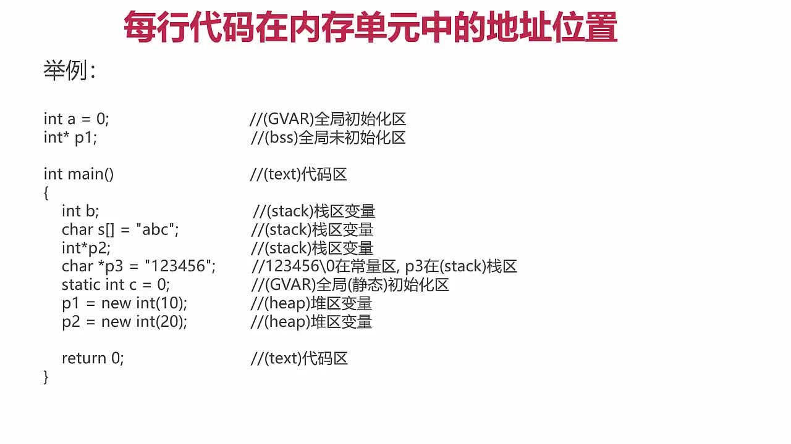
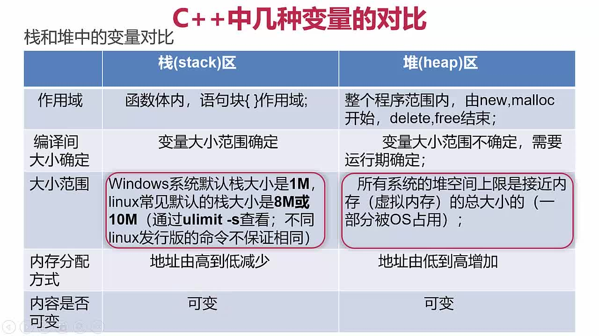

# 第05章 指针与引用

## 5-2 左值与右值

### 左值与右值的概念

### 表达式必须是一个可修改的左值

## 5-6 野指针

### NULL指针

### 野指针分类
> 野指针：指向垃圾内存的指针

三种情况：
+ 1.指针变量没有进行初始化
  > 
+ 2.已经释放不用的指针（地址空间内容已经释放）没有置为NULL
+ 3.指针操作超越了变量的作用范围

## 5-10 不同变量在内存中的位置

+ 栈(Stack)中的变量是从高地址向低地址存储；堆(Heap)中的变量是从低地址向高地址存储

> C++内存模型如下：

## 5-12 C++的动态分配与回收
### 堆在不同语言中的使用

### 动态分配的原则

## 5-13 RAII资源管理方案

## 5-14 几种变量存储区的对比
### 栈和堆的对比

### 全局静态存储区和常量区的对比

## 5-15 内存泄露问题

