# 第05章 指针与引用

## 5-2 左值与右值

### 左值与右值的概念


### 表达式必须是一个可修改的左值


## 5-6 野指针

### NULL指针
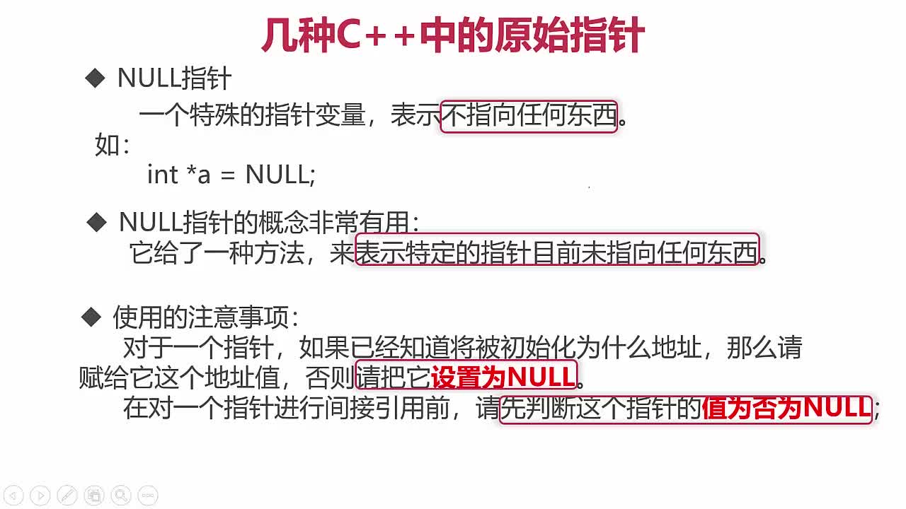

### 野指针分类
> 野指针：指向垃圾内存的指针

三种情况：
+ 1.指针变量没有进行初始化
  > 
+ 2.已经释放不用的指针（地址空间内容已经释放）没有置为NULL
+ 3.指针操作超越了变量的作用范围


## 5-10 不同变量在内存中的位置


+ 栈(Stack)中的变量是从高地址向低地址存储；堆(Heap)中的变量是从低地址向高地址存储

> C++内存模型如下：

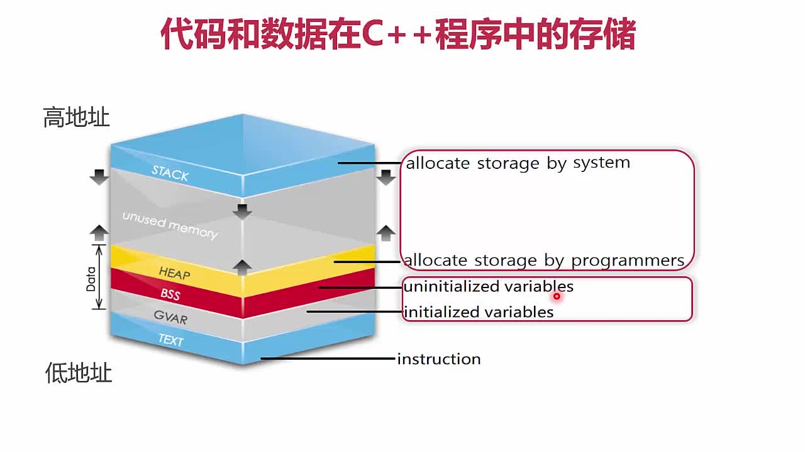

## 5-12 C++的动态分配与回收
### 堆在不同语言中的使用


### 动态分配的原则
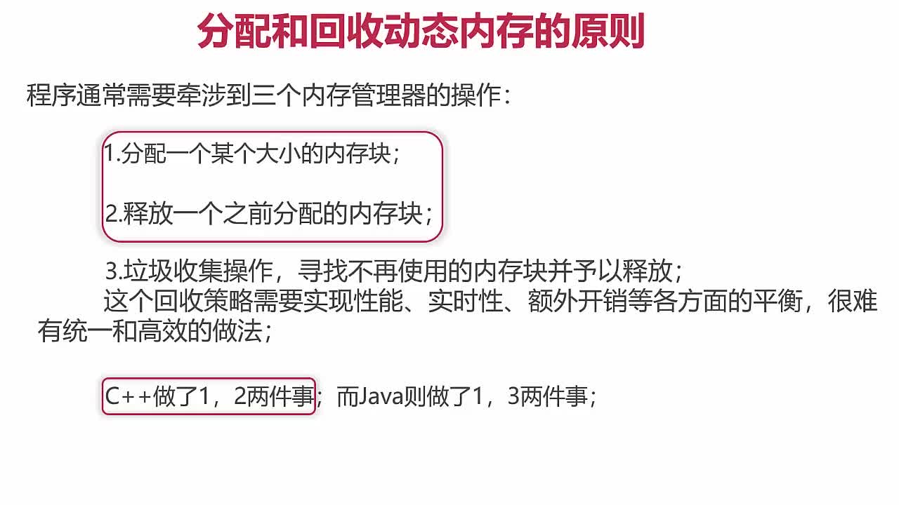

## 5-13 RAII资源管理方案


## 5-14 几种变量存储区的对比
### 栈和堆的对比


### 全局静态存储区和常量区的对比


## 5-15 内存泄露问题
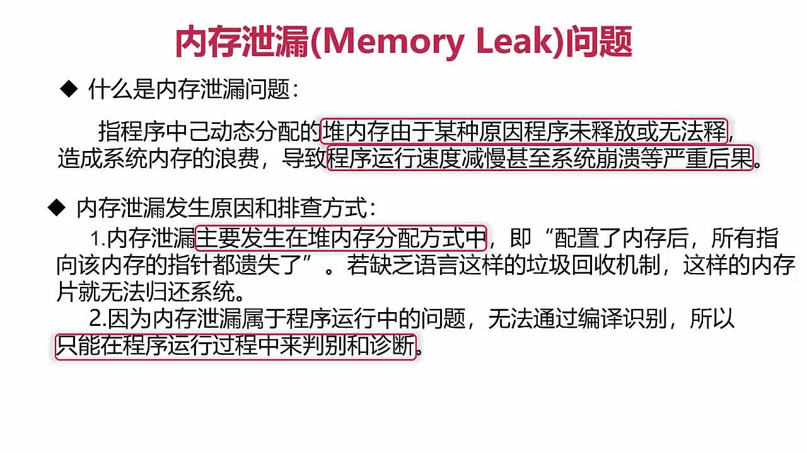

## 5-16 智能指针
### 安全使用指针的两种方案
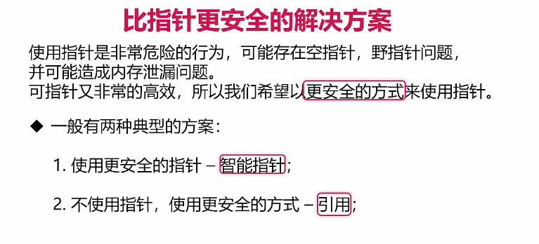

### 常用的智能指针
> shared_ptr和weak_ptr经常结合在一起用，用地最多


### auto_ptr的使用和问题
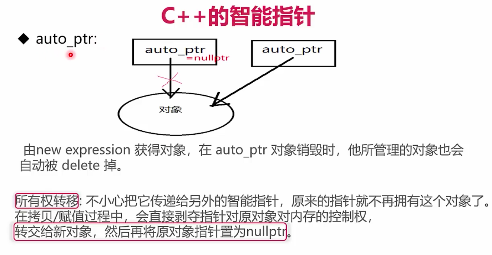

```cpp
#include <string>
#include <iostream>
#include <memory>

using namespace std;

int main() {
    {// 确定auto_ptr失效的范围
        // 对int使用
        auto_ptr<int> pI(new int(10));
        cout << *pI << endl;                // 10 

        // auto_ptr	C++ 17中移除	拥有严格对象所有权语义的智能指针
        // auto_ptr原理：在拷贝 / 赋值过程中，直接剥夺原对象对内存的控制权，转交给新对象，
        // 然后再将原对象指针置为nullptr（早期：NULL）。这种做法也叫管理权转移。
        // 他的缺点不言而喻，当我们再次去访问原对象时，程序就会报错，所以auto_ptr可以说实现的不好，
        // 很多企业在其库内也是要求不准使用auto_ptr。
        auto_ptr<string> languages[5] = {
                auto_ptr<string>(new string("C")),
                auto_ptr<string>(new string("Java")),
                auto_ptr<string>(new string("C++")),
                auto_ptr<string>(new string("Python")),
                auto_ptr<string>(new string("Rust"))
        };
        cout << "There are some computer languages here first time: \n";
        for (int i = 0; i < 5; ++i) {
            cout << *languages[i] << endl;
        }
        auto_ptr<string> pC;
        pC = languages[2]; // languges[2] loses ownership. 将所有权从languges[2]转让给pC，
        //此时languges[2]不再引用该字符串从而变成空指针
        cout << "There are some computer languages here second time: \n";
        for (int i = 0; i < 2; ++i) {
            cout << *languages[i] << endl;
        }
        cout << "The winner is " << *pC << endl;
        //cout << "There are some computer languages here third time: \n";
        //for (int i = 0; i < 5; ++i)
        //{
        //	cout << *languages[i] << endl;
        //}
    }
    return 0;
}
```

## 5-17 unique_ptr
> 注意使用unique_ptr需要引入memory头文件

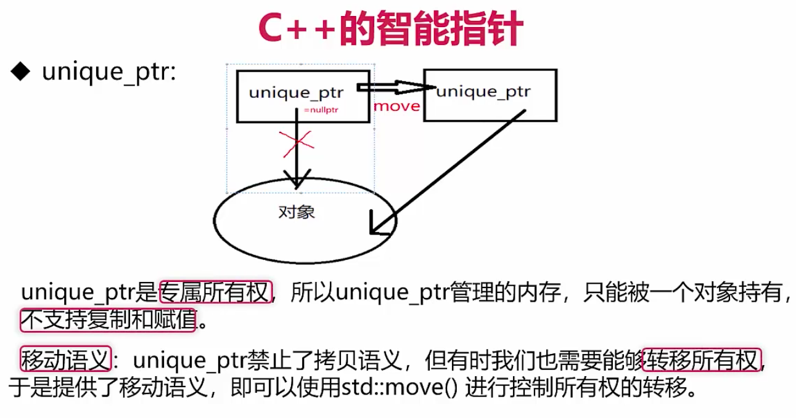

```cpp
#include <memory>
#include <iostream>
using namespace std;
int main()
{
	// 在这个范围之外，unique_ptr被释放
	{
		auto i = unique_ptr<int>(new int(10));
		cout << *i << endl;
	}

	// unique_ptr
	auto w = std::make_unique<int>(10);
	cout << *(w.get()) << endl;                             // 10
	//auto w2 = w; // 编译错误如果想要把 w 复制给 w2, 是不可以的。
	//  因为复制从语义上来说，两个对象将共享同一块内存。

	// unique_ptr 只支持移动语义, 即如下
	auto w2 = std::move(w); // w2 获得内存所有权，w 此时等于 nullptr
	cout << ((w.get() != nullptr) ? (*w.get()) : -1) << endl;       // -1
	cout << ((w2.get() != nullptr) ? (*w2.get()) : -1) << endl;   // 10
    return 0;
}
```

## 5-18 shared_ptr
### 基本使用
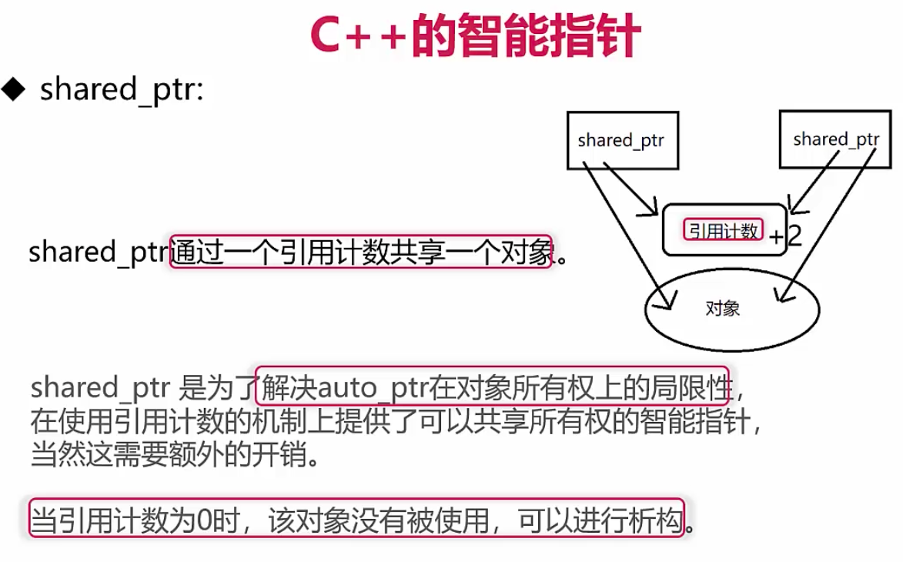

### 局限性


### 使用举例
```cpp
#include <iostream>
#include <memory>

using namespace std;

int main() {
    //// shared_ptr
    {
        //shared_ptr 代表的是共享所有权，即多个 shared_ptr 可以共享同一块内存。
        auto wA = shared_ptr<int>(new int(20));
        {
            auto wA2 = wA;
            cout << ((wA2.get() != nullptr) ? (*wA2.get()) : -1) << endl;   // 20
            cout << ((wA.get() != nullptr) ? (*wA.get()) : -1) << endl;     // 20
            cout << wA2.use_count() << endl;                                // 2
            cout << wA.use_count() << endl;                                 // 2
        }
        //cout << wA2.use_count() << endl;
        cout << wA.use_count() << endl;                                     // 1
        cout << ((wA.get() != nullptr) ? (*wA.get()) : -1) << endl;         // 20
        //shared_ptr 内部是利用引用计数来实现内存的自动管理，每当复制一个 shared_ptr，
        //	引用计数会 + 1。当一个 shared_ptr 离开作用域时，引用计数会 - 1。
        //	当引用计数为 0 的时候，则 delete 内存。
    }

    // move 语法
    auto wAA = std::make_shared<int>(30);
    auto wAA2 = std::move(wAA); // 此时 wAA 等于 nullptr，wAA2.use_count() 等于 1
    cout << ((wAA.get() != nullptr) ? (*wAA.get()) : -1) << endl;          // -1
    cout << ((wAA2.get() != nullptr) ? (*wAA2.get()) : -1) << endl;      // 30
    cout << wAA.use_count() << endl;                                                  // 0
    cout << wAA2.use_count() << endl;                                                // 1
    //将 wAA 对象 move 给 wAA2，意味着 wAA 放弃了对内存的所有权和管理，此时 wAA对象等于 nullptr。
    //而 wAA2 获得了对象所有权，但因为此时 wAA 已不再持有对象，因此 wAA2 的引用计数为 1。

    return 0;
}
```

## 5-19 weak_ptr
### 基本使用
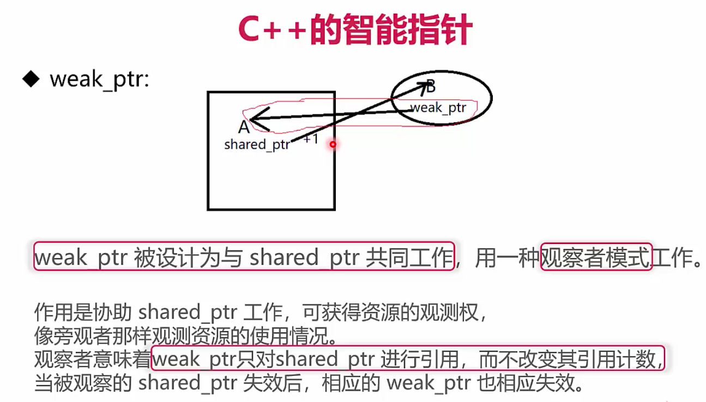

### shared_ptr与weak_ptr结合来防止循环引用
```cpp
#include <string>
#include <iostream>
#include <memory>

using namespace std;

struct B;

struct A {
    shared_ptr<B> pb;

    ~A() {
        cout << "~A()" << endl;
    }
};

struct B {
    shared_ptr<A> pa; // A和B都是shared_ptr，互相引用造成了循环引用，导致A和B的对象都无法释放，从而产生了内存泄露

    ~B() {
        cout << "~B()" << endl;
    }
};

// pa 和 pb 存在着循环引用，根据 shared_ptr 引用计数的原理，pa 和 pb 都无法被正常的释放。
// weak_ptr 是为了解决 shared_ptr 双向引用的问题。
struct BW;

struct AW {
    shared_ptr<BW> pb;

    ~AW() {
        cout << "~AW()" << endl;
    }
};

struct BW {
    weak_ptr<AW> pa; // 和B相比，这里把shared_ptr改成了weak_ptr，这是防止循环引用的关键

    ~BW() {
        cout << "~BW()" << endl;
    }
};

void Test() {
    cout << "Test shared_ptr and shared_ptr:  " << endl;
    shared_ptr<A> tA(new A());                                             // 1
    shared_ptr<B> tB(new B());                                             // 1
    cout << tA.use_count() << endl;
    cout << tB.use_count() << endl;
    tA->pb = tB;
    tB->pa = tA;
    cout << tA.use_count() << endl;                                        // 2
    cout << tB.use_count() << endl;                                        // 2
}

void Test2() {
    cout << "Test weak_ptr and shared_ptr:  " << endl;
    shared_ptr<AW> tA(new AW());
    shared_ptr<BW> tB(new BW());
    cout << tA.use_count() << endl;                                        // 1
    cout << tB.use_count() << endl;                                        // 1
    tA->pb = tB;
    tB->pa = tA;
    cout << tA.use_count() << endl;                                        // 1
    cout << tB.use_count() << endl;                                        // 2
}

int main() {
    Test();
    Test2();
    return 0;
}
```

## 5-20 引用
### 引用的基本使用
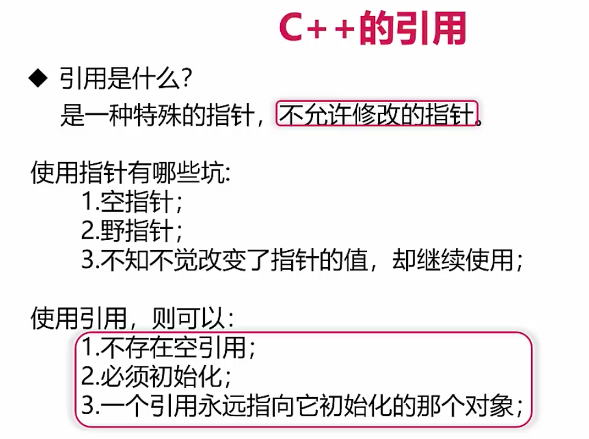

### 引用的使用规范
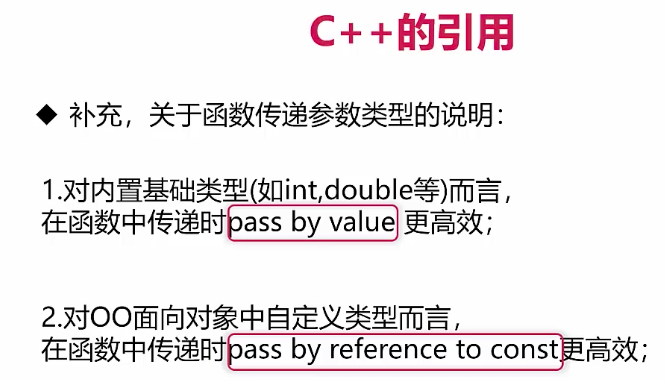