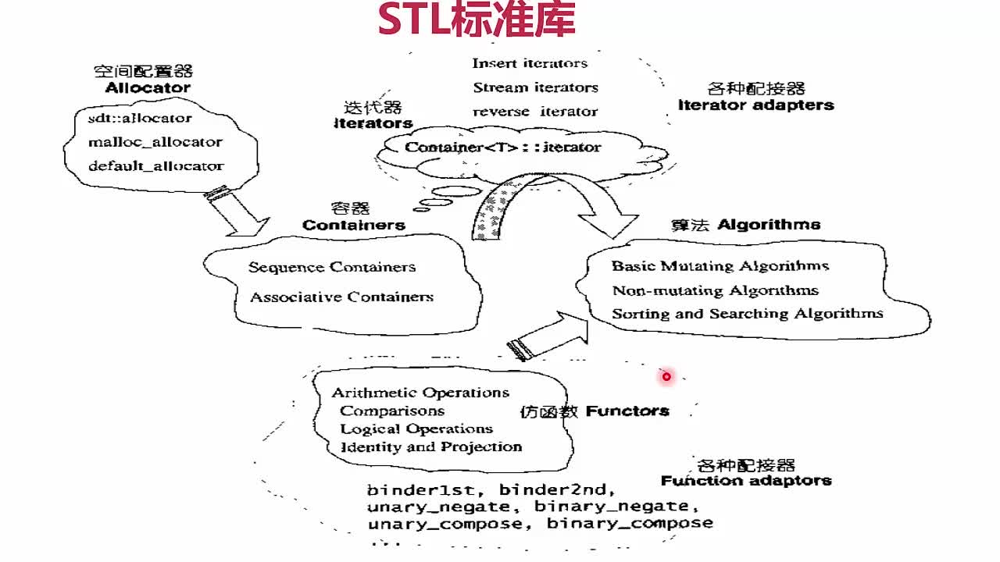
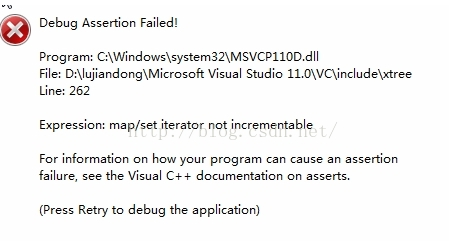

# C++进阶编程

## 9-1 STL标准简介
### STL结构

### STL最佳实践


## 9-4 迭代器失效的几种情况总结
> 参考：[C++迭代器失效的几种情况总结](https://www.cnblogs.com/fnlingnzb-learner/p/9300073.html)

### 一、序列式容器(数组式容器)
对于序列式容器(如vector,deque)，序列式容器就是数组式容器，删除当前的iterator会使后面所有元素的iterator都失效。

这是因为vetor,deque使用了连续分配的内存，删除一个元素导致后面所有的元素会向前移动一个位置。所以不能使用erase(iter++)的方式，

**还好erase方法可以返回下一个有效的iterator**，可以直接把返回的有效iterator覆盖原来的iterator

```cpp
for (iter = cont.begin(); iter != cont.end();)
{
   (*it)->doSomething();
   if (shouldDelete(*iter))
      iter = cont.erase(iter);  //erase删除元素，返回下一个迭代器
   else
      ++iter;
}
```

迭代器失效：

```cpp
void vectorTest() {
    vector<int> container;
    for (int i = 0; i < 10; i++) {
        container.push_back(i);
    }

    vector<int>::iterator iter;
    for (iter = container.begin(); iter != container.end(); iter++) {
        if (*iter > 3) container.erase(iter);
    }

    for (iter = container.begin(); iter != container.end(); iter++) {
        cout << *iter << endl;
    }
}
```

报错是：**vectoriterator not incrementable.**


```cpp
_Myiter operator++(int)
{
    _Myiter _Tmp=*this;
    ++*this;
    return (_Tmp);
}
```

对于序列式容器，比如vector，删除当前的iterator会使后面所有元素的iterator都失效。这是因为顺序容器内存是连续分配（分配一个数组作为内存），删除一个元素导致后面所有的元素会向前移动一个位置。（删除了一个元素，该元素后面的所有元素都要挪位置，所以，iter++，已经指向的是未知内存）。

但是erase方法可以返回下一个有效的iterator。所以代码做如下修改，就OK了。

```cpp
void vectorTest() {
    vector<int> container;
    for (int i = 0; i < 10; i++) {
        container.push_back(i);
    }

    vector<int>::iterator iter;
    for (iter = container.begin(); iter != container.end();) {
        if (*iter > 3) {
            iter = container.erase(iter); // 用返回的有效迭代器覆盖原来的迭代器
        } else {
            iter++;
        }

    }

    for (iter = container.begin(); iter != container.end(); iter++) {
        cout << *iter << endl;
    }
}
```

总结：vector是一个顺序容器，在内存中是一块连续的内存，当删除一个元素后，内存中的数据会发生移动，以保证数据的紧凑。所以删除一个数据后，其他数据的地址发生了变化，之前获取的迭代器根据原有的信息就访问不到正确的数据。

所以为了防止vector迭代器失效，常用如下方法：
```cpp
for (iter = container.begin(); iter != container.end(); )
{
    if (*iter > 3)
      iter = container.erase(iter);    //erase的返回值是删除元素下一个元素的迭代器
    else{
        iter++;
    }
}
```

这样删除后iter指向的元素后，返回的是下一个元素的迭代器，这个迭代器是vector内存调整过后新的有效的迭代器。

### 二、关联式容器
+ 对于关联容器(如map, set,multimap,multiset)，删除当前的iterator，仅仅会使当前的iterator失效，只要在erase时，递增当前iterator即可。
+ 这是因为map之类的容器，使用了红黑树来实现，插入、删除一个结点不会对其他结点造成影响。
+ erase迭代器只是被删元素的迭代器失效，但是返回值为void，所以要采用erase(iter++)的方式删除迭代器。

```cpp
for (iter = cont.begin(); it != cont.end();)
{
   (*iter)->doSomething();
   if (shouldDelete(*iter))
      cont.erase(iter++);
   else
      ++iter;
}

//测试错误的Map删除元素
void mapTest()
{
    map<int, string> dataMap;

    for (int i = 0; i < 100; i++)
    {
        string strValue = "Hello, World";

        stringstream ss;
        ss<<i;
        string tmpStrCount;
        ss>>tmpStrCount;
        strValue += tmpStrCount;
        dataMap.insert(make_pair(i, strValue));
    }

    cout<<"MAP元素内容为："<<endl;
    map<int, string>::iterator iter;
    for (iter = dataMap.begin(); iter != dataMap.end(); iter++)
    {
        int nKey = iter->first;
        string strValue = iter->second;
        cout<<strValue<<endl;
    }

    cout<<"内容开始删除："<<endl;
    //删除操作引发迭代器失效
    for (iter = dataMap.begin(); iter != dataMap.end();iter++)
    {
        int nKey = iter->first;
        string strValue = iter->second;

        if (nKey % 2 == 0)
        {
            dataMap.erase(iter);    //错误
        }
        /* cout<<iter->second<<endl;*/
    }
}
```

出错：



解析：dataMap.erase(iter)之后,iter就已经失效了，所以iter无法自增，即iter++就会出bug.解决方案，就是在iter失效之前，先自增。

```cpp
void mapTest()
{
    map<int, string> dataMap;

    for (int i = 0; i < 100; i++)
    {
        string strValue = "Hello, World";

        stringstream ss;
        ss<<i;
        string tmpStrCount;
        ss>>tmpStrCount;
        strValue += tmpStrCount;
        dataMap.insert(make_pair(i, strValue));
    }

    cout<<"MAP元素内容为："<<endl;
    map<int, string>::iterator iter;
    for (iter = dataMap.begin(); iter != dataMap.end(); iter++)
    {
        int nKey = iter->first;
        string strValue = iter->second;
        cout<<strValue<<endl;
    }

    cout<<"内容开始删除："<<endl;
    for (iter = dataMap.begin(); iter != dataMap.end();)
    {
        int nKey = iter->first;
        string strValue = iter->second;

        if (nKey % 2 == 0)
        {
            dataMap.erase(iter++);
            auto a = iter;

        }
        else {
            iter ++;
        }
    }
}
```

解析：dataMap.erase(iter++);这句话分三步走，先把iter传值到erase里面，然后iter自增，然后执行erase,所以iter在失效前已经自增了。

map是关联容器，以红黑树或者平衡二叉树组织数据，虽然删除了一个元素，整棵树也会调整，以符合红黑树或者二叉树的规范，但是单个节点在内存中的地址没有变化，变化的是各节点之间的指向关系。

所以在map中为了防止迭代器失效，在有删除操作时，常用如下方法：

```cpp
for (iter = dataMap.begin(); iter != dataMap.end(); )
{
     int nKey = iter->first;
     string strValue = iter->second;

     if (nKey % 2 == 0)
     {
         map<int, string>::iterator tmpIter = iter;
         iter++;
         dataMap.erase(tmpIter);
         //dataMap.erase(iter++) 这样也行

     } else
     {
        iter++;
     }
}
```

### 三、链表式容器
对于链表式容器(如list)，删除当前的iterator，仅仅会使当前的iterator失效，这是因为list之类的容器，使用了链表来实现，插入、删除一个结点不会对其他结点造成影响。只要在erase时，递增当前iterator即可，并且erase方法可以返回下一个有效的iterator。

+ 方式一:递增当前iterator
    ```cpp
    for (iter = cont.begin(); it != cont.end();)
    {
       (*iter)->doSomething();
       if (shouldDelete(*iter))
          cont.erase(iter++);
       else
          ++iter;
    }
    ```
+ 方式二:通过erase获得下一个有效的iterator
    ```cpp
    for (iter = cont.begin(); iter != cont.end();)
    {
       (*it)->doSomething();
       if (shouldDelete(*iter))
          iter = cont.erase(iter);  //erase删除元素，返回下一个迭代器
       else
          ++iter;
    }
    ```
  
### 四、总结
> 迭代器失效分三种情况考虑，也是分三种数据结构考虑，分别为数组型，链表型，树型数据结构。

+ **数组型数据结构**：该数据结构的元素是分配在连续的内存中，insert和erase操作，都会使得删除点和插入点之后的元素挪位置，所以，插入点和删除掉之后的迭代器全部失效，也就是说insert(*iter)(或erase(*iter))，然后在iter++，是没有意义的。解决方法：erase(*iter)的返回值是下一个有效迭代器的值。 iter =cont.erase(iter);
+ **链表型数据结构**：对于list型的数据结构，使用了不连续分配的内存，删除运算使指向删除位置的迭代器失效，但是不会失效其他迭代器.解决办法两种，erase(*iter)会返回下一个有效迭代器的值，或者erase(iter++).
+ **树形数据结构**： 使用红黑树来存储数据，插入不会使得任何迭代器失效；删除运算使指向删除位置的迭代器失效，但是不会失效其他迭代器.erase迭代器只是被删元素的迭代器失效，但是返回值为void，所以要采用erase(iter++)的方式删除迭代器。

注意：经过erase(iter)之后的迭代器完全失效，该迭代器iter不能参与任何运算，包括iter++,*ite

## 9-5 函数指针到仿函数模板
> https://blog.csdn.net/u010710458/article/details/79734558
### 1、何为仿函数
> 仿函数的主要功能是为了搭配STL算法使用，单独使用仿函数的情况比较少。

仿函数（functors）在C++标准中采用的名称是函数对象（function objects）。仿函数主要用于STL中的算法中，虽然函数指针虽然也可以作为算法的参数，但是函数指针不能满足STL对抽象性的要求，也不能满足软件积木的要求–函数指针无法和STL其他组件搭配，产生更灵活变化。仿函数本质就是类重载了一个operator()，创建一个行为类似函数的对象。

对于重载了()操作符的类，可以实现类似函数调用的过程，所以叫做仿函数，实际上仿函数对象仅仅占用1字节，因为内部没有数据成员，仅仅是一个重载的方法而已。实际上可以通过传递函数指针实现类似的功能，但是为了和STL内部配合使用，他提供了仿函数的特性。