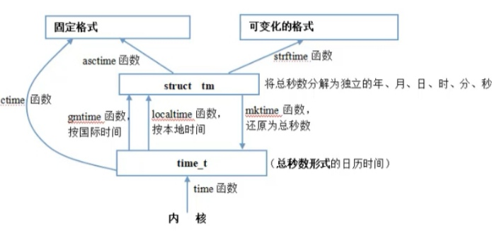

# 2. 获取系统时间

+ 什么是系统时间?
  就是年月日 时分秒，有OS时，这个时间就是系统提供的，因此成为系统时间。
  比如我的应用程序需要显示当前日期和时间，我就可以通过调用相应的API来获取。

+ 区分日期和时间
  + 日期：年 月 日
  + 时间：时 分 秒

准确来讲，具体的时 分 秒应该指的是时刻，两个时刻之间的差值才是时间，不过平时说习惯了，往往把时刻也说成是时间，甚至将日期和时间都合称为时间，后面我们说到时间时，指的就是日期和时间合在一起的情况。

## 2.1 Linux的计时方式


Linux系统记录的时间，是从公元1970年1月1日00:00:00开始，到现在的总秒数，每过1秒，总秒数就会+1。

这个总秒数 + 1970年1月1日00:00:00这个起点时间，即可计算得到当的前时间。

通过调用Linux系统提供系统 API——time，即可获取这个总秒数，我们可以自己去将这个总秒数转换成年月日、时分秒，但是由于涉及到闰年闰月的问题，我们一般不会自己去转换，因为很多人连什么是润年闰月都不清楚，自己写代码去转换不划算。

因此Linux下的C库还提供了gmtime、localtime、mktime、ctime、asctime、strftime等C库函数，调用这些函数就可以将time函数返回的总秒数，自动的转换为我们要的当前时间。

前面说过，所有语言的库都有获取时间的库API，这些库函数都是基于系统API来实现的，如果是windows的库，就是基于windows系统API实现的，如果是Linux的库，就是Linux的系统API实现的。

+ gmtime、localtime     
+ mktime、ctime、     
+ asctime、strftime
 
 ```txt
 C库时间API   C++库时间API    Java库时间API ...........
    |            |                |
    |            |                |
    |____________|________________| ................
                 |
                 |
            time(OS API)
                 |
                 |
              Linux OS
 ```

同样不要记这些函数，理解即可，通过理解C库的时间API，了解库函数的时间API，才是重点。

以后，如果在你写的c程序中用到了这些函数，查阅笔记和man手册即可。

如果你写的是c++和java函数的话，那就直接调用c++和java的获取时间的库函数即可。

## 2.2 time

### 2.2.1 函数原型

```c
#include <time.h>
time_t time(time_t *t);
```


+ 1）功能：返回总秒数

+ 2）参数 t：存放总秒数的缓存的地址

    time_t其实就是int类型，只不过被typedef重命名了
    调用time时，我们需要定一个int变量（缓存）来存放总秒数
    
    疑问：使用int的变量放总秒数，空间大小够吗？
    答：够，如果说你的总秒数，大到int型变量都放不了的话，起码需要好几百年的时间，才能累计如此之多的总秒数，在我们有生之年你是看不到总秒数把int变量撑爆的情况，你要是能看到，估计都成大仙了。


+ 3）返回值：函数调用成功返回总秒数，失败则返回(time_t)-1 ，errno被设置。
  讲到这里可以看出，获取总秒数的方式有两种。
  + （a）通过返回值获取

    ```c
    time_t tim = time(NULL);
    ```
    
    不使用参数时，参数指定为NULL

  + （b）参数
    
    ```c
    time_t tim；
    time(&tim);
    ```

### 2.2.2 代码演示

```c
#include <stdio.h>
#include <time.h>

int main(void)
{
    printf("%ld\n", time(NULL));
    printf("%ld\n", time(0));
    return 0;
}
```

## 2.3 gmtime、localtime、mktime、ctime、asctime、strftime				


### 2.3.1 系统API：time和库API：gmtime、localtime、mktime、ctime、asctime、strftime的调用关系



使用man 查看其中一个库函数，你会在man手册里面看到以上这些所有的库函数，他们也都使用<time.h>这个头文件

### 2.3.2 `ctime`

+ （1）函数原型
    
  ```c
  #include <time.h>
  char *ctime(const time_t *timep);
  ```

  + 1）功能
    将time返回的总秒数，转为固定的格式时间，不过这个时间是国际时间，并不是本地时间（我们的本地时间是北京时间）
    
  + 2）参数
    保存有总秒数的缓存的地址，这个总秒数，我们需要调用time来得到。

  + 3）返回值
    + 成功：转换后的时间字符串的指针
    + 失败：返回NULL，errno被设置

+ （2）代码演示

  ```c
  #include <stdio.h>
  #include <time.h>

  int main(void)
  {
      long int tim = 0;
      char *timep = NULL;
      timep = ctime(&tim);
      printf("time is %s\n", timep); // 根据参考点选取函数，固定格式不好用， 一般不用
      return 0;
  }
  ```
  
  结果为：
  
  ```shell
  time is Thu Jan  1 00:00:00 1970
  ```

### 2.3.3 `gmtime`、`localtime`、`mktime`

+ (1)`gmtime`  
      原型如下：

  ```c
  #include <time.h>
  struct tm *gmtime(const time_t *timep);
  ```

  + （a）功能  
      将time返回的总秒数，转为国际时间的`年 月 日 时 分 秒`

      然后开辟一个struct tm结构体变量，将年月日时分秒放到struct tm结构体变量中。

      ```c
      struct tm 
      {
            int tm_sec;         /* 秒 */
            int tm_min;         /* 分 */
            int tm_hour;        /* 时 */
            int tm_mday;        /* 月天 */
            int tm_mon;         /* 月份 */
            int tm_year;        /* 年 */
            int tm_wday;        /* 周天 */
            int tm_yday;        /* 年天 */
            int tm_isdst;       /* 夏时令设置 */
      };
      ```

  + （b）参数  	  
      存放有总秒数的缓存的地址。

  + （c）返回值  
    + 成功：返回struct tm结构体变量的地址，应用程序就可以使用里面存放的`年 月 日 时 分 秒`
    + 失败：返回NULL，errno被设置。

  + （d）代码演示
    ```c
    #include <stdio.h>
    #include <time.h>

    int main(void)
    {
        long int tim = 0;
        time(&tim); // 获取当前总秒数
        struct tm *timep = NULL; // 用于存储时间的结构体

        timep = gmtime(&tim); // 根据总秒数获取当前时间

        printf("%d年%d月%d日 %d时%d分%d秒 星期%d\n", timep->tm_year, timep->tm_mon + 1, timep->tm_mday, timep->tm_hour, timep->tm_min, timep->tm_sec, timep->tm_wday); // 可以看到时间和北京时间查了8个小时，所以需要用下面的localtime
        return 0;
    }
    ```
    
    结果为：
    
    ```shell
    119年3月31日 7时39分3秒 星期0
    ```

+ (2)`localtime`  
  原型如下：
  
  ```c
  #include <time.h>
  struct tm *localtime(const time_t *timep);
  ```

  功能与gmtime完全一样，只不过是转为本地时间的年月日时分秒，我们的本地时间是北京时间。
  代码演示
  
   ```c
    #include <stdio.h>
    #include <time.h>

    int main(void)
    {
        long int tim = 0;
        time(&tim); // 获取当前总秒数
        struct tm *timep = NULL; // 用于存储时间的结构体

        timep = localtime(&tim); // 根据总秒数获取当前时间

        printf("%d年%d月%d日 %d时%d分%d秒 星期%d\n", timep->tm_year, timep->tm_mon + 1, timep->tm_mday, timep->tm_hour, timep->tm_min, timep->tm_sec, timep->tm_wday);
        return 0;
    }
    ```
    
    结果为：
    
    ```shell
    119年3月31日 7时39分3秒 星期0
    ```

+ （3）`mktime`  
       原型如下：
   
   ```c
    #include <time.h>
    time_t mktime(struct tm *tm);
   ```

   + （a）功能  
      将struct tm变量中的年月日时分秒，反过来转为总秒数。

   + （b）返回值
      计算得到的总秒数。

   + （c）代码演示
     
      ```c
      #include <stdio.h>
      #include <time.h>

      int main(void)
      {
          long int tim = 0;
          time(&tim); // 获取当前总秒数
          struct tm *timep = NULL; // 用于存储时间的结构体
          timep = localtime(&tim); // 根据总秒数获取当前时间结构体timep


          printf("总的时间秒数为：%ld\n", mktime(timep)); // 再把时间结构体转为总秒数
          return 0;
      }
      ```
      
      结果为：
      
      ```shell
      总的时间秒数为：155401758
      ```

### 2.3.4 asctime、strftime

+ （1）`asctime`     
  原型如下：
  
  ```c
  #include <time.h>	
  char *asctime(const struct tm *tm);
  ```

  + （a）函数功能  
      负责将struct tm中的年月日时分秒，组合为固定格式的时间

  + （b）返回值  
      转换后时间字符换的指针

  + （c）代码演示
      
      ```c
      #include <stdio.h>
      #include <time.h>

      int main(void)
      {
          long int tim = 0;
          time(&tim); // 获取当前总秒数
          struct tm *timep = NULL; // 用于存储时间的结构体
          timep = localtime(&tim); // 根据总秒数获取当前时间,覆盖tm类型结构体timep
          printf("now is %s\n", asctime(timep)); // 根据时间结构体获取时间字符串
          return 0;
      }
      ```
      
      结果为：
      
      ```shell
      now is Sun Mar 31 07:36:17 2019
      ```

+ （2）`strftime`  		
  原型如下：

  ```c
  #include <time.h>	
  size_t strftime(char *s, size_t max, const char *format, const struct tm *tm);
  ```

  + （a）功能  
      与asctime功能一样，只不过**strftime能够组合为我们自己指定的时间格式**
      为了组合为我们自定义的时间格式，我们需要为函数其指定格式。

  + （b）返回值  
      返回转换后时间字符串的字符个数。

  + （c）参数  
      + s：缓存地址，这个缓存用于存放转换后的字符串  
      + max：缓存的大小  
      + tm：放有年月日时分秒的结构体变量的地址  
      + format：自定义时间格式  
          与printf("%d %s", a, buf);指定打印格式的操作方式是一样的  
          格式怎么用?  
            比如：
            strftime(strtim_buf, sizeof(strtim_buf), "%Y:%m:%d %H:%M:%S\n", tm);

            %Y:%m:%d %H:%M:%S指定的时间格式，是中国人惯用的格式 ———— 年：月：日 时：分：秒。

          格式表如下：
           ```c
            %a：缩写周日名             TUE
            %A：全周日名               Tuesday
            %b：缩写月名               Jan
            %B：月全名                 January
            %c：固定格式的日期和时间    Tue Jan 14 19:40:30 1992
            %d：月日                   26
            %H：24小时制               23
            %I：小时(上下午12小时制)    11
            %j：年日                   089
            %m：月份                   08
            %M：分                     55
            %p：AM/PM(上下午指示)       PM
            %s：秒                     30					
            %w：(周天到周6用0~6 表示)   0
            %x：固定格式日期            01/14/92
            %X：固定格式时间            19:40:30
            %y：不带公园的年            18
            %Y：带公元的年              2018
            %z：时区名                  MST、DST、WET、......
           ```

          有关这个表，不要记，你也记不住，理解了，用到时查man手册即可。

  + （d）代码演示
     
    ```c
    #include <stdio.h>
    #include <time.h>

    int main(void)
    {
        long int tim = 0;
        time(&tim); // 获取当前总秒数
        struct tm *timep = NULL; // 用于存储时间的结构体
        timep = localtime(&tim); // 根据总秒数获取当前时间,覆盖tm类型结构体timep

        char mytime[50] = {0};
        strftime(mytime, sizeof(mytime), "%Y-%m-%d %H:%M:%S\n", timep);

        printf("now is %s\n", mytime); // 根据时间结构体获取时间字符串
        return 0;
    }
    ```
    
    结果为：
    
    ```shell
    now is 2019-03-31 07:47:35
    ```
