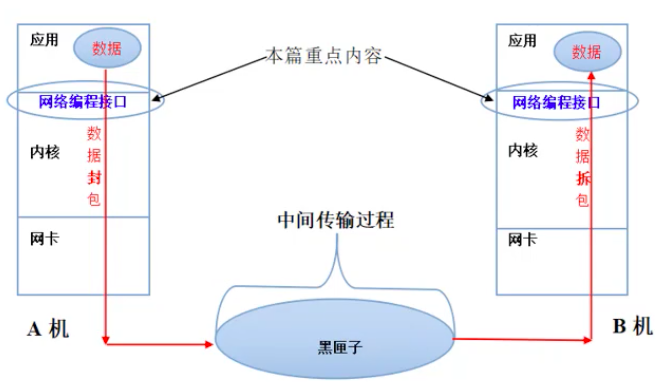

# 第11章 网络编程（网络IPC）

## 1. 本机进程间通信 与 网络通信

### 1.1 本机进程间通信

实现本机内部的进程间的通信，通信时需要使用专门IPC机制，比如信号、管道（无名、有名）、system V IPC（消息队列、共享内存、进程信号量），有关这些IPC的API在第8章“进程间通信”中，已经讲的非常清楚，这里不再赘述。

### 1.2 网络通信

网络通信也被称为网络IPC，直译就是网络进程间通信，简称网络通信，说白了就是跨机进程间的通信。图：

在网络通信没有出现之前，那个时候只有“本机进程间通信”，直到后来人们发现两台不同计算机的进程间也有通信的需求，此时才发明了网络通信，以实现“跨机进程间通信”。

所以可以简单的认为，网络通信其实就是“本机进程间通信”向“跨机进程间通信”扩展后的产物，只是这个扩展并不是那么容易的，为了实现跨机通信最起码：

+ （1）通信协议的实现
+ （2）各种通信设备的支持（网卡、路由器、光纤、电缆、基站等等）

不过对于本章来说，我们重点关心的不是通信协议和中间的通信设备，这些东西都是别人早已实现好，

+ （1）通信设备

  + 1）网卡：你的计算机肯定有
  + 2）路由器：没有路由器怎么上网，个人的路由器一般都自己买的
  + 3）光纤、电缆、基站等：由电信、移动、联通等网络运行商提供，我们无需操心

+ （2）通信协议
  协议很早以前就已经被定义好了，至于协议栈的代码实现，Linux等系统也早已实现好，只要使相应的网络API调用即可。
  多数情况下协议栈代码属于OS的一部分，但是如果裸机需要网络通信时，裸机没有运行OS，此时只能运行独立的协议栈代码。

  对于本章来说，重点是学习系统提供的网络编程API，从而实现网络通信。  
  

## 2. 网络编程API 与 系统API

本章虽然叫网络编程API，不过由于网络的协议栈代码属于Linux OS的一部分，所以网络编程的API其实也是Linux所提供的系统API之一，只不过是专门被用于网络通信，所以我们单独的称为网络编程接口（API），但是你自己要知道，与前面章节介绍各种的API在本质上并没有什么差别，其实都是系统提供的系统API。

搞清楚这一点后，大家不要过分的神话本章，本章的学习与前面章节的API学习相比，本质上并没有什么特殊的地方。

## 3. 本章的会严格掐好知识点的深度，避免形成极端

本章的API虽然也是系统API，与其他系统API并无本质区别，但是毕竟是用于网络通信的，因此也不是一点基础知识都不要的。

如果想要学习也好本章的话，大家必须具备一定的网络基础知识，如果没有的，大家在听本章的课程时，可能会有一定的障碍，因为我们所讲的内容不可能不涉及到这些网络知识。

为了打好网络基础知识，所以大家学习本章之前，请一定先学习《计算机体系结构体——网络篇》的课程，打好网络基础知识之后，再来学习本章的内容，你会觉得本章的学习很容易。

不过为了更好的讲解本章，在本章的开头，我们也会对《网络篇》里面的一些重要知识进行回顾。

当然本章的名字叫“网络编程”，所以重点是讲如何使用这些API来编写网络通信的程序，而不是将网络原理，因此我们的课程会严格把握知识的深度，防止出现两种极端情况：

+ （1）极端1：讲的过于简单  
  基本只讲API的大概怎么用，参数怎么写，但是不会与网络相关的知识进行结合学习，按照这种方式来讲的话，大家可能好像觉得听懂了，但是仔细一想其实并没有理解，比如：
  + 1）跨网通信时，TCP和UDP各自是怎么实现，TCP有连接和UDP无连接有什么区别
  + 2）TCP会建立连接，到底什么是连接，为什么建立连接就能够实现可靠通信

    我们所写的例子程序虽然是局域网测试的，准确讲是本机测试的，但是我们会介绍TCP/UDP“跨网通信”的情况。

+ （2）极端2：讲的太复杂  
    比如深入分析数据封包格式，分析网络协议栈的源码等等，有关这些深入的内容我们本章不会涉及，因为如果讲这些内容的话，本章讲的就不是网络编程，而是网络原理。  

    我们后面计划会出网络原理的课程，到时我们会讲封包格式以及协议的源码，同时通过抓取网络数据包来验证分析，不过前提是大家一定先打好网络的基础知识，只有当有了这些网络基础知识之后，到时候再去学习深入的网络原理时，所有的理解才会水到渠成的。  
    所以本章的课程一定会介绍的比较深入，但是同时又不会深到让大家难以理解。  

## 4.学习本章的意义

学习本章非常有意义，

+ （1）后面的课程会用到今天的内容
+ （2）便于理解其它系统的网络API以及库提供的网络API
+ （3）如果你未来想深入理解网络的话，如果没有本章这些知识作为基础，很难深入理解

### 4.1 后面的课程会用到今天的内容

后面进行Linunx嵌入式开发时，如果C程序需要涉及到网络通信时，会调用到今天所学的API既然会用到，重要性自然就不用多说了

### 4.2 便于理解其它系统的网络API以及库提供的网络API

#### （1）网络编程的接口有两种

+ 第一种：系统API
+ 第二种：库API，通过封装系统API实现

当然库在封装系统提供的网络API时，往往可能还会进一步简化，就是把我们本章讲的很多步骤的函数，封装为一个函数，调用库接口往往更简洁，不过总体上你会发现其实实现方式都是一样的。

+ 1）C程序实现网络通信

  + （a）直接调用系统提供网络API  
    比如直接调用Linux或者windows的系统API。

  + （b）直接调用C库的网络API  
    不过这里说的C库并不是标准C库（因为标准C库并不提供网络编程的接口），而是一些特定c库，这些c库会提供网络编程接口。

    Linux嵌入式c程序想要通信的话，既可以调用C库提供的网络API，也可以直接Linux系统的网络API，不过在嵌入式开发里面，为了节省计算机的资源，往往会尽量避免运行额外的库，所以此时会直接调用Linux的网络API来实现。

+ 2）C++、java等程序实现网络通信  
  基本都是直接调用它们的库接口来实现的，特别是java程序，java程序里面不能直接写C接口，所以必须使用java自己网络编程库接口。

  不过C++还好，因为c++兼容c，所以c++程序有三种选择
  + （a）使用c++自己“类库”提供的网络API
  + （b）使用某c库提供的网络API
  + （c）直接使用Linux OS提供的网络API

  c++程序一般使用的都是“类库”的网络API。

#### （2）为什么说学习本章，有助于理解其它形式的网络API

不管是window、Linux等系统提供网络API，还是各种库通过封装OS的网络API从而提供的库API，其实用法几乎一样，因此学会本章Linux的网络API，非常有助于大家接触和学习其它形式的网络API。

实际上你去学习windows的网络API时你会发现，它与Linux网络API几乎是差不多的，函数名称、功能、参数几乎没有什么区别。

## 4.3 有利于深入学习和理解网络原理

如果只是站在应用编程的角度的话，网络篇和本章的内容就够用了，但是如果你职业规划是想往网络方向深入发展的话，仅这些内容是不够的，但是想要深入理解网络原理，又不能一蹴而就，需要一定基础。

而网络篇和本章网络编程其实就是深入学习网络原理的基础。

## 5. 本章知识结构

+ (1). 回顾《计算机体系结构体——网络篇》的部分内容
+ (2). 网络通信协议 与 网络编程接口
+ (3). 如何使用TCP/IP实现网络通信
+ (4). TCP通信
+ (5). UDP通信
+ (6). 域套接字
+ (7). 广播
+ (8). 带外数据
+ (9). 服务器如何实现多客户
