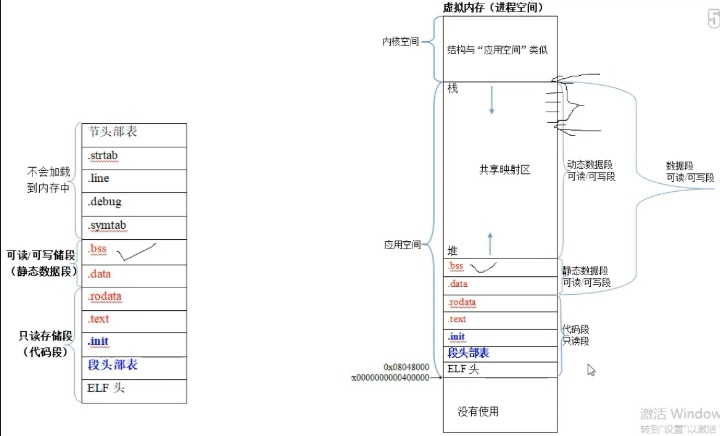
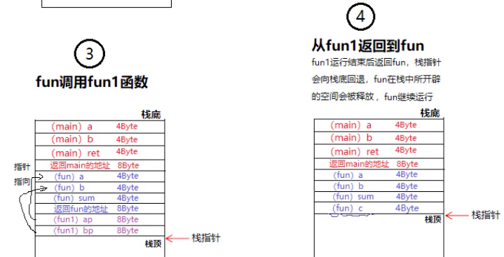
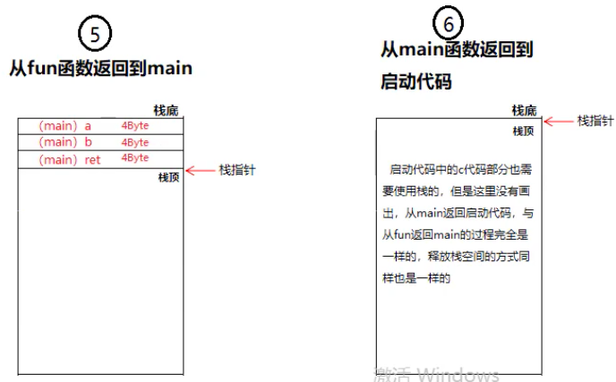

# 9. 函数调用
## 9.1 直接使用函数名调用
```c
int *fun(int a, int b)
{
	...
}

int fun1()
{
    fun(100, 200); //直接使用函数名调用
}
```

这种也是最常见的方式。

## 9.2 使用函数指针来调用
```c
int *fun(int a, int b)
{
	...
}

int *(*funp)(int, int) = &fun; //等价于fun 

int fun1(void)
{
    *funp(100, 200); //等价于(*funp)(100, 200)
}
```


为了使用更加方便，所以c语法允许将`&`和`*`省略，因此以上写法就简写为如下形式：
```c
int *(*funp)(int, int) = fun;  
funp(100, 200); 
```

## 9.3 函数调用时，栈的使用过程
### 9.3.1 本小节内容概要
我们都知道，函数在运行时是需要栈的，为什么需要栈呢?    
因为`函数的形参`、`自动局部变量`、`返回地址`等都放在栈中，没有栈的话函数是没办法运行的      

我们在第一章讲c程序的“内存结构”时，我们有详细介绍栈是个啥，所以在本小节就不再介绍栈是个啥.    
本小节的重点是讲解**函数调用时，栈的使用过程**  

### 9.3.2 直接通过例子理解
```c
#include <stdio.h>

int fun1(int *ap, int *bp)
{
    *ap *= 2; //等价于 *ap = *ap * 2
    *ap *= 2;
}

int fun(int a, int b)
{
    int sum;
    fun1(&a, &b);
    int c = 10;
    sum = a + b + c;

    return sum;
}

int main(void)
{
    int a = 10;
    int b = 20;
    int ret = 0;
    ret = fun(a, b);
    printf("ret = %d\n", ret);

    return 0;
}
```

#### （1）先做一个简单的铺垫
+ 为了简单化，我们这不考虑“启动代码”对于栈的使用。  

+ 为了方便讲解，我们一律认为形参都是开辟于栈中，不考虑形参在寄存器中的情况  

+ 最开始，栈针指向栈底，栈顶和栈底是重合的  

+ 从栈中每开辟1个字节，栈指针就移动一个字节，栈顶开始移动  
  栈顶和栈底之间的空间，就是开辟出的需要被使用的空间，形参等就在里面    

  `栈指针是个啥？`    
  栈指针全称叫“栈指针变量”，用于存放栈顶字节的地址，所以`栈指针标记了栈顶的位置`     
  
+ 释放时也是一样的，栈顶指针向栈底移动一个字节，就释放一个字节  
  只不过空间释放了，但是里面的数据还遗留在里面，遗留数据就变成了我们所说的随机值。  


+ 调用函数时，会在栈中保存被中断处下一条指令的地址，当函数运行结束后，就是利用保存的地址来返回并继续执行的  


#### （2）函数调用时，栈的使用过程

 
  


### 9.3.3 为什么工程代码越复杂，越消耗内存

因为当工程代码写复杂之后，无法避免的会封装大量的函数，函数调用时是非常耗费栈的，所以所工程越复杂，越消耗栈内存，栈是内存的一部分，栈消耗的很厉害，其实就是内存消耗的很厉害

## 9.4 有关函数传参的一些需要被强调的地方

### 9.4.1 实参类型与形参类型可以不一致，返回值与返回类型也可以不一致

这个问题我们在前面介绍过，此时如果不一致的话，就会进行隐式强制转换，但是我们建议使用显式强制转换。  

### 9.4.2 实参的数量与形参数量不一定要想等

#### （1）直接使用函数名调用时

要求实参与形参的数量必须相等，否则就会报错，编译无法通过。  

```c
int fun(int a, float b)
{
    ...
}
fun(100); //报参数太少的错误
fun(200，12.3, 324); //报参数太多的错误
```

`疑问`：为什么直接使用函数名调用时，参数不能多不能少，必须与形参一致？  
`答`：因为函数定义时，明确的指明了参数的个数，必须遵守。  

#### （2）使用“函数指针变量”来调用时，可以不相等

`疑问`：为什么使用“函数指针变量”来调用时，可以不相等？  
`答`：因为在定义“函数指针变量时”，可以从新指定形参。  

+ 1）例子1：定义函数指针变量时，省略部分形参

```c
#include <stdio.h>
int fun(float a, int b)
{
    printf("a = %f\n", a);
    printf("b = %d\n", b);
    return 0;
}

int main(void)
{
    int (*funp)(float, int) = fun;
    funp(12.3, 100); //此时传递两个
    int (*funp1)(float) = (int (*)(float))fun; //fun的类型为int (*)(float, int) ,强制参数个数转换
    funp1(12); //此时只传一个,第二个参数是个随机值(上一次该地址遗留的值)
    return 0;
}
```

```c
int (*funp)(int, float) = fun;
```

定义函数指针变量时，要求传递两个参数，所以调用时需要按照int和float来传参。  

```c
int (*funp1)(int) = (int (*)(int))fun; 
```

调用时传递只一个参数，没有传递实参的形参就是随机值。   

为什么时随机值？   
形参开辟与栈中，你不通过实参来初始化的话，它就是一个随机值。   

不过由于funp1的类型为`int (*)(int)`，而fun的类型为`int (*)(int, float)`，指针类型不一致，所以复制时需要将fun强制转为`int (*)(int)`类型。  


2）例子2：定义函数指针变量时，也可以将形参全部省略

```c
int fun(int a, float b)
{
	printf("a = %d\n", a);
	printf("b = %d\n", b);
}

int main(void)
{
	int (*funp)() = fun; //定义时将参数省略

	fun(10);             //可以
	fun(10, 12.4);       //可以
	fun(21, 34.5, 3453); //可以
}
```
从例子不难看出，定义函数指针变量时，如果不指定形参的话，调用时实参可以根据需求随意指定。  

`疑问1`：在`int (*funp)() = fun`中，为什么没有对fun进行“强制转换”   
`答`：不指定形参的这种情况，可以省略强制转换。  
  ```c
  int (*funp)() = (int (*)())fun;
  ```
可省略为  
  ```c
  int (*funp)() = fun;
  ```
  


`疑问2`：将参数全部省略，有意义吗?  
`答`：有，这么一来就**可以让“函数指针变量”指向任何一个函数**  
```c
int fun1(int a)
{
	...
}

int fun2(int a, int b)
{
	...
}

int fun3(int a, int b, float c)
{
	...
}

int main(void)
{
	int (*funp)() = NULL;   //赋NULL的时候不需要进行类型的强制转换

	funp = fun1;
	funp(10);

	funp = fun2;
	funp(23, 45);

	funp = fun3;
	funp(23, 45, 34.65);
}
```

如果定义为`int (*funp)(int, int)`，funp就只能指向fun2函数  
但是将形参全部省略后，就不用担心因参数的不同所带来的矛盾了  
