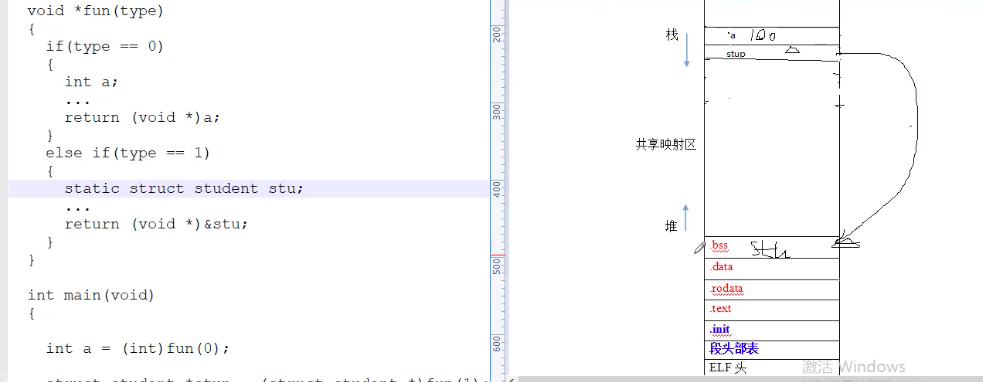

# 13. 如何得到函数的计算结果

当然并不是所有的函数都需要返回计算结果，但是如果需要得到计算结果的话，应该怎么办呢？

## 13.1 通过返回值的得到结果

```c
int fun(int a)
{
    ...
    return ***;
}

```

如果return的返回值不能确定，可以返回`void *`：

```c
void *fun(type)
{
	if(type == 0)
	{
		int a;
		...
		return (void *)a;
	}
	else if(type == 1)
	{
		// 返回的是stu的指针所以需要声明为static，会存放到bss区域，从而防止被释放
		static struct student stu;
		...
		// 因为返回值不确定，所以先转换为void类型
		return (void *)&stu;
	}
}	

int main(void)
{

    int a = (int)fun(0); // 强制转换回来

    struct student *stup = (struct student *)fun(1);

    return 0;
}
```



`疑问`：例子中的a和stu为什么需要加static修饰？  
答：如果不加static修饰的话，就是自动局部变量，函数运行结束后，自动局部变量就会被释放，此时就会返回一个被释放空间的指针，操作被释放的空间是很危险的，因为释放后的空间可能会被其它变量使用  
   加了static修饰后就是静态局部变量了，只要程序还活着，静态局部变量就会一直存在，不需要担心。  

## 13.2 通过`传参`返回计算结果

通过传参返回的意思就是，可以`通过指针来修改实参`，从而返回计算的结果。  

```c
void fun(int a, int b, int *p1, int *p2)
{
    *p1 = a * a;
    *p2 = b * b;
}

int main(void)
{	
    int ret1 = 0;
    int ret2 = 0;

    fun(10, 20, &ret1, &ret2);

    return 0;
}
```

+ `通过指针传参来返回计算结果时，可以返回多个值，如果要返回的值非常多的话，也可以封装为结构体返回`  

+ 封装为结构体返回时，可以使用return返回，也可以还是用传参来返回。  

+ 在库函数、OS API里面，retrun返回和传入形参返回是怎么用的,说一下应用场景：    
	+ return返回：往往用于说明函数是否调用成功，一般返回0表示调用成功，返回-1表示调用是失败  
	+ 传参返回：返回计算结果  

```c
int fun(int a, int *p)
{
	if(NULL != p)
	{
		*p = a * a;

		return 0;
	}
	else 
	{
		return -1;
	}
}

int main(void)
{
	int ret = 0;
	int va = 0;

	ret = fun(10, &va);
	if(-1 == ret )
	{
		printf("fun fail\n");
	}
	else 
	{
		printf("va = %d\n", va);
	}

	return 0;
}
```
