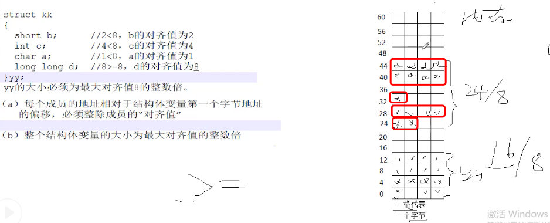

# 1. 结构体

## 1.1 为什么需要结构体

因为c语言有描述对象的需求，而结构体就是用来保存对象信息的

大家千万不要误认为只有面向对象的语言才有描述对象的需求，任何一种语言都有描述对象的需求 

至于为什么有“面向过程语言”和“面向对象语言”的区别，我们后面再介绍这个问题  

任何一个对象都包含很多的属性，比如人就包含身高、年龄、姓名、籍贯、性别等等，但是普通的变量和数组都不能很好的用于描述对象  

### （1）使用普通变量

```c
int Height;
short age;
char name[30];
char NativePlace[100];  //籍贯
char gender;
```
缺点非常明显，变量散列着，**无法被很好的集中管理**

### （2）使用数组

由于数组每个元素的类型的都是同质的，比如int buf[10]的每个元素的类型都是int.

**而不同属性的类型是不一定相同的**，比如身高的类型为int，name的类型为char，显然是无法使用数组来描述的。

### （3）使用结构体描述

显然结构体非常适合用来描述对象。

```c
//结构体类型，这个类型还不能称为对象，只是描述对象的一个模型
//在编译之后，类型不再起作用，在程序运行过程中，起作用的是变量
struct People  
{
    int Height;
    short age;
    char name[30];
    char NativePlace[100]; //籍贯
    char gender;
};

struct People ZhangSan = {172, 25, "zhangsan", "hubei", 'M'}; //结构体变量
```

## 1.2 对比c、c++、java的面向对象特性

前面说过，任何语言都有描述对象的需求，但是能够描述对象并不能代表是面想对象的语言.  

**因为面向对象的语言不仅能够描述对象，而且还有更加深入的面向对象的特性**，因此才能算做是面向对象的语言  

### 1.2.1 面向对象语言的三大特性

+ （1）封装   
  在面向对象的语言中，变量、函数，几乎所有的东西都被封装在了“类”中，类与结构体是相似的东西  

  所谓将函数封装在类中，其实就是将函数定义也包含在中.  

  在面向对象语言中，主体就是各种类使用**函数**和**变量**时，都是通过类(对象)来访问的  

+ （2）继承  
   从父类可以继承出子类中

+ （3）多态  
   这一点不太好描述，这里就不再深入介绍。

面向对象的语言的这三大特性，在面向过程的语言中是没有的。

### 1.2.2 C语言

c语言属于非常典型的“面向过程语言”，c语言只有最基本的结构体封装特性，没有继承和多态的特性，因此c语言只是一个面向过程的语言。

而且c结构体的封装特性与“面向对象语言”类的封装特性相比，**c结构体不能封装函数**，也就是说在c语言中，函数不能定义在结构体里面

在面向过程的语言中，最大的特点就是，函数都是独立外部的，访问函数时都是直接访问的，不需要通过类/对象去访问。

正是由于以上差别，使得面向过程语言与面向对象之间的直观区别就是:

**在面向过程的语言中，函数都是一个一个独立的存在，但是在面向对象语言中，函数定义都被包含在了类（结构体）的内部**

不过c++算是一个特例，因为c++向前兼容c语法，因此c++既有c的面向过程的特性，也有面向对象的特性，因此在c++中既有独立的函数，也可以有被类/结构体封装的函数。

### 1.2.3 c模拟面向对象思想

虽然在c的结构体中不能直接定义函数，**但是可以定义函数指针变量,用于存放函数指针，以函数指针的方式来变相的封装函数**

像这样的情况，我们称为模拟面向对象的思想，有关这一点后面还会讲到  

```c
struct People
{
    int Height;
    short Age;
    char Name[30];
    char NativePlace[100];  //籍贯
    char Gender;
    void (*printFun)(); //函数指针变量
};
struct People zhangSan = {172, 25, "zhangsan", "hubei", 'M', print};

//函数只能在外部独立存在，不能定义在结构体
void print(struct People pel)
{
    printf("%d", pel.Height);
    printf("%d", pel.age);
    printf("%s", pel.name);
    printf("%s", pel.NativePlace);
    printf("%c", pel.gender);
}
```
		
不过这里只是在模拟而已，与真正的面向对象还是有非常大的差距的.

**因为c不支持“继承”和“多态”，并不是真正的面向对象，或者说不是完整的面向对象**

一个比较有代表性的例子, 实现了模拟面向对象
```c
#include <stdio.h>

struct People{
    int height;
    short age;
    char name[30];
    char NativePlace[100];  //籍贯
    char gender;
    void (*printFun)(); //函数指针变量, 相当于函数别名
};


//函数只能在外部独立存在，不能定义在结构体
void print(struct People pel)
{
    printf("%d ", pel.height);
    printf("%d ", pel.age);
    printf("%s ", pel.name);
    printf("%s ", pel.NativePlace);
    printf("%c ", pel.gender);
    printf("%p\n", pel.printFun); // 指针函数地址，
}


int main(void)
{
    struct People pel = {172, 25, "zhangsan", "hubei", 'M', print};
    // 调用打印函数
    pel.printFun(pel);
    return 0;
}
```

结果如下：  

```shell
172 25 zhangsan hubei M 0x40059d
```

## 1.3 定义结构体变量

### 1.3.1 普通情况

```c
struct People
{
    int Height;
    short Age;
    char Name[30];
    char NativePlace[100];  //籍贯
    char Gender;
}zhangSan;

struct People zhangSan;
```

### 1.3.2 特殊情况：将结构体类型名省略

```c
struct  //people可以被省略
{
    int Height;
    short Age;
    char Name[30];
    char NativePlace[100];  //籍贯
    char Gender;
}zhangSan;
```

不过省略了结构体类型名后，结构体变量只能放在}的后面

这种方式用的不多，一般只有**临时使用结构体类型时**，才会这么定义。

## 1.4 向结构体变量给值

### 1.4.1 初始化

对于数组来说，初始化分为完全初始化、部分初始化、个别初始化，事实上结构体的初始化也分这几种初始化，我们还是以struct People为例来介绍

```c
struct People
{
    int Height;
    short Age;
    char Name[30];
    char NativePlace[100];  //籍贯
    char Gender;
};
```

+ （0）初始化为0
  ```c
  int buf[10] = {};
  struct People zhangSan = {};
  ```
  将整个结构体变量空间初始化为0。

+ （1）完全初始化
  ```c
  struct People zhangSan = {
        172,
        25,
        "zhangsan",
        "hubei",
        'M'
    }; //所有成员都被初始化
  ```
  
  **初始化值的顺序必须与成员的顺序一直，否者就会出问题**
  
  也可以使用另一个结构体变量来初始化。
  ```c
  struct People wangWu = zhangSan;
  ```

+ （2）部分初始化
  ```c
  struct People zhangSan = {172, 25, "zhangsan"};//只初始化部分成员
  ```
  进行部分初始化时必须是顺序进行的，不能跳跃着初始化。

+ （3）个别初始化
  ```c
  int buf[10] = {[0]=10, [8]=20, [2]=3};

  struct People zhangSan = {
    .Height=172,
    .Gender='M',
    .Age=25
  };
  ```

  个别初始化时，通过需要通过.来访问成员，然后对其进行初始化，个别初始化时，对成员顺序没有什么要求。

+ （4）结构体数组的初始化
    + 1）整个为数组，就按照数组的初始化方式来初始化，比如完全初始化、部分初始化、个别初始化
    + 2）每个元素为一个结构体变量，就按照结构体变量的初始化方式来初始化，同样也支持完全初始化、部分初始化、个别初始化
      ```c
      struct People zhangSan[3] = {
        {172, 25, "zhangsan", "hubei", 'M'}, // 完全初始化
        {.Height=172, .Gender='M', .Age=25}, // 部分初始化
      };
      ```

		整个数组为部分初始化，第一个元素为完全初始化，第二个为个别初始化。

### 1.4.2 赋值

+ （1）个别成员赋值

    ```c
    struct People zhangSan;

    zhangSan.Height = 172;
    zhangSan.Age = 25;
    strcpy(zhangSan.Name, "zhangsan"); 
    strcpy(zhangSan.NativePlace, "hubei"); 
    zhangSan.Gender = 'M';
    zhangSan.Name = "zhangsan";
    zhangSan.NativePlace = "hubei";
    ```

    Name和NativePlace是数组，数组是不能整体赋值的，要么通过循环给数组的每个元素赋值，要么调用strcpy函数来赋值。

    也可以使用memcpy来赋值:  

    ```c  
    strcpy(zhangSan.Name, "zhangsan"); // 通过'\0'来判断结束为止
    memcpy((void *)zhangSan.Name, (void *)"zhangsan", sizeof("zhangsan")); // 通过第三个参数的大小直接确定拷贝的终点
    ```

+ （2）整体赋值
	前面说过数组是不允许整体赋值的，比如：
    ```c
    int buf[5];
    buf = {0, 1, 2, 3, 4}; //不可以

    int buf[5] = {0, 1, 2, 3, 4};
    int buf1[5];
    buf = buf1; //不可以
    ```

    但是结构体变量可以，即`结构体变量允许整体赋值`. 不过只能使用另一个结构体变量来整体赋值：

    ```c
    struct People zhangSan;
    zhangSan = {172, 25, "zhangsan", "hubei", 'M'}; // 不可以，只能在定义时的初始化可以这么写。这里是声明后的赋值，是不可以的
    // struct People zhangSan = {172, 25, "zhangsan", "hubei", 'M'} // 是可以的，因为是在初始化赋值的。
    ```

    但是如下是可以的：

    ```C
    struct People zhangSan = {172, 25, "zhangsan", "hubei", 'M'};
    struct People wangWu;
    wangWu = zhangSan; //可以
    ```

## 1.5 结构体变量的成员访问

### 1.5.1 使用.访问

通过“结构体变量”访问成员时使用的都是`.`，在前面进行结构体变量的个别初始化、以及赋值时，就已经使用.。

### 1.5.2 使用`->`访问

通过“结构体变量的指针”来访问成员时，使用的就是->，事实上结构体指针也可以使用.来访问成员。

```C
struct People zhangSan;
struct People *p1 = &zhangSan; //将结构体变量zhangSan的指针放到p1中，结构体变量的指针就是变量第一个字节的地址。
```

p1指向了zhangSan结构体变量空间，使用`*`解引用后，`*p1`代表的就是zhangSan这个变量空间，得到结构体变量空间后，就可以使用.来访问成员。

```C
(*p1).Height = 172;
(*p1).Age = 25;

strcpy((*p1).Name, "zhangSan");
strcpy((*p1).NativePlace, "hubei");

(*p1).Gender = 'M';
```

这里一定要加()，因为.的优先级要高于`*`，所以如果不加()的话，就变成了`*p1.Gender`(等价于`*(p1.Gender)`)，这句话在语法上是不同的，编译会出错。

`疑问`：我怎么知道符号优先级情况是怎么样子的呢？  
答：这个需要查看符号优先级表，实际上这个符号优先级表不需要我们记忆，大部分的符号优先级是符合我们的直觉的，至于里面不符合直觉的符号优先级和结合方向，比如像`.`和`*`这种，它的优先级就不符合我们的直接，当涉及到时，我们会单独的介绍。
	
显然`(*p1).`这种访问方式使用起来很不方便，很容易写错，比如错写成`*(p1).`等形式，所以c给出了`->`的写法，`(*p1).`等价于`P1->`

```C
p1->Height = 172;
p1->Age = 25;

strcpy(p1->Name, "zhangSan");
strcpy(p1->NativePlace, "hubei");

p1->Gender = 'M';
```

`p1`：为结构体指针变量，里面放的是结构体变量指针
`p1->`：等价于`(*p1).`，代表的是p1所指向的zhangSan这个结构体变量空间。
`p1->Gender`：等价于`(*p1).Gender`，为zhangSan的Gender成员。

## 1.6 结构体的传参

根据需求，我们可以传递整个结构体变量、整个结构体变量的指针，传递某个成员的值、成员的指针。

数组是不能整体传参的，结构体可以整体传参，因为结构体可以整体初始化

```C
#include <stdio.h>
#include <string.h>

struct People{
    int height;
    short age;
    char name[30];
    char NativePlace[100];  //籍贯
    char gender;
};


//函数只能在外部独立存在，不能定义在结构体
void print(struct People pel)
{
    printf("%d ", pel.height);
    printf("%d ", pel.age);
    printf("%s ", pel.name);
    printf("%s ", pel.NativePlace);
    printf("%c \n", pel.gender);
    strcpy(pel.name, "liangshanguang"); // 传地是对象，不可以直接修改原对象
}


int main(void)
{
    struct People pel = {172, 25, "zhangsan", "hubei", 'M'};
    // 调用打印函数
    print(pel); // 172 25 zhangsan hubei M
    print(pel); // 172 25 zhangsan hubei M
    return 0;
}
```

传递整个结构体变量，也就是在使用实参去初始化结构体形参变量。

**但是为了提高效率，我们建议传递结构体变量的指针**
```c
#include <stdio.h>
#include <string.h>

struct People{
    int height;
    short age;
    char name[30];
    char NativePlace[100];  //籍贯
    char gender;
};


//函数只能在外部独立存在，不能定义在结构体
void print(struct People *pel)
{
    printf("%d ", pel->height);
    printf("%d ", pel->age);
    printf("%s ", pel->name);
    printf("%s ", pel->NativePlace);
    printf("%c \n", pel->gender);
    strcpy(pel->name, "liangshanguang"); // 传地是指针，可以直接修改原对象
}


int main(void)
{
    struct People pel = {172, 25, "zhangsan", "hubei", 'M'};
    // 调用打印函数
    print(&pel); // 172 25 zhangsan hubei M
    print(&pel); // 172 25 liangshanguang hubei M
    return 0;
}
```

## 1.6 结构体的对齐（结构体成员的对齐）

> 事实上对于结构体成员对齐来说，我们可以不用太过关心，因为默认就是对齐的，但是我们这里还需要介绍一下结构体对齐，因为我们想借着讲“结构体对齐”来介绍其它相关知识点。

### 1.6.1 为什么要对齐

对齐可以让硬件更加快速的访问变量，总之对齐有利于提高空间的访问效率

这就跟现实中存放物品时，按照物体的尺寸来对齐存放，会让物品的管理更加的规范，这样能够有效的提高我们存取物品的效率

至于为什么在硬件上访问对齐变量空间时效率更高，这个我们不深究，因为这个涉及到底层硬件的内部原理

### 1.6.2 结构体变量内部成员的对齐

#### （1）结构体大小

在前面的课程中我们就说过，`结构体的大小不能简单的等于各个成员大小之和`，比如下面两个结构体：  
```C
struct A
{
    int    a;
    char   b;
    short  c;
};

struct B
{
    char   b;
    int    a;
    short  c;
};
```

这两个结构体成员唯一的不同就是成员顺序，但是它们各自的大小是不一样的，

```C
printf("%d\n", sizeof(struct A));  //打印结果：8
printf("%d\n", sizeof(struct B));  //打印结果：12
```

不管是8还是12，都大于成员之和（7字节）。

结构体大小为什么不等于成员大小之和，以及为什么结构体成员顺序调整之后，结构体的大小也会发生变化.

当大家理解结构体对齐之后，大家自然就能理解，到那时，就算不使用sizeof来测试，我们自己也能够计算出结构体的大小

#### （2）结构体成员对齐的规则

首先我们要明白，结构体成员的对齐，是由编译器在编译“结构体”时来实现的

一般来说编译器默认会按照4字节来对齐，当然不同的编译器、不同的平台可能有所不同

目前我使用的`gcc编译器默认是按照8字节对齐`

`这个4或8为对齐系数(对齐系数可以认为是地址宽度，windows是8，Linux是4，见第04章_指针与函数/03_指针概述.md)`  

具体的对齐规则如下：

+ 1）**每个成员的地址相对于结构体变量第一个字节地址的偏移，必须整除成员的“对齐值”**  
	+ （a）如果成员大小<8字节，成员的“对齐值”为自身大小
	+ （b）如果成员大小>=8字节，成员的“对齐值”为8
		
+  2）**整个结构体变量的大小为最大对齐值的整数倍**

#### 3）对齐举例	

+ 1）例子1
    定义如下这样一个结构体
    ```C
    struct kk
    {
        char a;      //1<8，a的对齐值为1
        short b;     //2<8，b的对齐值为2
        int c;       //4<8，c的对齐值为4
        long long d; //8>=8，d的对齐值为8
    }yy;
    ```
    + （a）每个成员的地址相对于结构体变量第一个字节地址的偏移，必须整除成员的“对齐值”
    + （b）整个结构体变量的大小为最大对齐值的整数倍

    yy在内存中的结构图。

     

    从这张图中可以看出，结构体变量的大小为16字节，`printf("sizeof(yy) = %d\n", sizeof(yy))`打印验证的结果也为16个字节  

    而且由于对齐的缘故，结构体成员之间并不是紧密相连的，中间可能有空隙（空字节），这个空隙就是由成员对齐导致的  

    如果你那里的结果与我们对不上，说明你所使用的编译器默认给的“对齐系数”，与我在这边的不相同  

+ 2）例子2
    ```c
    struct kk
    {
        short b;     //2<8，b的对齐值为2
        int c;       //4<8，c的对齐值为4
        char a;      //1<8，a的对齐值为1
        long long d; //8>=8，d的对齐值为8
    }yy;
    ```
    yy的大小必须为最大对齐值8的整数倍  

    结构体成员还是那些，但是被调整了顺序，按照之前的规则，yy变量的内存结构图为：  

      

    yy空间大小：24字节
			
			
### 1.6.3 结构体手动对齐1：#pragma
		
结构体变量默认就是对齐的，我们所用的gcc编译器的“对齐系数”为8，事实上我们完全可以自己指定这个对齐系数，自己指定时就是“手动对齐”  

手动对齐有什么意义呢？有关这个问题，后面介绍  
	
#### （1）`#pragma`

在第2章中，我们一早就介绍过#pragma这个预编译指令，它有很多功能，目前要使用的是它的手动对齐的功能。

+ 1）使用格式

    ```c
    //n为我们手动指定的对齐系数，n可以指定的值一般为1/2/4/8/16，再大就没有意义了，
    //为什么没意义，将后面的介绍完之后，大家自然就理解了
    #pragma pack(n)  
    ...

    struct ***  //按照n（对齐系数）来对齐
    {
        ...
    }

    ...
    #pragma pack() //还原为之前的对齐方式
    ```

    #pragma后面可以跟很多不同的东西，跟的东西不同，所要实现的通过功能也是不同，我们这里跟的是pack，表示要实现的是手动对齐功能  

    使用#pragma pack(n)手动对齐时，对齐规则不变  

   + （a）**每个成员的地址相对于结构体变量第一个字节地址的偏移，必须整除成员的“对齐值”**
     +  如果成员大小<“对齐系数”，成员的“对齐值”为自身大小
     +  如果成员大小>=“对齐系数”，成员的“对齐值”为“对齐系数”

   + （b）**整个结构体变量的大小为最大对齐值的整数倍**

    而且#pragma pack()为c标准语法特性，所以所有的编译器都支持，自然gcc也支持。


+ 2）例子1
    
    ```c
    #include <stdio.h>
    
    /*  默认按照8字节对齐，大小为16 */
    struct kk1
    {       
        char a;      //1<8，对齐值为1
        short b;     //2<8，对齐值为2
        int c;       //4<8，对齐值为4
        long long d; //8>=8，对齐值为8
    }yy1;

    /* 按照1字节对齐，大小为15 
     * 按照1自己对齐后，成员之间时紧密排列在一起的。
    */
    #pragma pack(1) //对齐系数为1
    struct kk2
    {       
        char a;         //1>=1，对齐值为1
        short b;        //2>=1，对齐值为1
        int c;          //4>=1，对齐值为1
        long long d;    //8>=1，对齐值为1
    }yy2;               //1>=1，对齐值为1
    #pragma pack()


    /* 按照4字节对齐，大小也为16 */
    #pragma pack(4)
    struct kk3
    {       
        char a;         //1<4，对齐值为1
        short b;        //2<4，对齐值为2
        int c;          //4>=4，对齐值为4
        long long d;    //8>=4，对齐值为4
    }yy3;
    #pragma pack()

    void main(void)
    {
        printf("%d\n", sizeof(struct kk1));
        printf("%d\n", sizeof(struct kk2));
        printf("%d\n", sizeof(struct kk3));

        return 0;
    }
    ```
    打印结果： 
    ```shell
    16
    15
    16
    ```

    结构体的内存结构图  
      
    注意内存图和左侧代码顺序是相反地  
				
### 1.6.4 结构体手动对齐2：使用GCC的对齐指令`__attribute__((aligned(n)))`来对齐

> `__attribute__`和`aligned(n)`是独立的关键字，而且是GCC编译器支持的特有关键字  	
	
	
+  `__attribute__`
    实际上我们在第2章就讲过`__attribute__`，该关键字用于设置属性，比如设置函数的属性、变量的属性、类型的属性等  
    
    设置属性的格式为`__attribute__(属性)`，设置属性的目的是为了控制编译器对被修饰代码的优化  
    
    通过`__attribute__`设置变量的对齐，其实就是在设置变量的属性

    `__attribute__`关键字的用法很多，而且好些都是冷门用法，而且只有在Linux下才能见到，因此我们没有必要去刨根问底，我们对待`__attribute__`的原则就是，知道它大概的作用，以后遇到没见过的用法时，我们再有针对性了解，这样才是最合理  

    不仅是`__attribute__`，凡事与`__attribute__`相似的知识点，我们都应该采用这样的对待方式，只有这样，才能有效的提高我们的学习效率和工作效率，否者那你会发现，永远都有一堆的东西学不完，事实上这些玩意并不会妨碍我们的正常工作，但是就是因为我们太过纠结，结果把自己搞的很痛苦  

+ `aligned(n)`
  指定按照按照n字节对齐，n为对齐系数，与pack(n)是类似的。			
				

#### （1）为什么要讲GCC对齐命令

我们这之所有要讲__attribute__((aligned(n)))，是因为在进行Linux嵌入式开发时，在Linux源码中可能会见到，所以我们需要了解。
		
		
#### （2）`#pragma pack(n)`与`__attribute__((aligned(n)))`的区别

+ 1）相似处
     都是手动指定n为对齐系数，进行手动对齐。

+ 2）不同之处 
    + （a）n的取值不同  
        +  `#pragma pack(n)`    
            n的值为1/2/4/8/16，再大没有意义  

        +  `__attribute__((aligned(n)))`  
            n必须为2的幂次，如果不为2的幂次，编译会报错。而且，n可以指定的很大，指定为一个很大数是有意义  

    + （b）规则有所不同  
        + `#pragma pack(n)`  
            结构体的大小为最大对齐值的整数倍  

        + `__attribute__((aligned(n)))`
            结构体的大小为n的整数倍  

			
#### （3）例子

```c
struct kk2
{       
    char a; //1<32，a的对齐值为1	
    short b; //2<32，b的对齐值为2	
    int c; //4<32，b的对齐值为4		
    long long d; //8<32，d的对齐值为8
}__attribute__((aligned(32))) yy2;//yy2的大小为32的整数倍。


void main(void)
{
    printf("sizeof(yy2) = %d\n", sizeof(yy2));
    printf("%d\n", sizeof(yy2) % 32); //打印结果为0，说明整个结构体变量的大小为32的整数倍

    return 0;
}
```

打印结果：32   刚好能够整除32  

为了实现是32的整数倍，最后必须补足空间，让大小为32的整数倍  

yy2的结构图：图4：
			
			
#### （4）手动对齐的意义（作用）

本来想介绍一下手动对齐的作用的，但是在没有具体应用背景的情况下，介绍手动对齐作用的例子有些不好理解，

所以现在大家只需要知道如下几点即可：  

+ （1）知道结构体默认就是对齐的
+ （2）理解对齐的规则（不需要记忆，理解即可）
+ （3）知道什么是手动对齐，当以后涉及到手动时，基于现在所学的基础知识，大家能够自己去理解搞定

不过有一点可以向大家肯定，在应用开发中，手动对齐用的非常少，只有在偏底层开发中会稍多些。

		
#### （5）`__attribute__((packed)))`

+ 1）作用
    `__attribute__((packed))`用于取消对齐，所谓取消对齐其实就是按照1字节对齐，等价于`__attribute__((aligned(1)))`


+ 2）虽然`__attribute__((aligned(1)))`和`#pragma pack(1)`都是按照1字节对齐的，但是二者有区别
    + （a）`#pragma pack(1)`
        按照1字节对齐，成员之间是紧密排列在一起的，成员间没有空隙，而且整个大小就是各个成员之和。

    + （b）`__attribute__((aligned(1)))`
        按照1字节对齐后，成员之间也是紧密排列在一起的，成员间也没有空隙，但是在最后面可能会补字节空间，至于是补多少个字节，由编译器根据实际情况而定，并没有具体的规则  

        所以使用`__attribute__((aligned(1)))`或者`__attribute__((packed))`来1字节对齐的话，由于会补充字节缘故，整个大小并不会刚好等于各个成员之和，而是>=各个成员之和，到底是>还是=，这个就要看编译器怎么解释了  

+ 3）例子

```c
//按照1字节对齐，大小刚好为各个成员之和，为15
#pragma pack(1)  
struct kk1
{       
    char a;        //1>=1，对齐值为1
    short b;       //2>=1，对齐值为1
    int c;         //4>=1，对齐值为1
    long long d;   //8>=1，对齐值为1
}yy2;     
#pragma pack()

//按照1字节对齐，但是最后补了1个字节，所以大小位16
struct kk2
{       
    char a;         //1>=1，对齐值为1
    short b;        //2>=1，对齐值为1
    int c;          //4>=1，对齐值为1
    long long d;    //8>=1，对齐值为1
}__attribute__((aligned(1))) yy2;  //等价于__attribute__((packed))

void main(void)
{
    printf("%d\n", sizeof(struct kk1));
    printf("%d\n", sizeof(struct kk2));

    return 0;
}
```
打印结果：  
```shell
15 
16 
```
结构图。图5：  

