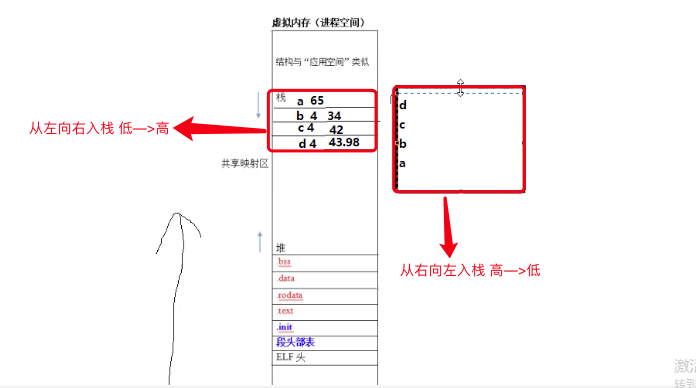

# 8. 可变参函数、可变参宏、do{}while(0)的妙用

## 8.1 可变参函数

### 8.1.1 什么是可变参函数

参数个数和类型不定的函数就是可变参函数，比如scanf和printf函数就是典型的可变参函数。

### 8.1.2 介绍可变参函数的意义

实际上我们自己所写的99%的c函数都是“定参函数”，参数个数和参数类型的都是确定，比如：

```c

void fun(int a, int *p, float c) //定参函数
{
    ...
}
```

我们自己使用“可变参函数”的情况并不多见，那么我们这里讲可变参函数的意义何在呢？

+ （1）虽然用的机会不多，但是有时还是有使用的可能的
+ （2）能够看懂c源码中可能存在的“可变参函数”
+ （3）借此理解printf、scanf可变参的实现原理，对printf、scanf函数不再感到神秘
+ （4）顺带介绍函数参数的“入栈顺序”

对于可变参的学习重在理解，不要死记忆，死记忆没有意义，当你真的某天用到时，能够基于理解然后快速用起来，这就可以了。

### 8.1.3 形参的入栈

#### （1）形参空间的开辟

在前面的章节讲过，在intel x86这种寄存器偏少的cpu和ARM这种寄存器偏多的cpu，形参空间的开辟会有所不同。

ARM：前四个形参空间开辟寄存器上，超过四个的多余的形参，则开辟在栈（内存）中。

这样做的目的是为了提高形参访问效率，因为寄存器的放速度要高于内存。

x86：所有的形参空间都开辟于栈中

为了便于讲解，我们这里只考虑所有形参都开辟于栈中的情况。


#### （2）形参的入栈顺序

例子：

```c
void fun(char a, int b, int c, float d)
{
    ...
}

int main(void)
{
    fun('a', 34, 42, 43.98);

    return 0;
}
```

顺序有两种：

+ 1）左到右
    也就是a b c d的顺序入栈。

    a: 高地址
    ...
    ...
    b：低地址

    我们将函数时，也提高过入栈，当时我们默认介绍的是“左到右”的入栈顺序。

+ 2）右到左
    也就是d c b a的顺序入栈。

    a: 低地址
    ...
    ...
    b：高地址
    不同平台（与OS、cpu）的入栈顺序是不一致的，入栈顺序与cpu、OS都有关系



+ （3）怎么测试入栈顺序

    ```c
    #include "stdio.h"

    void fun(int a, int b, int c, int d)
    {
        printf("%p\n", &a);
        printf("%p\n", &b);
        printf("%p\n", &c);
        printf("%p\n", &d);
    }

    int main(void)
    {
        fun(20, 34, 42, 43);
        return 0;
    }
    ```

    查看打印顺序：
    如果打印地址为从高到底：从右到左入栈

    windows这边是从“右到左”入栈的。

    如果打印地址为从低到高：从左到右入栈

    在Windows上的运行结果：

    ```shell
    0060ff00
    0060ff04
    0060ff08
    0060ff0c
    ```

    **Windows为从右到左入栈**

    在Linux上的运行结果：

    ```shell
    0x7ffdcac8fe3c
    0x7ffdcac8fe38
    0x7ffdcac8fe34
    0x7ffdcac8fe30
    ```

    **Linux为从左到右入栈**

    介绍入栈顺序的目的，主要是为了方便我们后面举例介绍“可变参函数”的实现。

### 8.1.4 可变参的实现

#### （1）可变参函数的定义格式

```c
返回类型 fun(type fmt, ...)

返回类型 fun(type fmt, type fm, ...)

.......
```

`...`代表可变参数，其它的为固定参数，而且至少包含一个固定参数，可变参数`...`只能在最后。

scanf和printf的函数原型：

```c
int printf(const char *format, ...);
int scanf(const char *format, ...);
```

从格式可以明显看出，scanf和printf也是可变参函数。

#### （2）获取“可变参数”的原理

可变参函数的定义格式非常简单，但问题是，我们应该如何获取每一个变参中值呢？
不管形参时从左到右入栈，还是从右到左入栈，其实获取变参值的原理都是一样的，之后举例时我们就以“从右到左”的顺序来介绍。

例子：

```c
void fun(char *fmt, ...)
{
    //获取...中每一个变参的值，然后进行处理
}

int main(void)
{
    fun("xxx", 10, 'a', 123.56);

    return 0;
}
```

fun的第一个形参的类型为`char *`，这个是定参，类型是写死的，而...中每个变参的类型则是由实参的类型来决定的。

不过需要注意的是，**在变参中当实参为int，short，char时，变参统统以int来接收，实参为float、double时则统统以double来接收**：

+ `10、'a'`：以int接收，也就说会从栈中开辟int空间来存放
+ `123.56`：以double来接收。
+ `xxx`：为字符串常量，实际是存放在了.rodata中，“固定形参fmt”中放的只是字符串指针。

我们假设是“从右到左”入栈。

**在fun函数中，如何访问...所代表的每个形参值呢？**

+ 第1步：首先我们使用一个`char *`的指针变量（比如ap），指向...中第一个变参的空间，也就是...最左边的那个。

+ 第2步：ap + ...中每个变参空间的大小，然后得到每一个变参空间的地址，然后再以每个变参空间的类型去解释
    “地址”所指向的空间。
    图8：

    `疑问`：如何知道...中每个参数的类型呢？
    答：我们需要通过第一个fmt参数(format)来得知...中每个变参的类型，讲到这里大家应该清楚了为什么scanf和printf函数的第一个参数会指定%d %s %f等格式，

    ```c
    printf("%d %f\n", 12, 123.56);
    ```

    这些格式就是用来指明每个变参的类型的，如果没有这些格式说明的话，就没有办法去解释每个变参空间。

    我们自己再实现“变参函数”时，可以沿用%d %f等这些格式，也可以自己规定新的格式，比如：

    **很重要**

    ```c
    c：char
    s：short
    i：int
    f：float
    d：double
    ```

#### （3）“解析变参”的具体实现

+ 1）具体实现步骤
     具体实现时，会使用到va_start、va_arg、va_end带参宏，这个几个宏定义在了stdarg.h中，我们实现变参函数时，必须包含这个.h，讲第5章时我们介绍过stdarg.h，大家应该有映像。
    + （a）定义一个`char *`指针变量
        ```c
        va_list ap
        ```
        va_list为typedef重命名后的类型名`(typedef char* va_list)`，所以`va_list ap`等价于`char *ap`  

    + （b）让ap指向...中第一个参数的空间
       ```c
       va_start(ap, prev_param) 
       ```
       +  ap：指向...中的第一个变参
       +  prev_param：...前的最后一个固定参数
          ...中的第一个参数与prev_param是紧挨着的，通过prev_param这个固定参数的指针，就可以计算机出...第一个参数的指针。

    + （c）让指针ap的指向发生移动，指向...中下一个变参的空间
        ```c
        va_arg(ap, type) 
        ```
        + ap：指向当前空间
        + type：当前空间的类型，具体代表什么类型，需要通过fmt来指定

        va_arg宏会计算出下一个变参空间的指针，计算方法为`ap = ap + sizeof(type);`
        我们只要拿到了...变参空间的指针，然后将ap强转为`type *`后，就可以解引用访问。		

    + （d）`va_end(ap)`
            操作完毕后，我们需要使用va_end将ap赋值为NULL，防止ap变为野指针，给程序带来潜在风险。
            其实我们直接`ap = NULL`也是可以的。

+ 2）例子代码

    ```c
    #include <stdio.h>
    #include <stdarg.h> //必须包含
    #include <string.h>

    void fun(char *fmt, ...) {
        int i = 0;
        int ival; // 接收c(char)、s(short)、i(int)
        double dval; // 接收f(float)、d(double)

        va_list ap; //等价于char *ap

        va_start(ap, fmt); //让ap指向f...中的第一个参数

        for (i = 0; i < strlen(fmt); i++) {
            switch (fmt[i]) {
                // c(char)、s(short)、i(int)都以int解释
                case 'c':
                case 's':
                case 'i':
                    ival = va_arg(ap, int);  // 指向下一个变参空间,同时返回当前位置的值,用int来接收不会丢精度
                    printf("%d\n", ival); // 打印实际收到的值
                    break;

                // f(float)、d(double)都以double解释
                case 'f':
                case 'd':
                    dval = va_arg(ap, double); // 指向下一个变参空间
                    printf("%lf\n", dval);
                    break;
            }
        }

        va_end(ap); //等价于ap = NULL
    }

    int main(void) {
        int a = 10;
        char b = 'a';
        float c = 123.56;

        //"icf"为 a b c各自对应的格式，对应关系必须一致，不能颠倒，否则解释就会出错
        fun("icf", a, b, c);

        return 0;
    }
    ```

    结果为：

    ```shell
    10
    97
    123.559998
    ```

## 8.2 可变参宏

### 8.2.1 可变参宏的写法

也是使用...来表示的，可变参宏其实就是为了和可变参函数配合使用而出现的。

### 8.2.2 常见的各种写法

#### （1）c标准语法所规定的写法

```c
#define debug(fmt, ...)  printf(fmt, __VA_ARGS__)  //写__VA_ARGS__代表“可变参数”
debug("%d %s\n", 234, "sdfdsf"); //参数可以根据自己的情况来变化
```

#### （2）GCC扩展语法

```c
#define debug(format, args...) printf(format, args)  //args这个名字并不固定
```

我们前面使用的就是这种情况。

### 8.2.2 如果不传递“可变参数”会怎样(只传一个参数，可变参数一个也没有)

比如：

```c
#define debug(format, args...) fprintf(format, args)
debug("11111111\n");  // 只传递了第一个参数，可变参数一个也没有
```

编译时会报错，那如何解决这个问题呢？  
`使用##来解决`，将以上宏定义改为如下形式。

```c
#define debug(fmt, ...)  printf(fmt, ##__VA_ARGS__)
```

或者：

```c
#define debug(format, args...) printf(format, ##args)
debug("11111111\n");  //这个写法就是允许的，适应起来可以更加的灵活
```

`##`的作用我们在第2章就详细介绍过，至于##在这里的作用，大家只需记住，**有了##后就可以省略“可变参数”**  
`为了让我们的调试宏更加的灵活，我们前面介绍的调试宏，都应该加上##`  

## 8.3 do{}while(0)的妙用

### 8.3.1 定义复杂宏时避免;所带来的错误

我们以前面的print_error宏为例，其实完全可以将`do{}while(0);`改为{}，改变后为

```c
#define print_error(str) \
do{\
    fprintf(stderr, "File %s, Line %d, Function %s error\n", __FILE__, __LINE__, str);\
    perror("error Reason");\
    exit(-1);\
}while(0);
```

改变后

```c
#define print_error(str) \
{\
    fprintf(stderr, "File %s, Line %d, Function %s error\n", __FILE__, __LINE__, str);\
    perror("error Reason");\
    exit(-1);\
}
```

我们平时使用宏时往往喜欢加;，但是当前面为if判断时，加;会导致出现错误。

```c
if(NULL == *p)
    print_error("malloc");
else
{
    ...
}

```

进行宏展开：

```c
if(NULL == *p)
{
    fprintf(stderr, "File %s, Line %d, Function %s error\n", __FILE__, __LINE__, str);
    perror("error Reason");
    exit(-1);
};
else
{
    ...
}
```

**在if的最后}后面是不能加;的，否则编译会报错** 

那么有些同学可能会说，只要记住不能加;就可以了，但是但凡是靠人预防都是容易出问题的，所以我们需要更保险、更傻瓜的方法，有了这个保险的方法后，不需要我们去刻意记忆要加不加;这种麻烦事。

但是我们使用do{}while(0);进行改进后,可以防止;的问题：

```c
#define print_error(str) \
do{\
    fprintf(stderr, "File %s, Line %d, Function %s error\n", __FILE__, __LINE__, str);\
    perror("error Reason");\
    exit(-1);\
}while(0);

if(NULL == *p)
    print_error( "malloc");
else
{
    ...
}
```

进行展开后：

```c
if(NULL == *p)
do{
    fprintf(stderr, "File %s, Line %d, Function %s error\n", __FILE__, __LINE__, str);
    perror("error Reason");
    exit(-1);
}while(0)
else
{
    ...
}
```

此时不加;和多加;都无所谓，不加原本就有一个;，多加也不会报错。

**`do{}while(0);`里面虽然包裹了好几句话，但是整体上`do{}while(0);`为一句话**，与下面的写法是类似的

```c
if(a > 100)
    printf("hello wolrd\n");  //一句话时{}可以省略
```

`do{...}while(0);`与其一样，也为一句话，当然你也可以将{}加上

```c
if(NULL == *p)
{
    do{
        fprintf(stderr, "File %s, Line %d, Function %s error\n", __FILE__, __LINE__, str);
        perror("error Reason");
        exit(-1);
    }while(0);;  //两个;;无所谓
}
```

但是由于里面只有一句话，所以外面的{}完全可以省略。

事实上在Linux下面，`do{}while(0)`还可以被`({...;..;})`替换，这个玩意我们在上一章就介绍过，它的作用与`do{}while(0)`所希望起到的作用是一样的，所以

```c
define print_error(str)\
do{\
    fprintf(stderr, "File %s, Line %d, Function %s error\n", __FILE__, __LINE__, str);\
    perror("error Reason");\
    exit(-1);\
}while(0);
```

完全可以替换为：

```c
define print_error(str)
({\
    fprintf(stderr, "File %s, Line %d, Function %s error\n", __FILE__, __LINE__, str);\
    perror("error Reason");\
    exit(-1);\
})
```

`({...;..;})`能够将多句话合为一句话。

不过由于`({...;..;})`是gcc才支持的写法，其它编译器不一定能识别，所以我们建议使用`do{}while(0)`

```c
#define container_of(ptr, type, member)\
    ({ \
        const typeof( ((type *)0)->member ) *__mptr = (ptr);\
        (type *)( (char *)__mptr - offsetof(type,member) );  \
    })
```

使用`do{}while(0)`来代替`({...;..;})`

```c
#define container_of(ptr, type, member)\
    do{ \
        const typeof( ((type *)0)->member ) *__mptr = (ptr);\
        (type *)( (char *)__mptr - offsetof(type,member) );  \
    } while(0)
```

### 8.3.2 避免使用大量的goto的使用

先举一个大量使用goto的例子

```c
int fun()
{
    int ret = 0;

    somestruct *ptr = malloc(...);

    ret = fun1(ptr); //返回1代表Ok
    if(ret != 1)
            goto FREE;

    ret = fun2(ptr); //返回1代表Ok
    if(ret != 1)
            goto FREE;

    ret = fun3(ptr); //返回1代表Ok
    if(ret != 1)
            goto FREE;

FREE:
    free(ptr);
    return 0;
}
```

因为goto的缺点，在c实际上不建议大量使用goto，但是这里确使用了很多的goto，显然不好，此时我们可以改为
如下形式：

```c
int fun()
{
    int ret = 0;

    somestruct *ptr = malloc(...);

    ret = fun1(ptr); //返回1代表Ok
    if(ret != 1)
    {
        free(ptr);
        return 0;
    }

    ret = fun2(ptr); //返回1代表Ok
    if(ret != 1)
    {
        free(ptr);
        return 0;
    }

    ret = fun3(ptr); //返回1代表Ok
    if(ret != 1)
    {
        free(ptr);
        return 0;
    }

    return 0;
}
```

这个写法也是可以的，但是这会多出很多冗余代码，让代码变的很臃肿，此时我们就可以使用`do{...}while(0);`
即能避免大量goto的使用，又可以让代码变的很简洁

```c
int fun()
{
    int ret = 0;

    somestruct *ptr = malloc(...);

    do
    {
        ret = fun1(ptr); 
        if(ret != 1) break;

        ret = fun2(ptr); 
        if(ret != 1) break;

        ret = fun3(ptr); 
        if(ret != 1) break;
    }while(0);

    free(ptr);
    return 0;
}
```

如果这里不使用do{...}while(0)的话，就只能使用前面的goto方式或者更繁琐的方式来实现。
