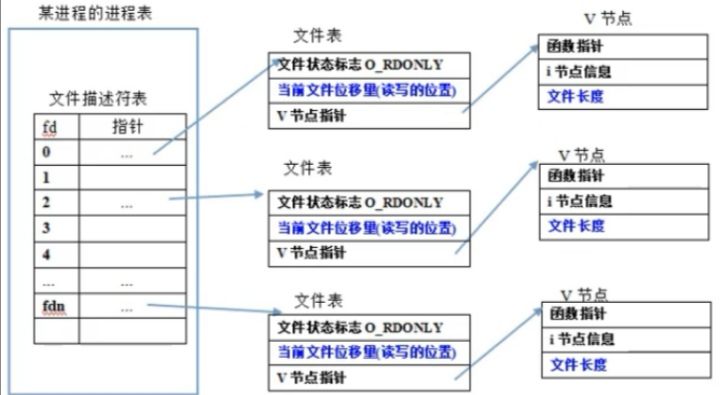
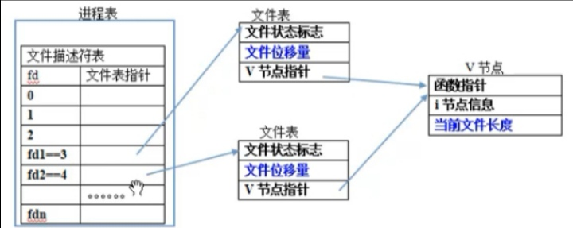
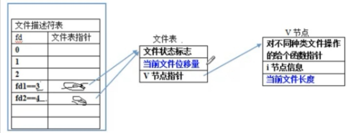

# 03_lseek-dup-fcntl-ioctl

## 4 lseek函数
	
我们在前面的例子中，简单的用过，在这一小节，我们就来详细的介绍一下，这个lseek函数的一些具体的情况。

### 4.1 函数原型和头文件

```c
#include <sys/types.h>
#include <unistd.h>

off_t lseek(int fd, off_t offset, int whence);
```

#### （1）功能

**调整读写的位置**，就像在纸上写字时，挪动笔尖所指位置是一样的  

C库的标准io函数里面有一个`fseek`函数，也是用于调整读写位置的

fseek就是对lseek系统函数封装后实现的，后面讲到标准io时，还会讲到fseek函数  

`默认当前读写文件位置为文件开头(SEEK_SET)`  

#### （2）返回值

+ 调用成功  
  **返回当前读写位置相对于文件`开始`位置的偏移量(字节byte)**

  可以使用lseek函数获取文件的大小，怎么获取？
  ```c
  ret = lseek(fd, 0, SEEK_END);
  ```
  将文件读写的位置移动到最末尾，然后获取返回值，这个返回值就是文件头与文件尾之间的字节数，也就是文件大小

+ 调用失败  
  返回-1，并给errno设置错误号。

#### （3）参数

```c
off_t lseek(int fd, off_t offset, int whence);
```

+ 1）`fd`：文件描述符，指向打开的文件
  
+ 2）offset
  精定位：微调位置  
  从whence指定的位置，向前或者向后移动指定字节数  
  +  为`负数`：向**前**移动指定字节数 
  +  为`正数`：向**后**移动指定字节数 

+ 3）`whence`：
  粗定位，选项有：  
  + `SEEK_SET`：调到文件**起始**位置
  + `SEEK_CUR`：调到文件**当前读写**的位置
  + `SEEK_END`：调到文件**末尾**位置

  不过当whence被指定为SEEK_SET时，如果offset被指定为负数的话，是没有意义，为什么?  
  因为已经到文件头上了，在向前移动就越界了，不再当前文件的范围内了，如果非要向前调整，lseek函数会报错  

### 4.2 代码演示

```c
#include <stdio.h>
#include <sys/types.h>
#include <unistd.h>
#include <sys/stat.h>
#include <fcntl.h>
#include <errno.h>

int main(void)
{
    int fd = -1;
    int ret = -1;
    fd = open("file.txt", O_RDWR);
    
    if(fd < 0){
        perror("open error");
        return -1;
    }
    
    // 获取文件大小
    // ret = lseek(fd, -10, SEEK_END);
    // printf("size of file = %d\n", ret);
    
    // 调整到文件尾部，返回调整后的位置相对于头部的距离(字节数).然后-10是指再从文件末尾向前数10个字节
    // 因为字符为1个字节，所以相当于向前移动10个字符
    ret = lseek(fd, -10, SEEK_END);
    if(ret < 0){
        perror("lseek fail");
        return -1;        
    }
    
    // 获取倒数10个字符
    char buf[30] = {0};
    read(fd, (void *)buf, sizeof(buf));
    printf("buf = %s\n", buf);;
    return 0;
}
```

`od -c 文件` ：以字符形式查看文件内容。

### 4.3 可以使用lseek制作出空洞文件

留到下一章再来介绍。

## 5. 文件描述符表

### 5.1 什么是文件描述符表

在前面的课程中，我们说当open打开文件成功后，会创建相应的结构体（数据结构），用于保存被打开文件的相关信息，对文件进行读写等操作时，会用到这些信息，这个数据结构就是我们要讲的“文件描述符表”. `文件描述符只存使用中的文件描述符，没在使用地不会在文件描述符表中出现`

### 5.2 进程表：`task_struct`

#### （1）前面我们介绍过`task_struct`结构体，这个结构体又叫进程表。

这个结构体的成员项非常多，多达近300个。


##### （2）每一个进程运行起来后，Linux系统都会为其在内存中开辟一个`task_struct`结构体


#### （3）task_struct专门用于存放进程在运行过程中，所涉及到的所有与进程相关的信息

  其中，:cn:**`文件描述符表就被包含在了task_struct中`**:cn:
  

#### （4）进程运行结束后，进程表所占用的内存空间，会被释放

### 5.3 task_struct 与 文件描述符表 之间的关系

#### 5.3.1 关系图



+ （1）`0/1/2`默认被使用了。
+ （2）文件状态标志  
  + 1）是什么  
    就是open文件时指定的`O_RDONLY`、`O_WRONLY`、`O_RDWR`、`O_TRUNC`、`O_APPEND`、`O_CREAT`、`O_EXCL`、`O_NONBLOCK`、`O_ASYNC`等
    比如：
    
    ```c
    //                             文件状态标志
    fd = open("./file1.txt", O_RDWR|O_CREAT|O_EXCL, 0664);
    ```

    open打开文件成功后，会将文件状态标志保存到“文件表”中。

  + 2）有什么用  
    读写文件时，会先检查“文件状态标志”，看看有没有操作权限，然后再去操作文件。比如open时指定的是：
    + （a）`O_RDONLY`  
    写（wrtie）文件时，通过fd检查“文件状态标志位”，发现只允许读，写操作会错误返回，并报“不允许写的错误”。演示：
    + （b）`O_WRONLY`  
    读（read）文件时，通过fd检查“文件状态标志位”，发现只允许写，读操作会错误返回，并报“不允许读的错误”  
    只有当“文件状态标志”允许相应的操作时，读写操作才能成功进行

+ （3）文件位移量 与 文件长度  
    它们不是一回事，不要搞混  
  + 1）文件位移量：文件当前读写位置与文件开始位置的距离(字节数)  
      “文件位移量”代表的就是文件读写的位置，read、write读写数据时，通过文件位移量，就知道从哪里开始读写了
      一般情况下打开文件时，文件的位移量默认为0，表示读写的位置在文件头上  
      每读写一个字节，文件读写位置（笔尖）就往后移动一个字节，文件位移量随之+1  
      调用lseek函数调整文件读写位置，其实就是修改文件位移量  

  + 2）文件长度：文件的大小   
      在写文件的过程中，每写一个字节的数据到文件中，文件的长度就+1，文件长度也是动态更新的

+ （4）函数指针  
  read、write等操作文件时，会根据底层具体情况的不同，调用不同的函数来实现读写，所以在V节点里面保存了这些不同函数的函数指针，方便调用。

#### 5.3.2 `O_APPEND` 

+ （1）功能
  open文件时，如果指定了这个文件状态标志，表示以追加的方式打开文件. 写文件时，会从文件的最末尾开始写操作

+ （2）追加的实现原理    
  文件的位移量代表的，就是文件的读写位置  
  open指定了O_APPEND时每次写文件时，都会把“文件位移量”设置为“文件的长度”，也就是说写的位置被调整到了末尾，写文件时从文件尾部进行追加每一次写操作后，文件的内容会增加，那么自然文件的长度会被动态更新
  总之，指定了O_APPEND后，每次写文件时，都会使用文件长度去更新文件位移量，保证每次都是从最末尾开始写数据的  

+ （3）O_APPEND的意义  
  多次open同一文件，实现共享操作时，指定O_APPEND可以防止数据相互覆盖的发生，后面会详细介绍

#### 5.3.3 O_TRUNC
  如果文件中原来就有数据的话，open打开文件时，会全部被清空。
  由于文件已经被清空了，所以将V节点中的文件长度，修改为0

### 5.4 共享操作文件

介绍两种情况：    
+ 同一进程共享操作相同的文件  
+ 多个进程之间，共享操作相同文件  

#### 5.4.1 同一进程（程序），多次open同一个文件

+ （1）在同一个进程中多次open打开同一文件时，文件描述符可能会相同吗?   
  答：不可能,在同一进程里面，一旦某个文件描述符被用了，在close释放之前，别人不可能使用，所以指向同一文件的描述符不可能相同  

+ （2）例子中写数据时，为什么会相互的覆盖？  
  + 1）看看共享操作时的文件描述符表长啥样
    由图知道，正是由于不同的文件描述符，各自对应一个独立的文件表，在文件表中有属于自己的“文件位移量”，开始时都是0  
    各自从0开始写，每写一个字节向后移动一个字节，他们写的位置是重叠的，因此肯定会相互的覆盖  
    
  + 2）怎么解决
    + （a）**指定O_APPEND即可解决**  
      必须每个open都要指定，有一个不指定就会覆盖，就先过马路一样，都要准守交通规则才能安全，开车的和行人，只要有一个不准守都会出事。

    + （b）**为什么使用O_APPEND可以解决?**  
      文件长度信息时大家共享的，当文件被写入数据后，文件长度就会被更新，都指定O_APPEND后，使用不同的文件描述符写数据时，都会使用文件长度更新自己的文件位移量，**保证每次都是在文件的最末尾写数据**，就不会出现相互覆盖的情况。

#### 5.4.2 多个进程(程序), 共享操作同一个文件			

+ （1）程序演示  
  不同进程打开同一文件时，各自使用的文件描述符值可能相等，比如我们例子中的1和2进程，它们open后的描述符就相等  
  之所以相同，是因为不同的进程有自己独立的文件描述符池，都是0~1023的范围，各自分配自己的，有可能分派到相等值的文件描述符  

+ （2）进程表 和 文件描述符表 
   共享操作同一个文件.jpg)
   

+ （3）覆盖的原因
  也是因为因为各自有独立的文件位移量。

+ （4）解决办法
  同样的，指定O_APPEND标志，写操作时，使用文件长度去更新文件位移量，保证各自操作时，都在文件的尾部操作，就不会出现相互覆盖的情况。
				
## 6、dup和dup2函数

### 6.1 dup

#### 6.1.1 函数原型

```c
#include <unistd.h>
int dup(int oldfd);
```

+ （1）功能
  复制某个已经打开的文件描述符，得到一个新的描述符，这个新的描述符，也指向被复制描述符所指向的文件。

  比如：4指向了某个文件，从4复制出5，让5也指向4指向的文件。

   ```c
    4 ——————> file.txt
                ^
   dup          |
                |
    5 ——————————|
   ```


  至于需要用到的新描述符，**dup会使用描述符池(0~1023)中当前最小没用的那一个**  

+ （2）返回值
  +  1）成功：返回复制后的新文件描述符  
  +  2）失败：返回-1，并且errno被设置  

+ （3）参数
  oldfd：会被复制的、已经存在的文件描述符。
  
#### 6.1.2 代码演示

```c
#include <stdio.h>
#include <string.h>
#include <sys/types.h>
#include <sys/stat.h>
#include <fcntl.h>
#include <unistd.h>
#include <errno.h>
#include <stdlib.h>

#define FILE_NAME "file.txt"

#define print_error(str) \
do{\
    fprintf(stderr, "File %s, Line %d, Function %s error\n",__FILE__, __LINE__, __func__);\
    perror(str);\
    exit(-1);\
}while(0);

int main(void)
{
    int fd1 = -1;
    int fd2 = -1;
    
    fd1 = open(FILE_NAME, O_RDWR | O_TRUNC);
    
    if(fd1 < 0){
        print_error("open fd1 fail");
    }
    
    fd2 = dup(fd1);
    if(fd1 < 0){
        print_error("dup fd2 fail");
    }
    
    printf("fd1 = %d, fd2 = %d\n", fd1, fd2);
    
    write(fd1, "hello1\n", 7);
    write(fd2, "hello2\n", 7);
    
    return 0;   
}
```

结果为：

```shel
fd1 = 3, fd2 = 4
```

文件内容为：

```txt
hello1
hello2

```

###  6.2 dup2

#### 6.2.1 函数原型

```c
#include <unistd.h>
int dup2(int oldfd, int newfd);
```

+ （1）功能  
    功能同dup，只不过在dup2里面，我们**可以自己指定新文件描述符**  **如果这个新文件描述符已经被打开了，dup2会把它给关闭后再使用**  

    比如：
    
    ```c
    dup(2, 3); // 从2复制出3，让3也指向2所指向的文件，如果3之前被打开过了，dup2会关闭它，然后在使用
    ```

    dup2和dup的**不同之处**在于：  
    + `dup`：自己到文件描述符池中找新文件描述符
    + `dup2`：我们可以自己指定新文件描述符


+ （2）返回值
  +  1）成功：返回复制后的新文件描述符
  +  2）失败：返回-1，并且errno被设置。

+ （3）参数
  +  `oldfd`：会被复制的、已经存在的文件描述符。
  +  `newfd`：新的文件描述符
  
#### 6.2.2 代码演示

```c
 fd2 = dup(fd1); // dup自定选择未用的最小fd,结果是fd1 = 3, fd2 = 4
 fd2 = dup2(fd1, 5); // dup2可以自己强制指定fd，结果是fd1 = 3, fd2 = 5
```

### 6.3 dup、dup2复制的意义

#### 6.3.1 实现文件共享操作

+ （1）代码演示：
  ```c
  #include <stdio.h>
  #include <sys/types.h>
  #include <sys/stat.h>
  #include <fcntl.h>
  #include <stdlib.h>
  #include <unistd.h>

  #define FILE_NAME "file.txt"

  #define print_error(str) \
  do{\
      fprintf(stderr, "File %s, Line %d, Function %s error\n",__FILE__, __LINE__, __func__);\
      perror(str);\
      exit(-1);\
  }while(0);

  int main(void)
  {
    int fd1 = 0;
    int fd2 = 0;
    fd1 = open(FILE_NAME, O_RDWR|O_TRUNC);
    if(-1 == fd1) print_error("1 open fail");

    //fd2 = dup(fd1);
    fd2 = dup2(fd1, 4);

    printf("fd1 = %d, fd2 = %d\n", fd1, fd2);

    while(1)
    {
      write(fd1, "hello\n", 6);
      sleep(1);
      write(fd2, "world\n", 6);
    }

    return 0;
  }
  ```
   
   **结果**：交替输出hello 和 world 不会互相影响和覆盖
   
+ （2）为什么没有出现相互覆盖情况？
  `为什么没有覆盖？`  
  **`使用dup、dup2复制方式实现文件共享时，不管复制出多少个文件描述符，它们永远只有一个文件表，所以使用所有描述符去操作文件时，最后使用的都是通过同一个文件位移量，不管谁操作后文件位移量都会被更新，因此不会出现覆盖`**
  

#### 6.3.2 实现重定位 

+ （1） 什么是重定位  
  某文件描述符原来指向了A文件，输出数据是输出到A文件，但是重定位后，文件描述符指向了B文件，输出时数据输出到了B文件，这就是重定位 
  所谓重定位，说白了就是，文件描述符所指向的文件该变了，使得数据输出的目标文件也随之变  

+ （2） 举例使用dup、dup2实现重定位
 
  ```c
  #include <stdio.h>
  #include <sys/types.h>
  #include <sys/stat.h>
  #include <fcntl.h>
  #include <stdlib.h>
  #include <unistd.h>

  #define FILE_NAME "file.txt"

  #define print_error(str) \
  do{\
    fprintf(stderr, "File %s, Line %d, Function %s error\n",__FILE__, __LINE__, __func__);\
    perror(str);\
    exit(-1);\
  }while(0);

  int main(void)
  {
      int fd1 = 0;
      int fd2 = 0;
      fd1 = open(FILE_NAME, O_RDWR|O_TRUNC);
      if(-1 == fd1) print_error("1 open fail");

      close(1); // 关闭stdout的指针，方便下面重定向到文件中
      fd2 = dup(fd1); // fd2一定会把上面关掉的stout文件描述符重定向过来，所以下面的printf的东西都会输出到file.txt中
      
      // 上面的两行代码等下于下面的一行,dup2检测到文件描述符1被占用会先自动关闭，不用我们手动close了
      // fd2 = dup2(fd1, 1);

      printf("fd1 = %d, fd2 = %d\n", fd1, fd2);

      printf("hello world\n");

      return 0;
  }
  ```
  
  结果file.txt的内容为：
  
  ```txt
  fd1 = 3, fd2 = 1
  hello world

  ```

  + 1）回顾printf与write的关系

    ```txt
    printf(...)
        |
        |
    write(1, buf, ...)
    ```
    printf输出时，原本通过1，将数据输出到标准输出文件（显示器）的，但是现在，我想让printf输出到file.txt文件，而不是输出到屏幕，应该怎么办？  
    
    最简单的办法是就是，把printf函数调用的write函数里面的1，改成指向file.txt文件的新描述符即可，但是不幸的是write中的1写死了，1这个数字改不了，怎么办？  
    1这个数改不了，但是可以对1进行重定位，让1不再指向标准输出文件，而是指向file.txt，printf的数据，就输出到了file.txt文件中。

  + 2）实现步骤
    + （a）`open file.txt文件`，返回一个文件描述符，比如3

        ```txt
        3 ————> file.txt
        ```
        
    + （b）`close(1)`，不要再让1指向标准输出文件（/dev/stdout）


    + （c）使用dup、dup2把3复制到1上，让1也指向file.txt文件

        ```shell
        3——————>file.txt
                  ^
                  |
        1—————————|  X  ——————> /dev/stdout
        ```

       1这个文件描述符就被重定位了，凡是通过1输出的数据，都被写到了file.txt中，printf底层调用的是write(1, ...)，用的也是1，printf的数据就被输出到了file.txt中。相当于printf函数的输出目的地，被重定位为了新的文件，这就是重定位。

       思考题：scanf默认从标准输入文件（键盘）读数据，请大家自行写代码对0进行重定位，重定位后，让scanf从file.txt
       
        ```txt
        scanf(....)
          |
          |
        read(0, ...)
        ```

+ （3） 什么时候会使用dup、dup2，来实现从定位？  
    **函数中的文件描述符值写死了，无法修改为新的描述符，但是你又希望该函数，把数据输出到其它文件中**，此时就可以使用dup、dup2对该函数中的文件描述符，进行重定位，指向新的文件，函数就会将数据输出到这个新文件

+ （4） 重定位 `>`   
  
  > 重定位 命令（>）是dup、dup2的典型应用，这个命令在重定位时，就是调用dup、dup2函数来实现的。

  + 1）>使用的例子

    ```shell
    ls > file.txt
    ```
    
    ls的结果原本是输出到显示器的，但是>从定位后，就输出到了file.txt文件。

  + 2）具体从定位的过程
    + （a）>命令（程序）会open打开file.txt文件，假设返回的文件描述符是3

       ```txt
        3————>file.txt
       ```

    + （b）ls命令（程序）原本会调用write(1, ...)，将结果输出到标准输出文件（显示器），但是 >会调用dup2，把3复制到1上，实现重定位，让1也指向file.txt文件，ls的结果自然就输出到file.txt文件了

        ```shell
        3————>file.txt
              ^
              |
              |
        1—————|  X  ——————> /dev/stdout
        ```

## 7. 总结：文件的共享操作

+ （1）**单一进程多次open同一个文件，实现共享操作**
   
+ （2）**多个进程多次open，共享操作同一个文件**
   共享操作同一个文件.jpg)
+ （3）**在单个进程中，使用dup、dup2实现文件共享操作**
   

## 8. fcntl函数

### 8.1 函数原型

不要去记我们讲的这些函数，但现在为止我也没记不住  
我能记住的就是他们大概的用法，用到时，直接查阅man手册或者相关资料，自然就能立刻把它用起来
所以对于大家来说，学习这些函数的重点是于理解，而不是记住

#### （1）功能

fcntl函数其实是File Control的缩写，通过fcntl可以设置、或者修改已打开的文件性质。

#### （2）返回值

+ 调用成功：返回值视具体参数而定，这个后面还会再介绍
+ 调用失败：返回-1，并把错误号设置给errno。

#### （3）参数

```c
int fcntl(int fd, int cmd, ... /* arg */ );
```

+ 1）fd：指向打开文件
+ 2）cmd：控制命令，通过指定不同的宏来修改fd所指向文件的性质。
  + （a）`F_DUPFD`
      + 复制描述符，可用来用来模拟dup和dup2，后面会有例子对此用法进行说明。
      + 返回值：返回复制后的新文件描述

  + （b）`F_GETFL`、`F_SETFL`
      + 获取、设置文件状态标志，比如在open时没有指定O_APPEND，可以使用fcntl函数来补设。
      + 返回值：返回文件的状态
      
  +   什么时候需要fcntl来补设？

      当文件描述符不是你自己open得到，而是调用别人给的函数，别人的函数去open某个文件，然后再将文件描述符返回给你用，在这种情况下，我们是没办法去修改被人的函数，在他调用的open函数里补加文件状态标志。

      此时就可以使用fcntl来布设了，使用fcntl补设时，你只需要知道文件描述符即可。

      c、d、e这三种情况，后面课程中具体涉及到后，再来详细介绍如何。

  + （c）F_GETFD、F_SETFD	

  + （d）F_GETOWN、F_SETOWN

  + （e）F_GETLK或F_SETLK或F_SETLKW
  
### 8.5、测试用例

#### 8.5.1 fcntl 模拟dup和dup2

不过，我们真要进行文件描述符复制时，往往都使用dup、dup2来实现，而不会使用fcntl，这里使用fcntl来模拟dup、dup2，完全是为了向大家演示一下，fcntl这个函数是怎么用的。

+ （1）fcntl模拟dup, 代码演示

   ```c
  #include <stdio.h>
  #include <sys/types.h>
  #include <sys/stat.h>
  #include <fcntl.h>
  #include <stdlib.h>
  #include <unistd.h>
  
  #define FILE_NAME "file.txt"
  
  #define print_error(str) \
  do{\
    fprintf(stderr, "File %s, Line %d, Function %s error\n",__FILE__, __LINE__, __func__);\
    perror(str);\
    exit(-1);\
  }while(0);
  
  int main(void)
  {
      int fd = -1;
      fd = open(FILE_NAME, O_RDWR);
      if(-1 == fd) print_error("1 open fail");
  
      close(1); // 关闭stdout的指针，方便下面重定向到文件中
      int fd_tmp = fcntl(fd, F_DUPFD, 0); // 第三个参数不想传就设置为0
  
  
      printf("hello world fd_tmp = %d\n", fd_tmp);
  
      return 0;
  }
  ```

  会把printf的内容重定向输出到file.txt中，内容为

   ```shell
   hello world fd_tmp = 1

   ```

+ （2）fcntl模拟dup2,代码演示
  dup2进行复制时，如果新的文件描述符已经被用，dup2函数会关闭它，然后再复制，但是fcntl模拟dup2时，必须自己手动的调用close来关闭，然后再进行复制  

  ```c
  #include <stdio.h>
  #include <sys/types.h>
  #include <sys/stat.h>
  #include <fcntl.h>
  #include <stdlib.h>
  #include <unistd.h>
  
  #define FILE_NAME "file.txt"
  
  #define print_error(str) \
  do{\
    fprintf(stderr, "File %s, Line %d, Function %s error\n",__FILE__, __LINE__, __func__);\
    perror(str);\
    exit(-1);\
  }while(0);
  
  int main(void)
  {
      int fd = -1;
      fd = open(FILE_NAME, O_RDWR);
      if(-1 == fd) print_error("1 open fail");
  
      /* 模拟dup */
	    //close(1);
	    //dup(fd);
	    
	    //close(1);
	    //fcntl(fd, F_DUPFD, 0);
	    
	    /* 模拟dup2 */
	    //dup2(fd, 1);
	    close(1);
	    int fd_tmp = fcntl(fd, F_DUPFD, 1);

      printf("hello world fcntl fd_tmp = %d\n", fd_tmp);
  
      return 0;
  }
  ```

  和上面模拟dup的结果相同，file.txt内容如下

  ```txt
  hello world fcntl fd_tmp = 1
  
  ```

#### 8.5.2 fcntl补设O_APPEND文件状态标志

```c
#include <stdio.h>
#include <sys/types.h>
#include <sys/stat.h>
#include <fcntl.h>
#include <unistd.h>
#include <errno.h>

#define FILE_NAME "file.txt"

#define print_error(str) \
do{\
  fprintf(stderr, "File %s, Line %d, Function %s error\n",__FILE__, __LINE__, __func__);\
  perror(str);\
}while(0);

int open_fun1(void)
{
	int fd = open(FILE_NAME, O_RDWR);
	if(-1 == fd) 
	{
		print_error("open fail");
		return 0;
	}
	return fd;
}	

int open_fun2(void)
{
	int fd = open(FILE_NAME, O_RDWR);
	if(-1 == fd)
	{
		print_error("open fail");
		return 0;
	}
	return fd;
}	

int main(void)
{
	int fd1 = 0;
	int fd2 = 0;
	int flag = 0;

	fd1 = open_fun1();
	fd2 = open_fun2();
	
	/* 直接制定F_SETFL时，会直接使用新的标志，去修改掉就的标志
	   返回的是新设置的标志
	 */
	flag = O_WRONLY|O_TRUNC|O_APPEND;
	fcntl(fd1, F_SETFL, flag);

	/* 保留原有标志，然后在原有标志的基础上，叠加新标志 */
	flag = fcntl(fd2, F_GETFL, 0);//获取原有标志
	flag = flag | O_TRUNC | O_APPEND;//叠加
	fcntl(fd2, F_SETFL, flag); //设置回去
	

	while(1)
	{
		write(fd1, "hello\n", 6);
		sleep(1);
		write(fd2, "world\n", 6);
	}
		
	
	return 0;
}
```

## 9. ioctl

### 9.1 为什么有ioctl这个函数

在某些特殊的情况下，使用read、write、lseek函数进行文件io（读写）操作时，存在一定的问题，此时往往就是使用ioctl函数，来实现这些比较特殊情况的io操作

ioctl是一个杂物箱，根据设置参数的不同，有很多种不同的功能，如果没有特定使用环境作为支撑的话，这个函数理解起来不太容易，因此在这里，我们先记住有这么一个函数，有关它的使用，等后面涉及到了具体应用环境时，再来具体讲解
