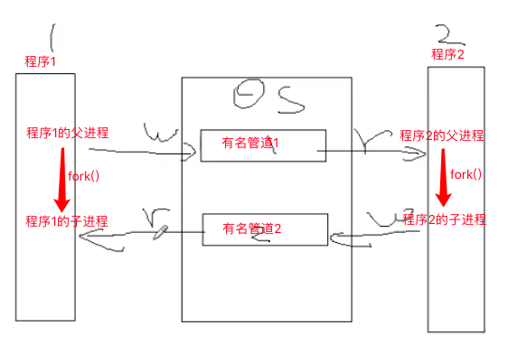

# 2. 有名管道

## 2.1 为什么叫“有名管道”

无名管道因为没有文件名，被称为了无名管道，同样的道理，有名管道之所以叫“有名管道”，是因为它有文件名。

也就是说当我们调用相应的API创建好“有名管道”后，会在相应的路径下面看到一个叫某某名字的“有名管道文件”。

不管是有名管道，还是无名管道，它们的本质其实都是一样的，它们都是内核所开辟的一段缓存空间。

进程间通过管道通信时，本质上就是通过共享操作这段缓存来实现，只不过操作这段缓存的方式，是以读写文件的形式来操作的。

## 2.2 有名管道特点

### 2.2.1 能够用于非亲缘进程之间的通信

因为**有文件名**，所以进程可以直接调用open函数打开文件，从而得到文件描述符，不需要像无名管道一样，必须在通过继承的方式才能获取到文件描述符。

所以**任何两个进程之间，如果想要通过“有名管道”来通信的话，不管它们是亲缘的还是非亲缘的，只要调用open函数打开同一个“有名管道”文件，然后对同一个“有名管道文件”进行读写操作，即可实现通信**。

```shell
A进程 —————————> 有名管道 ————————> B进程
```

总之，不管是亲缘进程还是非亲缘进程，都可以使用有名管道来通信。

### 2.2.2 读管道时，如果管道没有数据的话，读操作同样会阻塞(休眠)

### 2.2.3 当进程写一个所有读端都被关闭了的管道时，进程会被内核返回SIGPIPE信号

如果不想被该信号终止的话，我们需要忽略、捕获、屏蔽该信号。

不过一般情况下，不需要对这个信号进行处理，除非你有必须要处理的理由。

## 2.3 有名管道的使用步骤

+ （1）进程调用mkfifo创建有名管道
+ （2）open打开有名管道
+ （3）read/write读写管道进行通信

对于通信的两个进程来说，创建管道时，只需要一个人创建，另一个直接使用即可。

为了保证管道一定被创建，最好是两个进程都包含创建管道的代码，谁先运行就谁先创建，后运行的发现管道已
经创建好了，那就直接open打开使用。

## 2.4 有名管道API

### 2.4.1 函数原型

```c
#include <sys/types.h>
#include <sys/stat.h>
int mkfifo(const char *pathname, mode_t mode);
```

#### （1）功能

创建有名管道文件，创建好后便可使用open打开

如果是创建普通文件的话，我们可以使用open的O_CREAT选项来创建，比如：

```c
open("./file", O_RDWR|O_CREAT, 0664);
```

但是对于“有名管道”这种特殊文件，这里只能使用mkfifo函数来创建。

#### （2）参数

+ 1）pathname：被创建管道文件的文件路径名。
+ 2）mode：指定被创建时原始权限，一般为0664（110110100），必须包含读写权限。
  使用open函数创建普通文件时，指定原始权限是一样的

  ```c
  open("./file", O_RDWR|O_CREAT, 0664);
  ```

  不过我们学习第2章时讲过，创建新文件时，

  ```c
  文件被创建时的真实权限 = mode & (~umask)
  ```

  umask是文件权限掩码，一般默认为002或者022，对umask不清楚的同学，请会看第2章。

  ```c
  mkfifo(“./fifo”, 0664);
  ```

#### （3）返回值

+ 成功返回0
+ 失败则返回-1，并且errno被设置

#### （4）代码演示

```c
#include <stdio.h>
#include <unistd.h>
#include <errno.h>
#include <stdlib.h>
#include <strings.h>
#include <sys/types.h>
#include <sys/stat.h>
#include <fcntl.h>
#include <errno.h>
#include <signal.h>

#define FIFO_NAME1 "./fifo1"

#define print_error(str) \
do{\
    fprintf(stderr, "File %s, Line %d, Function %s error\n",__FILE__, __LINE__, __func__);\
    perror(str);\
    exit(-1);\
}while(0);

int create_open_fifo(char *fifoname, int open_mode)
{
    int ret = -1;
    int fd = -1;

    ret = mkfifo(fifoname, 0664); // 创建有名管道
    if((ret == -1) && (errno != EEXIST)) print_error("mkfifo fail");// 出异常退出程序,fifo文件已经存在的错误要忽略

    fd = open(fifoname, open_mode); //打开有名管道文件进行写操作
    if(fd == -1) print_error("open fail");

    return fd;
}

void signal_func(int signo)
{
    remove(FIFO_NAME1); // unlink也行.删除fifo文件
    exit(-1);// 退出进程
}

int main(void)
{
    int ret = -1;
    int fd = -1;
    char buf[] = "helloworld";

    signal(SIGINT, signal_func); //程序执行完清理下有名管道文件fifo.这句话需要放在创建create函数前面
    fd = create_open_fifo(FIFO_NAME1, O_WRONLY);

    while(1){
        bzero(buf, sizeof(buf)); // 先清空下
        write(fd, buf, sizeof(buf));
    }

    return 0;
}
```

执行时会创建fifo1有名管道文件，按Ctrl+C退出程序时会自动把前面生成的fifo1删除掉

### 2.4.2 代码演示

比如有两个进程想要通信，而且还是非亲缘进程，此时我们就可以使用“有名管道”来通信。

+ （1）单向通信
  mkfifo_single_write.c 用于写内容

  ```c
  // mkfifo_single_write.c
  #include <stdio.h>
  #include <unistd.h>
  #include <errno.h>
  #include <stdlib.h>
  #include <strings.h>
  #include <sys/types.h>
  #include <sys/stat.h>
  #include <fcntl.h>
  #include <errno.h>
  #include <signal.h>
  
  #define FIFO_NAME1 "./fifo1"
  
  #define print_error(str) \
  do{\
      fprintf(stderr, "File %s, Line %d, Function %s error\n",__FILE__, __LINE__, __func__);\
      perror(str);\
      exit(-1);\
  }while(0);
  
  int create_open_fifo(char *fifoname, int open_mode)
  {
      int ret = -1;
      int fd = -1;
  
      ret = mkfifo(fifoname, 0664); // 创建有名管道
      if((ret == -1) && (errno != EEXIST)) print_error("mkfifo fail");// 出异常退出程序,fifo文件已经存在的错误要忽略

      fd = open(fifoname, open_mode); //打开有名管道文件进行写操作
      if(fd == -1) print_error("open fail");

      return fd;
  }
  
  void signal_func(int signo)
  {
      remove(FIFO_NAME1); // unlink也行.删除fifo文件
      exit(-1);// 退出进程
  }
  
  int main(void)
  {
      int ret = -1;
      int fd = -1;
      char buf[] = "helloworld";

      signal(SIGINT, signal_func); //程序执行完清理下有名管道文件fifo.这句话需要放在创建create函数前面
      fd = create_open_fifo(FIFO_NAME1, O_WRONLY); // 只写方式方式

      while(1){
          bzero(buf, sizeof(buf)); // 先清空下
          scanf("%s", buf);
          write(fd, buf, sizeof(buf));
      }

      return 0;
  }
  ```

  mkfifo_single_read.c用于读数据

  ```c
  // mkfifo_single_read.c
  #include <stdio.h>
  #include <unistd.h>
  #include <errno.h>
  #include <stdlib.h>
  #include <strings.h>
  #include <sys/types.h>
  #include <sys/stat.h>
  #include <fcntl.h>
  #include <errno.h>
  #include <signal.h>
  
  #define FIFO_NAME1 "./fifo1"
  
  #define print_error(str) \
  do{\
      fprintf(stderr, "File %s, Line %d, Function %s error\n",__FILE__, __LINE__, __func__);\
      perror(str);\
      exit(-1);\
  }while(0);
  
  int create_open_fifo(char *fifoname, int open_mode)
  {
      int ret = -1;
      int fd = -1;
  
      ret = mkfifo(fifoname, 0664); // 创建有名管道
      if((ret == -1) && (errno != EEXIST)) print_error("mkfifo fail");// 出异常退出程序,fifo文件已经存在的错误要忽略

      fd = open(fifoname, open_mode); //打开有名管道文件进行写操作
      if(fd == -1) print_error("open fail");

      return fd;
  }
  
  void signal_func(int signo)
  {
      remove(FIFO_NAME1); // unlink也行.删除fifo文件
      exit(-1);// 退出进程
  }
  
  int main(void)
  {
      int ret = -1;
      int fd = -1;
      char buf[] = "helloworld";

      signal(SIGINT, signal_func); //程序执行完清理下有名管道文件fifo.这句话需要放在创建create函数前面
      fd = create_open_fifo(FIFO_NAME1, O_RDONLY); // 只读方式打开

      while(1){
          bzero(buf, sizeof(buf)); // 先清空下
          read(fd, buf, sizeof(buf)); // 当mkfifo_single_write中的scanf阻塞时，写阻塞，mkfifo_single_read这边读也会阻 塞，所以不会无限制打印东西
          printf("recv: %s\n", buf);
      }

      return 0;
  }
  ```

  执行过程和结果：

  ```shell
  # mkfifo_single_write.c执行结果
  root@9bcde94681d8:/workspace/chapter07ipc# gcc mkfifo_single_write.c -o mkfifo_single_write
  root@9bcde94681d8:/workspace/chapter07ipc# ./mkfifo_single_write
  sdfs
  sfdgreregs
  ```

  ```shell
  # mkfifo_single_read.c执行结果
  root@9bcde94681d8:/workspace/chapter07ipc# gcc mkfifo_single_read.c -o mkfifo_single_read
  root@9bcde94681d8:/workspace/chapter07ipc# ./mkfifo_single_read
  recv: sdfs
  recv: sfdgreregs
  ```

+ （2）双向通信
  同样的，使用一个“有名管道”是无法实现双向通信的，因为也涉及到抢数据的问题。所以双向通信时需要两个管道 

  **两个进程各自创建子进程来实现双向通信**
 
    

  实现两个程序双向通信的 总结：  

  + 程序1 mkfifo_double_write.c 父进程写fd1, 子进程读fd2
  + 程序2 mkfifo_double_read.c  父进程读fd1, 子进程写fd2

  ```c
  // mkfifo_double_write.c 父进程写fd1,子进程读fd2
  #include <stdio.h>
  #include <unistd.h>
  #include <errno.h>
  #include <stdlib.h>
  #include <strings.h>
  #include <sys/types.h>
  #include <sys/stat.h>
  #include <fcntl.h>
  #include <errno.h>
  #include <signal.h>
  
  #define FIFO_NAME1 "./fifo1"
  #define FIFO_NAME2 "./fifo2"
  
  #define print_error(str) \
  do{\
      fprintf(stderr, "File %s, Line %d, Function %s error\n",__FILE__, __LINE__, __func__);\
      perror(str);\
      exit(-1);\
  }while(0);
  
  int create_open_fifo(char *fifoname, int open_mode)
  {
      int ret = -1;
      int fd = -1;
  
      ret = mkfifo(fifoname, 0664); // 创建有名管道
      if((ret == -1) && (errno != EEXIST)) print_error("mkfifo fail");// 出异常退出程序,fifo文件已经存在的错误要忽略

      fd = open(fifoname, open_mode); //打开有名管道文件进行写操作
      if(fd == -1) print_error("open fail");

      return fd;
  }
  
  void signal_func(int signo)
  {
      remove(FIFO_NAME1); // unlink也行.删除fifo文件
      remove(FIFO_NAME2); // unlink也行.删除fifo文件
      exit(-1);// 退出进程
  }
  
  int main(void)
  {
      char buf[100] = {0}; // 存储写入和读取的内容
      int ret = -1;
      int fd1 = -1;
      int fd2 = -1; // 用于双向通信而加地命名管道,放在子进程里调用

      fd1 = create_open_fifo(FIFO_NAME1, O_WRONLY); // 只写方式方式
      fd2 = create_open_fifo(FIFO_NAME2, O_RDONLY); // 只读方式打开

      ret = fork();

      if(ret > 0){
          signal(SIGINT, signal_func); //程序执行完清理下有名管道文件fifo.父进程清理
          // 父进程 写入
          while(1){
              bzero(buf, sizeof(buf)); // 先清空下
              scanf("%s", buf);
              write(fd1, buf, sizeof(buf));
          }
      }else if(ret == 0){
          // 子进程 读取
           while(1){
              bzero(buf, sizeof(buf)); // 先清空下
              read(fd2, buf, sizeof(buf)); // 当mkfifo_single_write中的scanf阻塞时，写阻塞，mkfifo_single_read这边读也会阻塞，所以不会无限制打印东西
              printf("parent recv: %s\n", buf);
              sleep(1); // 防止关闭写进程会，读进程无限打印导致系统崩溃
          }
      }
      return 0;
  }
  ```

  ```c
  // mkfifo_double_read.c 父进程读fd1, 子进程写fd2
  #include <stdio.h>
  #include <unistd.h>
  #include <errno.h>
  #include <stdlib.h>
  #include <strings.h>
  #include <sys/types.h>
  #include <sys/stat.h>
  #include <fcntl.h>
  #include <errno.h>
  #include <signal.h>
  
  #define FIFO_NAME1 "./fifo1"
  #define FIFO_NAME2 "./fifo2"
  
  #define print_error(str) \
  do{\
      fprintf(stderr, "File %s, Line %d, Function %s error\n",__FILE__, __LINE__, __func__);\
      perror(str);\
      exit(-1);\
  }while(0);
  
  int create_open_fifo(char *fifoname, int open_mode)
  {
      int ret = -1;
      int fd = -1;
  
      ret = mkfifo(fifoname, 0664); // 创建有名管道
      if((ret == -1) && (errno != EEXIST)) print_error("mkfifo fail");// 出异常退出程序,fifo文件已经存在的错误要忽略

      fd = open(fifoname, open_mode); //打开有名管道文件进行写操作
      if(fd == -1) print_error("open fail");

      return fd;
  }
  
  void signal_func(int signo)
  {
      remove(FIFO_NAME1); // unlink也行.删除fifo文件
      remove(FIFO_NAME2); // unlink也行.删除fifo文件
      exit(-1);// 退出进程
  }
  
  int main(void)
  {
      char buf[] = "helloworld";
      int ret = -1;
      int fd1 = -1;
      int fd2 = -1; // 用于双向通信而加地命名管道,放在子进程里调用

      fd1 = create_open_fifo(FIFO_NAME1, O_RDONLY); // 只读方式打开
      fd2 = create_open_fifo(FIFO_NAME2, O_WRONLY); // 只写方式方式

      ret = fork();
      if(ret > 0){
          signal(SIGINT, signal_func); //程序执行完清理下有名管道文件fifo.父进程清理
          // 父进程 读取
          while(1){
              bzero(buf, sizeof(buf)); // 先清空下
              read(fd1, buf, sizeof(buf)); // 当mkfifo_single_write中的scanf阻塞时，写阻塞，mkfifo_single_read这边读也会阻塞，所以不会无限制打印东西
              printf("child recv: %s\n", buf);
              sleep(1); // 防止关闭写进程会，读进程无限打印导致系统崩溃
          }
      }else if(ret == 0){
          // 子进程 写入
          while(1){
              bzero(buf, sizeof(buf)); // 先清空下
              scanf("%s", buf);
              write(fd2, buf, sizeof(buf));
          }
      }
      return 0;
  }
  ```

## 2.5 什么时候使用有名管道

### （1）实现网状通信

面对众多进程网状通信，有名管道依然实现起来很吃力，所以基本也只适合于两个进程之间的通信。

你自己可以尝试下，看看能不能使用有名管道来实现多进程的网状通信，在实现过程中，你自己就会发现，实现起来很困难。

### （2）什么时候合适使用有名管道

当两个进程需要通信时，不管是亲缘的还是非亲缘的，我们都可以使用有名管道来通信。

至于亲缘进程，你也可以选择前面讲的无名管道来通信。

## 2.6 总结与回顾

### （1）回顾有名管道双向通信

在使用有名管道实现双向通信时，由于读管道是阻塞读的，为了不让“读操作”阻塞“写操作”，使用了父子进程来多线操作，

+ 1）父进程这条线：读管道1
+ 2）子进程这条线：写管道2

实际上我们后面学习了线程以后，凡是涉及到多线操作的，基本都使用多线程来实现，比如

+ 1）主线程：读管道1
+ 2）次线程：写管道2

不过由于我们目前还没有讲线程，所以目前没办法使用线程来实现，后面把线程讲完之后，我们就可以把这个代码中的多进程改为多线程了。

### （2）对比多进程和多线程各自使用的场合

我们前面讲了进程，虽然线程还没有讲，但是大家大致也能理解线程是一个什么样的东西，事实上线程和进程都是并发运行的，但是线程和进程各自的使用的场合有所不同。

#### 1）线程

凡是涉及多线时，我们使用线程来并发实现，比如我们讲的“有名管道”双向通信的例子，这个多线操作理论上就应该使用多线程来实现，只不过我们还没讲多线程而已。

因为多线使用线程更省计算机cpu和内存的开销。也就是说创建出并发运行次线程的目的，是为了多线操作

#### 2）进程

一般情况下，我们的程序并不会涉及到多进程，当涉及多线操作时，我们会直接使用线程来并发实现

##### （a）那什么时候我们的程序才会涉及到多进程呢？

一个简单的判断标准就是，如果你发现你的程序必须要去运行一个新程序时，此时必须涉及到多进程，因为此时如果你不创建一个子进程，你是没有办法来执行新程序的。

新创建的子进程和父进程肯定是并发运行的，只不过这里并发运行的主要目的并不是为了多线操作，而是为了单独的去执行新程序，执行新程序时，我们只能使用多进程来操作，你是没有办法使用多线程来操作的，因为线程是不可能去执行一个新程序的。

##### （b）一般开发的应用程序不涉及执行新程序

除非你开发的是比较大型框架，或者拥有众多功能套件的大型应用软件，在你的程序中必须开辟新的子进程去执行具有独立功能的新程序，否则们自己写的程序一般都是单进程，根本不涉及开辟一个并发运行的子进程，然后在子进程里面去执行新程序。

也就是说创建一个并发执行的子进程的目的，是为了执行一个全新的程序。

### （3）老师你讲的这个东西不好想同不太懂啊

听不太懂没关系，因为毕竟我们目前只讲了进程，我们还没讲线程，不过在正式讲线程之前，我们这里有必要先预热一下，我们下一章讲到线程时，还会再次讲到以上这些内容。

如果你这里听懂了，我们再讲完线程后，当我们再次介绍时，相信你会有更深理解，如果现在你听的似懂非懂也没关系，有了现在的基础，到线程再讲时，你一定能够完全的理解。