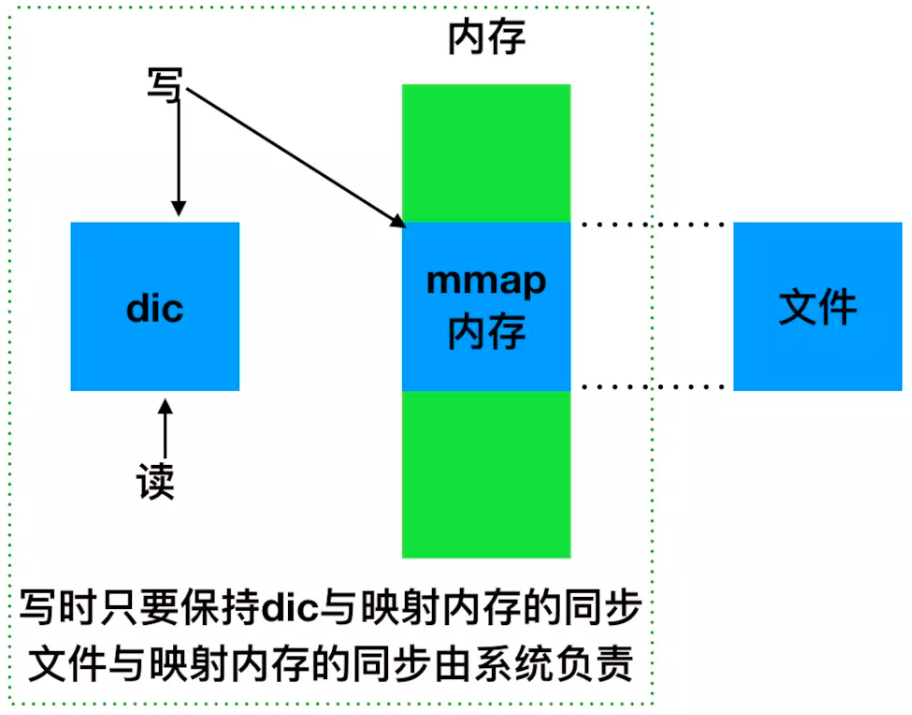
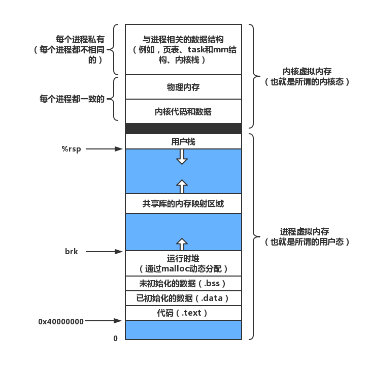
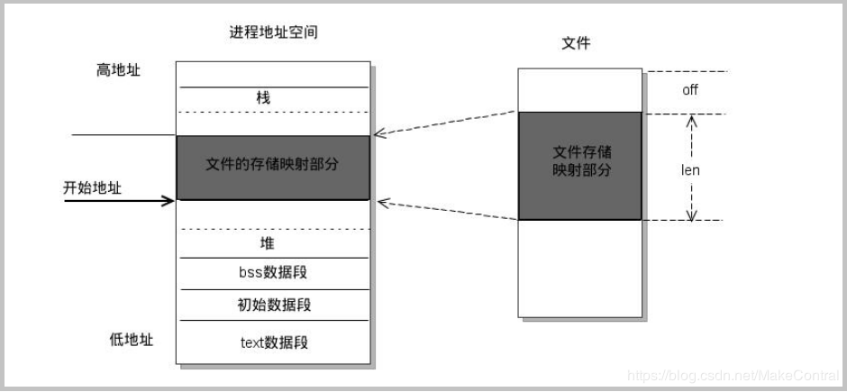

# 7. 存储映射

## 7.1 普通读写文件方式的缺点

### 7.1.1 普通读写文件的特点

使用文件IO的read/write来进行文件的普通读写时，函数经过层层的调用后，才能够最终操作到文件，	

比如我们以读（read函数）为例：

```shell
  应用层  read(fd, buf, sizeof(buf)); //buf应用缓存
              |
  ------------|--------------------------------------
  OS层        |
           xxx1_read(**, xxx1_buf, **);   //xxx_buf1内核缓存
              |
              |
           xxx2_read(**, xxx2_buf, **);   //xxx_buf2内核缓存
              |
              |
            ......
              |
              |
          xxxn_read(**, xxxn_buf, **);   //xxxn_buf内核缓存
  ------------|----------------------------------------
              |
             文件
```

以上画的只是一个示意的过程，不是说这些函数就一定叫这样的名字，但是不管怎么说上图能够很好反映出，在读写时中间会有很多的调用过程，数据需要在不同的缓存间倒腾，最终才能从文件到应用缓存，或者从应用缓存到文件，效率很低。

疑问：为什么中间经过一系列的捣腾后效率会很低呢？

+ （1）cpu执行一堆的函数，很耗费cpu资源，而且浪费时间
+ （2）中间一堆的缓存都是函数从内存开辟的，浪费内存资源，而且数据在各缓存间倒腾时也很耗费时间

总之read、write这种普通读写文件的方式效率不高，那效率不高还要它干嘛？  
因为对于数据量较少的情况来说，这种普通读写方式还是非常方便的，而且数据量较少时，效率并不会太低，只有当数据量非常大时，效率的影响才会非常的明显。

所以对于数据量很少的情况来说，我们最常用的还是普通的读写方式。

疑问：使用标准IO函数的读和写，中间过程也很多吗？  
答：当然，因为“标准io”本来就是封装文件IO来实现的。

### 7.1.2 普通读写方式的缺点：面对大量数据时显得很吃力

#### （1）例子1

比如应用层有超大量的数据，需要保存到“硬盘”的某个普通文件上。

```c
buf[] = 超大量数据;
```

```shell
  应用层 write(fd, buf, sizeof(buf)); //buf应用缓存
              |
  ------------|--------------------------------------
  OS层        |
           ......
  ------------|----------------------------------------
              |
           普通文件
```

#### （2）例子2

应用程序向“显示器”这个字符设备文件的“显存”写视频和图片数据。

大家都知道视频和图片的数据量非常大，特别是视频

```c
buf[] = 视屏或者图片数据;
```


```c
应用层  write(fd, buf, sizeof(buf)); //buf应用缓存
            |
------------|--------------------------------------
OS层        |
          ......
------------|----------------------------------------
            |
  显存（“LCD”字符设备文件）
```

不管是以上的哪一个例子，当涉及大数据量时，如果使用普通read、write的话，中间过程太过繁杂，效率非常的低，所以使用普通的read、write就不行了，此时就需要使用到本小节讲的存储映射了。

不过我们在讲存储映射时，我们目前只能先以普通文件来举例，至于如实使用存储映射，向底层“LCD”字符设备文件的“显存”写数据，我们只会大致的介绍下，细节只能留到讲“LCD驱动”时再详细介绍。

## 7.2 存储映射所用的mmap函数

mmap是memory map的缩写，map就是映射的意思，有些同学可能会说map不是地图的意思吗，map当动词时也有映射的意思。其实“地图”本身就真实地理环境的映射，所以地图本身就有映射的意思。

### 7.2.1 mmap的原理

比如以映射普通文件为例：

mmap的原理就是，既然直接read、write很费劲，那我干脆抛弃read、write的操作，mmap采用直接映射的方式实现，mmap映射时，比如映射普通文件，其实就会将普通文件的硬盘空间的物理地址映射到进程空间的虚拟地址。
图：

通常情况下，进程空间的虚拟地址只映射自己底层物理空间的物理地址，但是使用mmap时，他会将文件的硬盘空间的地址也映射到虚拟地址空间，这么一来应用程序就可以直接通过映射的虚拟地址操作文件，根本就不需要read、write函数了，使用地址操作时省去了繁杂的中间调用过程，可以快速对文件进行大量数据的输入输出。

`疑问`：使用存储映射时，read、write被省掉了，open是不是也被省掉了？  
答：open不能省，必须要将文件open后，才能使用mmap进行映射。

### 7.2.2 映射时，具体映射到了进程空间的什么位置呢？

映射到了“进程应用空间”**堆和栈中间那片虚拟地址的位置**





+ （1）进程内核空间：用于映射“OS”所在的物理内存空间
+ （2）进程应用空间：用于映射“应用程序”所在的物理内存空间

### 7.2.3 对比IPC之共享内存

大家思考下，本小节讲的存储映射与共享内存是不是很像。

#### （1）回顾共享内存

共享内存是让不同的进程空间映射到同一片物理内存上，然后通过共享的物理内存来实现进程间通信。图：

共享内存的使用过程：

+ 1）shmget：创建共享内存，其实就是从物理内存中划出一片准备用于共享的空间出来
+ 2）shmat：调用该函数的进程，将自己的进程空间的某片虚拟地址映射到共享内存上
  程序员不需要知道共享内存空间的起始物理地址是多少，shmat它会知道。至于说映射后的起始虚拟地址一般也是由shmat自己选择的，程序员不需要干预。
+ 3）shmdt：取消映射
+ 4）shmctl：将被取消映射的共享内存删除（释放）

#### （2）对比存储映射和共享内存

+ 1）存储映射，其实也可以用来实现进程间通信  
  比如A和B进程都映射到同一个普通文件上，这时A进程往里写数据，B进程从里面读数据，反过来也是一样的，如此就实现了进程间的通信。

  但是这顶多只算是广义上的通信，所谓广义上的通信就是，只要不是OS提供专门的IPC，就不是专门的进程间通信，只能算是广义的IPC。

  实际上，我们也不会使用mmap映射普通文件来实现进程间通信，因为操作硬盘的速度相比操作内存来说低了很多，如果你想实现进程间大量数据通信的话，完全可以使用与存储映射原理类似的“共享内存”来实现，而且速度很快。

+ 2）虽然存储映射和共享内存原理相似，但是各自用途不同

  + （a）共享内存  
    实现进程间大量数据通信（共享）。

  + （b）存储映射  
    对文件进行大量数的高效输入输出。

### 7.2.4 mmap函数

+ （1）函数原型

  ```c
  #include <sys/mman.h>
  void *mmap(void *addr, size_t length, int prot, int flags, int fd, off_t offset);
  ```

+ （2）功能：将文件所在的磁盘空间映射到进程空间。

+ （3）返回值：调用成功，返回映射的起始虚拟地址，失败则返回(void*)-1，errno被设置。

+ （4）参数
  + 1）addr：人为指定映射的起始虚拟地址  
    如果设置为NULL，表示由内核决定映射的起始虚拟地址，这也是最常见的设置方式，这与我们调用shmat映射共享内存时指定NULL是一样的。

    如果设置不为NULL，就表示由自己指定，指定的起始虚拟地址必须是虚拟页（4k）的整数倍，这与自己指定shmat的映射起始虚拟地址也是一样的。

  + 2）length：映射长度，也就是你想对文件映射多长。

  + 3）prot：指定对映射区的操作权限，可指定如下宏：
    + （a）PROT_EXEC：映射区的内容可执行  
      如果你映射的是普通文件是一个可执行文件的话，将映射权限指定为PROT_EXEC后，是能够通过映射后的虚拟地址去执行文件中的“指令”。图：
    + （b）PROT_READ：映射区的内容可读  
    + （c）PROT_WRITE：映射区的内容可写  
      以上三种选项可相互 | 操作。比如：`PROT_EXEC | PROT_READ`
    + （d）PROT_NONE：映射区不允许访问（不允许执行、读、写），一般不会指定这个，如果指定为不可访问的话，映射就没有意义了

  + 4）flags：向映射区写入了数据，是否将数据立即更新到文件中  
   （a）MAP_SHARED：立即更新。

  + 5）fd：需要被映射文件的描述符。
  
  + 6）offset：
    表示从文件头的offset处开始映射。
  
    一般都指定为0，表示从文件头开始映射。

### 7.2.5 munmap

+ （1）函数原型

  ```c
  #include <sys/mman.h>
  int munmap(void *addr, size_t length);
  ```

+ （2）功能：取消映射

+ （3）返回值：调用成功返回0, 失败则-1, errno被设置。

+ （4）参数
  + 1）addr：映射的起始虚拟地址
  + 2）length：需要取消的长度

### 7.2.6 代码演示

写一个例子程序，将A文件的大量数据复制到B文件中。

如果采用传统方式，使用read函数从A文件读出数据，然后向B文件write，如果数据量很大的话，复制的效率会非常低，此时我们就可以使用存储映射来实现。

实现原理：图

mmap映射文件size为0的文件时，会映射失败，映射失败时内核会向进程发送一个SIGBUS信号，提示mmap失败了，这个信号的默认处理方式是终止，所以当进程收到这个信号时就被异常终止了

如果你不想被这个信号终止，你可以自己忽略或者屏蔽这个信号，一般来说我们不需要忽略和屏蔽该信号。

代码演示：
