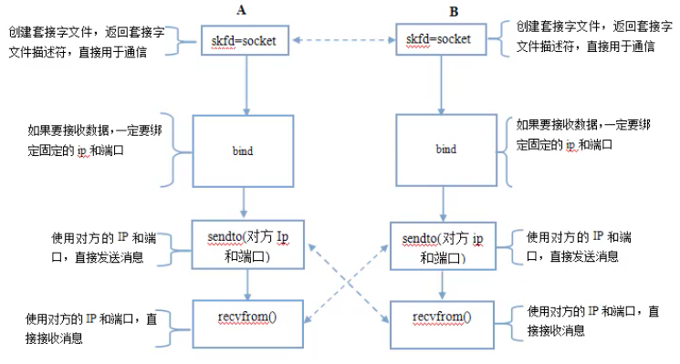

# 5. UDP通信

> UDP是User Datagram Protocol的缩写，直译为用户数据报协议。

## 5.1 UDP的特点 

### 5.1.2 UDP是不可靠传输协议

刚好与TCP相反，它是一种面向无连接的不可靠传输层协议，而且UDP每次发送的分组数据大小都是固定的。
为什么UDP是不可靠传输？

+ （1）不建立连接
+ （2）没有应答机制
+ （3）不会根据网络的好坏调整分组数据的大小

其实有关UDP为什么是不可靠传输协议，我们在介绍TCP时就讲的很清楚了，之所以不是可靠传输协议，主要还是因为UDP没有连接和应答机制，导致UDP在发送数据时，根本不清楚通信线路的连通状态，所以UDP传输数据时，无法保证数据一定能发送给对方，因此UDP是不可靠传输协议，或者说是不可靠通信。

### 5.1.2 每次传输数据时，必须指定对方的IP和端口

+ （1）回顾TCP
  TCP建立连接时，服务器和客户端的TCP协议会自动记录下对方的IP和端口，后续调用recv、send来正式通信时，应用程序不再需要指定对方的Ip和端口，因为会自动使用TCP记录的IP和端口。

+ （2）UDP
  对于UDP来说，UDP协议没有建立连接特性，所以UDP协议没有自动记录对方IP和端口的特点，因此每次发送数据时，应用程序必须亲自指定对方的IP和端口，只有这样才能将数据发送给对方。如果是跨网通信的话，指定的ip就是对方的公网ip。

## 5.2 什么时候使用UDP呢

对于数据量很大但是允许数据丢失的数据来说，可以使用UDP通信。

比如像视频、音频等这类数据，尽管数据量很大，但是就算数据有所丢的话，对通信质量不会有太大影响，此时就可以使用UDP来传输。

当然，我们在开发项目时，如果有现成的调用UDP的应用层协议，我们可以直接这些应用层协议，这些协议代码是可以到网上下载或者购买的，否者我们就自己亲自调用UDP来实现。

比如我们在开发与视频监控相关的网络程序时（主要时客户端），往往会使用RSTP或者RTP应用层协议来传输监控视频数据，RSTP和RTP底层实际上使用的就是UDP协议。

## 5.3 UDP的编程模型



学习TCP通信时我们说过，TCP协议要求必须要有一个服务器，这一点是由TCP协议本身的特性所决定的。

但是通过UDP的编程模型可以看出，UDP通信双方要做的事情一摸一样的，所以对于UDP通信的双方来说，不需要区分谁是服务器端、谁是客户端，通信双方的身份完全是对等的，所以UDP通信也被称为对等通信，或者叫“点对点”通信。

同样的，UDP这种对等通信的特点，或者说点对点通信的特点，是由UDP协议本身的特性所决定的，与应用程序没有关系。

## 5.4 UDP通信的例子程序

> 写一个A程序，然后再写一个B程序，让这两个程序之间使用UDP通信,完整代码见[peer1.c](my_code/UDP/peer1.c)和[peer2.c](my_code/UDP/peer2.c)

### 5.4.1 第1步：调用socket创建套接字文件

+ （1）参数
  
  ```c
  int socket(int domain, int type, int protocol);
  ```

  参数如何指定？
  + 1）domain：AF_INET，表示使用的是TCP/IP协议族
  + 2）type：SOCK_DGRAM，表示使用的是协议族中的无连接、不可靠、固定长度的数据报协议。在TCP/IP协议族里面只有UDP协议属于这种情况，所以使用的必然是UDP协议
  + 3）protocol：0

+ （2）代码演示
  
  ```c
  /* 第1步：创建使用TCP协议通信的套接字文件，客户端的套接字直接用于和服务器端通信*/
  skfd = socket(AF_INET, SOCK_DGRAM, 0); // 一定注意第二个参数和TCP通信的不同
  if(skfd == -1) print_error("socket fail");
  ```

### 5.4.2 第2步：bind绑定固定的ip和端口

如果只是使用UDP发送数据，可以不绑定固定的ip和端口，如果要接收数据的话，必须绑定固定的ip和端口。

疑问：为什么UDP接收数据时需要bind 固定的ip和端口？

如果不绑定，每次使用的都是自动设置的ip和端口，自动设置的话，ip和端口就是不定的，如果每次都是变化的，发送数据端在指定IP和端口时就不知所应该写什么了。
所以如果要接收数据，就必须绑定固定的IP和端口。

代码演示：

```c
/* 第2步：bind绑定固定的ip和端口 */
struct sockaddr_in self_addr; 
self_addr.sin_family = AF_INET; // 使用是IPV4 TCP/IP协议族的ip地址(32位)
self_addr.sin_port = htons(SELF_PORT); // 指定端口
self_addr.sin_addr.s_addr = inet_addr(SELF_IP); // 指定IP
ret = bind(skfd, (struct sockaddr *)&self_addr, sizeof(self_addr)); // 绑定信息，记住第二个参数需要进行强制转换
if(ret == -1) print_error("bind fail");
```

### 5.4.3 第3步：调用sendto和recvfrom函数，发送和接收数据

#### （1）为什么没有listen和accept

UDP没有连接的过程，listen和accept是TCP连接时才会用到函数，既然UDP没有连接，自然也就用不到了。

#### （2）sendto

+ 函数原型

```c
#include <sys/types.h>
#include <sys/socket.h>

ssize_t sendto(int sockfd, const void *buf, size_t len, int flags, const struct sockaddr *dest_addr, socklen_t addrlen);
```

+ 功能
  发送数据，当后两个参数为NULL和0时，功能等价于send，send专门用于TCP这种面向连接的通信，`但对于像UDP这种非连接的通信，必须使用sendto`，因为此时必须使用最后两个参数。

+ 返回值：成功返回发送的字节数，失败返回-1，errno被设置
+ 参数
  + sockfd：socket返回的套接字描述符，对于UDP来说，套接字描述符直接用于通信
  + buf：存放数据的应用缓存
  + len：应用缓存的大小
  + flags：一般写0，表示阻塞发送数据, 其它常用的选项与send的flags一样。
  + dest_addr：填写目标ip和端口, 前面就讲过，对于UDP来说，UDP没有连接的过程，所以没有自动记录对方的ip和端口，所以每次发送数据的时候，都需要指定对方的ip和端口。
  + addelen：dest_addr的大小

+ 代码演示
  
  ```c
  while(1){
      // 设置对端UDP进程的信息比如IP和端口等，需要命令行传参来指定.UDP通信每次收发数据都需要指定IP和端口
      peer_addr.sin_family = AF_INET; // 使用是IPV4 TCP/IP协议族的ip地址(32位)
      peer_addr.sin_port = htons(atoi(argv[2])); // 对端UDP进程端口
      peer_addr.sin_addr.s_addr = inet_addr(argv[1]); // 对端UDP进程所在机器的IP
      bzero(&stu_data, sizeof(stu_data)); // 清空结构体中的数据
      // 获取学生学号,但是需要从主机端序转换为网络端序
      printf("Please input student number:\n"); 
      scanf("%d", &tmp_num);
      stu_data.stu_num = htonl(tmp_num);
      // 获取学生姓名，不需要进行端序转换,因为字符数组以一个字节为单位进行存储
      printf("Please input student name:\n"); // 获取学生姓名
      scanf("%s", stu_data.stu_name);
      // 根据skfd向指定的UDP对端发送数据
      ret = sendto(skfd, (void *)&stu_data, sizeof(stu_data), 0, (struct sockaddr *)&peer_addr, sizeof(peer_addr));
      if(ret == -1) print_error("sendto fail");
  }
  ```

#### （2）recvfrom

+ 函数原型

  ```c
  #include <sys/types.h>
  #include <sys/socket.h>

  ssize_t recvfrom(int sockfd, void *buf, size_t len, int flags, struct sockaddr *src_addr, socklen_t *addrlen);
  ```

+ 功能：接收数据，最后两个参数与NULL和NULL时，功能与recv功能相同。UDP通信时，常使用的是recvfrom函数，因为需要用到后两个参数。
+ 返回值：成功返回接收到的字节数，失败返回-1，ernno被设置
+ 参数
  + sockfd：socket返回的套接字文件描述符
  + buf：应用缓存，用于存放接收到的数据
  + len：buf的大小
  + flags：一般写0，表示阻塞接收数据, 其它的常用设置同recv函数
  + src_addr：用于保存“数据发送方”的ip和端口，以便“接收方”回答对方, 如果是局域网通信，ip就是局域网ip，如果是广域网通信，ip就是对方的所在路由器的公网ip. 如果不需要回答对方数据的话，可以不用保存对方的ip和端口，这时recvfrom的最后两个参数写NULL，此时与recv函数的功能完全等价。
  + addrlen：src_addr的大小

+ 代码演示

  ```c
  ......
  /* 第4步：注册线程函数，用于对端的消息 */
  pthread_t recv_thread_id; // 接收对端消息的线程id
  ret = pthread_create(&recv_thread_id, NULL, pth_func, NULL); // 注册消息接收线程
  if(ret != 0) print_error("pthread_create fail");
  ......
  /* 线程处理函数，用于从读取客户端发送过来的消息,用于第6步 */
  void *pth_func(void *path_arg)
  {
      int ret = -1;
      student stu_data = {0};
      unsigned int peer_addr_size = 0;

      while(1){
          bzero(&stu_data, sizeof(stu_data)); // 清空结构体中的数据
          peer_addr_size = sizeof(peer_addr); // 设置信息题大小
          ret = recvfrom(skfd, (void*)&stu_data, sizeof(stu_data), 0, (struct sockaddr *)&peer_addr, &peer_addr_size); 
          if(ret == -1) print_error("recvfrom fail");
          printf("peer_port= %d, peer_addr=%s\n", ntohs(peer_addr.sin_port), inet_ntoa(peer_addr.sin_addr)); // 打印客户端端口和IP，一定要先进行端序转换
          printf("student number = %d\n", ntohl(stu_data.stu_num)); // 打印学号，记得把数据从网络端序转为主机断端序
          printf("student name = %s\n", stu_data.stu_name); // 1个字符存储的无需进行端序转换
      } 
  }
  ......
  ```
  
  UDP因为没有“连接和应答”这种确认机制，所以UDP是不可靠通信，不过我们自己可以在应用层加入确认机制，以弥补UDP的补足

  比如每次使用UDP通信发送数据给对方后，对方必须回答，如果对方没有回答或者回答数据有错，发送方就重发，以此保证UDP的通信的可靠性，这就是通过应用程序来弥补UDP的不可靠性
  
### 5.4.4 完整代码演示

> 完整代码见[peer1.c](my_code/UDP/peer1.c)和[peer2.c](my_code/UDP/peer2.c)
  
执行结果如下：

peer1.c

```shell
root@6fb4b72f0c7c:/workspace/linuxc/chapter10socket/UDP# gcc peer1.c -pthread -o peer1
root@6fb4b72f0c7c:/workspace/linuxc/chapter10socket/UDP# ./peer1 127.0.0.1 5001
Please input student number:
234
Please input student name:
lsg
Please input student number:
peer_port= 5001, peer_addr=127.0.0.1
student number = 567
student name = wangrui
```

peer2.c

```shell
root@6fb4b72f0c7c:/workspace/linuxc/chapter10socket/UDP# gcc peer2.c -pthread -o peer2
root@6fb4b72f0c7c:/workspace/linuxc/chapter10socket/UDP# ./peer2 127.0.0.1 5006
Please input student number:
peer_port= 5006, peer_addr=127.0.0.1
student number = 234
student name = lsg
567
Please input student name:
wangrui
Please input student number:
```

## 5.5 分析UDP的几种通信情况

> 见 https://edu.51cto.com/center/course/lesson/index?id=268328 的1:54、4:30、10:37

### 5.5.1 本机通信


### 5.5.2 局域网内跨机通信


### 5.5.3 过路由器，跨网通信

UDP跨网通信的前提是，必须要知道对方的公网ip，暂时先假设发送者本来就知道。


## 5.6 使用UDP通信搭建出服务器

有同学可能会有疑问说，不对啊，不是说UDP是“对等通信”，没有服务器吗，怎么还可以使用UDP搭建服务器呢？

我们说UDP没有服务器，这是站在UDP协议角度来说，但是并不是说我们自己写的“应用程序”，不能基于UDP来实现服务器，应用程序基于UDP实现服务器的时候，服务器的实现者是应用程序，而不是UDP协议。图：

总之，使用UDP实现服务器时，服务器是由应用程序本身来构建的，而不是UDP协议，就算搭建出了服务器，但是使用UDP来实现“服务器”和“客户”的通信时，站在UDP协议的角度来说，任然还是对等通信。

服务器如何同时与n多个客户通信？

+ （1）多线程
+ （2）多进程
+ （3）多路IO

## 5.7 如何实现两台普通计算机之间的跨网通信

比如我的PC和我同事的PC之间想要进行跨网通信，方法有两种，

+ 第一种：通过服务器中转
+ 第二种：直接通信

### 5.7.1 通过服务器中转

+ （1）TCP
+ （2）UDP

我们举例子时，直接举跨网通信的例子。

### 5.7.2 直接通信

PC之间如果要直接通信的话，只能使用UDP通信。

不过如果PC之间要进行UDP直通的话，也必须要有服务器程序的参与，否者pc1根本不能知道pc2的公网IP和端口。

服务器的实现有两种，

+ （1）UDP服务器方式
+ （2）TCP服务器方式

实际上QQ的实现使用的就是TCP/UDP相联合的方式
+ TCP：用于管理所有的用户信息，以及转发文字聊天信息
+ UDP：当客户双方进行视频通话时，由于视频通话的数据量太大，所以客户双方此时就使用UDP来点对点直接通信
