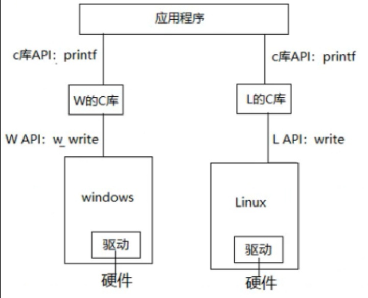
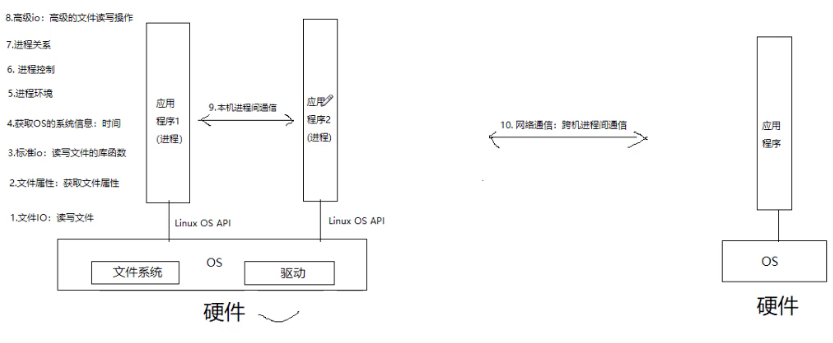

# Linux系统编程和网络编程视频

+ 1.课程地位
+ 2.Linux系统编程/网络编程这门课，具体是个什么课？
+ 3.学习《Linux系统编程、网络编程》这门课，学的是什么？
+ 4.既然有库了，学习Linux的OS API还有意义吗？
+ 5.《Linux系统编程、网络编程》具体知识点有些啥


## 1. 课程地位


这门课既然叫系统编程、网路编程，必然是与OS有关，建议大家配合学习《计算机体系结构》软件篇-操作系统课程，两相结合学习，你会有一种一通百通，豁然开朗的感觉  

建议先学《计算机体系结构》操作系统，再来学Linux系统编程/网络编程，当然这两门课谁先谁后，你也可以自己根据自己需求，随意组合  

## 2. Linux系统编程/网络编程这门课，具体是个什么课？

### 2.1 我们可不可能从零开始写代码？

首先问大家，你觉得餐馆的厨师能不能从零开始，自己先种各种蔬菜、粮食，制作各种调料，然后再下厨做饭，显然是不现实的，肯定都是基于别人先成的东西来做饭的。

我们编写应用程序也是如此，基本不可能自己全部从零实现你要用到的所有东西，比如初学C/c++等语言的时候，你需要调用一个别人提供的类似printf这样的函数，实现打印显示的功能，如果写个程序，还要你自己去写一个pintf函数，这就有点扯到蛋了  

所以我们实际在编写代码的过程中，大量调用别人事先写好的各种函数，获取这些函数所提供的功能（服务）属于常态，那么别人事先写好函数，其实就是常说的“应编程的接口”，或者说全了就是“编写应用程序所要调用的函数接口”，“应编程的接口”的英文说法就是API  

`疑问：那我调用自己写的函数，自己写的函数算不算API呢？`  
按照定义来说也算，不过一般来说，我们不会把自己写的函数说成是API，一般都是把别人写的、提供给我们用的函数叫API。API的英文全称叫Application Programming Interface，翻译过来就是应用编程接口（其实就是函数接口）。总之，在我们自己写的应用程序里面，经常需要调用各种API，以获取别人事先写好的函数所提供的功能。

### 2.3 都有谁会提供API？

大体上有两个，库和OS

+ （1）库(c/c++/java等的库) ：调用库API，可以获取库函数提供的功能。

+ （2）OS : 调用OS API（系统API），可以获取OS函数提供的功能。

  只不过我们常调用的是库API，很少直接调用OS API，使得很多同学只了解库API，不熟悉OS API，其实你不知道的是，80%库API(库函数)都是基于OS API(系统函数)实现的，你调用库API时，基本都是间接调用了OS API的，只要你弄清楚了库API和OS API的关系，很容易就能搞清楚这一点。

### 2.4 库API和系统API关系



#### （1）每个OS都有自己的系统API

+ windows、Linux等OS，都有自己的独立的OS API  
  如果你曾经了解过windows的OS API的话，你再来学Linux的系统API时，你会发现它们非常相似，甚至有些OS API的函数名都一样  

+ 基于OS运行的应用程序，为什么需要调用系统API吗？
  既然应用程序是基于OS的运行的，百分百需要OS所提供的服务  
   
+ **应用程序如何调用系统API?**
  + 直接调用  
    应用程序 —— OS API(OS函数)  
  + 间接调用  
    应用程序 —— 库API(库函数) ——— OS API(OS函数)  
    只不过对大家来说，常见的是间接调用，库函数对OS API做了二次封装，你在通过库API区间接调用系统函数  

#### （2）既然可以直接调用OS API，库的意义何在？

大体上为两个方面的意义：
+ 1.实现不同OS平台的兼容
+ 2.库函数在系统函数的基础上，还叠加了一些额外的功能

##### 1）实现不同OS平台的兼容

+ （a）OS如何导致了程序的不兼容性  
  不同OS的系统API是不一样的，比如Linux系统中调用的某个系统API叫write，那windows下也许叫w_write，你写的运行在Linux应用程序，显然调用的是Linux 的OS API的话，这个程序你拿到windows就运行不了了，人家windows不认，怎么办？  
    程序员就必须重新写一个windows版的应用程序，显然增加了程序的负担  
    这就好比以前不同国家有自己不同的计量单位，中国的是斤，英国的是镑，相互不兼容，对接起来相当的麻烦  

+ （b）库如何解决了这种不兼容性  
  为了能够让同一个程序兼容所有的OS，后来就出现了库这个东西，它实现了不同OS的兼容,这就好比后来出现了各种全球化的公制单位（公斤、米等），兼容了不同国家的计量单位  
  
  比如c库，有专门针对Linux的C库，专门针对windows的C库，也有专门针对其它OS的c库,所有的C库实现的功能，已经提供的库API都是一样的，但是不同OS的C库都是不同的，因为各自需要对接不同的OS API  
  
  + Linux C库：由Linux相关团队开发，对接Linux的OS API
  + windows c库：由windows相关团队开发，对接的是Windows的OS API  
  + 其它OS的C库：由其它团队开发，对接的是其它OS API 

  但是对于编写应用程序的程序员来说，调用库API时，不管是那个平台的C库，调用的API（函数接口）和实现的功能都是一样的，程序员自己不同操作如何去兼容不同的OS  

##### 2）库函数在系统函数的基础上，还叠加了一些额外的功能

比如，你调用Linux C库提供的printf函数时，其实printf最终调用的还是Linux OS的write这个系统API，我们知道printf函数有%d %s等格式化的输出，这种格式化的输出并不是write系统API提供的，其实是printf对write做二次封装时，叠加一些性的更加人性化的功能  

#### （3）库API一定会调用系统API吗

调不调用要看需求，80%的库函数都会调用OS API，剩余20%的就是独立的库函数，与OS API没有任何关系  

比如还是以C库为例

+ 1）与OS API有关的C库函数

  + （a）Linux C库的printf函数：调用的是Linux的write系统API

    ```txt
      应用程序
        |
    printf C库函数
        |
        |
    write系统函数(OS)
        |
        |
      硬件（屏幕）
    ```


  + （b）Linux C库的malloc函数：调用的是Linux的sbrk系统API

     ```txt
        应用程序
          |
      malloc C库函数
          |
          |
     sbrk系统函数(OS)
          |
          |
      硬件(内存)
      ```

  当然，对于windows这边的C库，调用的自然就是windows的OS API了。

+ 2）与OS API无关的C库函数

  + （a）比如c库的strlen函数
      这个函数就是统计字符串中字符的个数，但凡学过c语言的同学，自己都能实现这个函数的功能，这个函数就根本不需要调用任何的系统函数（OS API）。
      ```txt
       应用程序
          |
    strlen C库函数
      ```

## 3. 总结：《Linux系统编程、网络编程》这门课，到底学的是什么？

学的就是Linux OS所提供的各种API，学会使用这些OS API后，在编程时直接调用这些系统API，直接获取OS提供的各种功能(服务)

但是在学习的过程中，也不是100%的都是Linux的OS API，剩余10%也有C库的API  

我们学习系统编程时，都是使用C语言来编写各种调用系统API的测试例子，通过这些例子来学会系统API的使用，为什么是C语言呢？

因为Linux系统就是C语言写的，提供系统函数(OS API)都是C语言的接口，自然使用C语言来编写示例程序。

## 4. 既然有库了，学习Linux的OS API还有意义吗？

估计不少同学都有这样的疑问，其实是有意义的。

###  4.1 直接意义

#### （1）Linux嵌入式开发有其自己的特殊性，编写应用程序时，往往有时会直接调用Linux的OS API

#### （2）后面写驱动程序时，需要调用Linux系统API，编写测试驱动程序的应用代码

 ```txt
  测试应用

    os

 你写的驱动
 ```

#### （3）如果你以后涉安卓中间层开发时，也会涉及到Linux系统API的调用和封装

```txt
   java层
   c++层
  Linux os
    驱动
--------------
    硬件
```

### 4.2 间接意义

#### （1）学习OS API，有助于理解OS这个东西

#### （2）帮助我们理解文件读写、进程、进程间通信、线程、信号、锁等概念

大家在使用C、C++、java等编写程序时，会调用相应的库函数实现文件读写、进程、进程间通信、线程、锁等机制，我们说这些库都是基于系统API实现的，只不过做了一层封装而已，通过Linux 系统API的学习，可以让大家从源点上理解这些相关概念，帮你解答你以前的疑惑
	
## 5.《Linux系统编程、网络编程》具体知识点都有些啥

既然调用OS API是为了获取OS提供的服务，那么大家思考一下，我们编写应用程序运行起来时，都希望从OS那里获取到哪些服务呢？

### 5.1 OS可能会提供的服务有哪些 



### 5.2 课程大纲

+ （1）文件io

+ （2）操作文件属性

+ （3）c库提供标准io
    
    基于文件io实现
    
    windows的c库的标准Io函数基于windows文件io实现，Linux的c库的标准io函数基于Linux的文件io实现。

    对比文件io和标准Io的异同。

+ （4）获取OS的系统信息
   比如获取时间。

+ （5）进程相关内容
  + 1）进程环境
  + 2）进程控制
  + 3）进程关系
  + 4）进程间通信(IPC, Inter-Process Communication)

+ （6）高级io 
  读写文件的一些高级用法。

+ （7）网络编程
    建议先看《计算机体系结构》网络篇的网络基础知识，再来学习网络编程，很多东西，你会豁然开朗。
