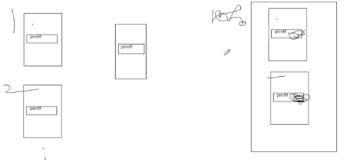
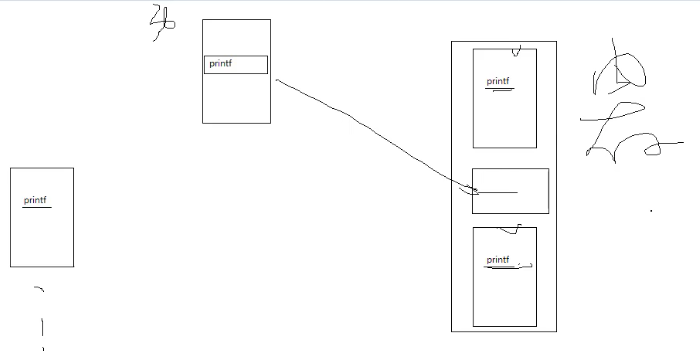

# 3.静态链接与动态链接
> 什么是链接，链接其实就是连接的意思，将所有相关的东西连接起来。
	
## 简单理解静态连接和动态链接：
  + 静态链接：编译时完成链接
  + 动态链接：程序运行起来后，根据需求再去链接，这就是动态链接

			
## 3.1 静态链接
### 3.1.1 什么是静态链接
所谓静态链接，其实就是在编译时，调用ld/collect2链接程序，将所有的.o中的机器指令整合到一起，然后保存到可执行文件中。
### 3.1.2 什么时候用到静态链接呢？
编译时用到，编译时的链接就是静态链接，所以链接程序ld/collect2，也可以称为静态链接器。

			
### 3.1.3 静态链接时做了什么事
> 两件事，符号解析 和 重定位。接下来就大概的介绍一下这两件事，为后面的详细介绍打基础。

+  （1）符号解析
     + （a）符号解析的作用
          符号解析的目的就是将符号的引用(使用)和符号(包括函数和全局变量)的定义联系起来。


     + （b）例子  
　　　　a.c　　　　　　　　　　　b.c

              fun(100);              void fun(int a)
                                     {
                                      ...
                                     }
                |                     |
                |                     |
                V                     V
               a.o	 <——静态链接———> b.o

          引用符号fun<————— 联系————>定义符号fun


          为了方便实现符号解析，编译得到.o文件时，每个.o文件都会包含符号一张的符号表。  
          符号表记录什么？  
          + 记录本模块定义了些什么符号
          + 记录本模块引用了些什么符号

          旁注：单个.c文件，也被称为一个模块，整个工程就是以模块为单位来进行组织的，模块化组织很重要，  
          不进行模块化在组织的话，就只能将所有内容全写到一个文件中，对于大型c程序来说，显然很难操作。
	  
	     但是模块化组织有一个麻烦事就是，你需要将所有的模块合成一个完整的可执行程序，这个合成的麻烦事  
          就是由collect2/ld来承担的。


+  （2）重定位
     +	怎么理解重定位这三个字？  
        简单理解就是，之前的地址不对，重新定位新地址，就好比导航时目的地址弄错了，重新定位一个新的目  
        的地址，这就是“重定位”的含义。
	
     + （a）重定位作用  
          > 将.o文件中每个机器指令的逻辑地址，重定位为(转为)实际运行的地址。

          + 如果是裸机运行的：运行的地址就是内存的物理地址。
          + 如果是基于OS运行的：运行地址就是虚拟内存的地址
            不过虚拟内存机制，最终还是会将虚拟地址会转为物理地址。

     + （b）**.o中**的逻辑地址  
            逻辑地址只是理论上的，这个地址是无法被cpu取指运行的，因为逻辑地址即不是实际的物理地址，也不是  
          虚拟内存的虚拟地址，它只是在编译时临时给的一个编号。  
            .o中的每个节(.text/.rodata/.data等)，逻辑地址都是从0开始的。  
	    
	    演示：查看helloworld.o的逻辑地址  
              但是由于.o是纯二进制文件，很难被阅读，所以需要将它反汇编为ascii的汇编。  
              反汇编时，每条二进制的机器指令，会被翻译为对应的每条汇编指令，是一一对应的关系。  

	      反汇编：objdump -D helloworld.o > hw1.s  
              查看逻辑地址：  
			
			helloworld.o:     file format elf64-x86-64


			Disassembly of section .text:

			0000000000000000 <main>: /**16个0，十六进制每个位代表4位，所以是16*4=64位系统**/
			   0:	55                   	push   %rbp
			   1:	48 89 e5             	mov    %rsp,%rbp
			   4:	48 83 ec 10          	sub    $0x10,%rsp
			   8:	c7 45 fc 64 00 00 00 	movl   $0x64,-0x4(%rbp)
			   f:	be 64 00 00 00       	mov    $0x64,%esi
			  14:	bf 00 00 00 00       	mov    $0x0,%edi
			  19:	b8 00 00 00 00       	mov    $0x0,%eax
			  1e:	e8 00 00 00 00       	callq  23 <main+0x23>
			  23:	bf 00 00 00 00       	mov    $0x0,%edi
			  28:	b8 00 00 00 00       	mov    $0x0,%eax
			  2d:	e8 00 00 00 00       	callq  32 <main+0x32>
			  32:	b8 00 00 00 00       	mov    $0x0,%eax
			  37:	c9                   	leaveq 
			  38:	c3                   	retq   

			Disassembly of section .rodata:

			0000000000000000 <.rodata>:
			   0:	79 6f                	jns    71 <main+0x71>
			   2:	75 72                	jne    76 <main+0x76>
			   4:	20 73 63             	and    %dh,0x63(%rbx)
			   7:	6f                   	outsl  %ds:(%rsi),(%dx)
			   8:	72 65                	jb     6f <main+0x6f>
			   a:	20 69 73             	and    %ch,0x73(%rcx)
			   d:	20 25 64 0a 00 63    	and    %ah,0x63000a64(%rip)        # 63000a77 <main+0x63000a77>
			  13:	6f                   	outsl  %ds:(%rsi),(%dx)
			  14:	6e                   	outsb  %ds:(%rsi),(%dx)
			  15:	64 69 74 69 6f 6e 20 	imul   $0x6f63206e,%fs:0x6f(%rcx,%rbp,2),%esi
			  1c:	63 6f 
			  1e:	64                   	fs
			  1f:	65                   	gs
				...

			Disassembly of section .comment:

			0000000000000000 <.comment>:
			   0:	00 47 43             	add    %al,0x43(%rdi)
			   3:	43 3a 20             	rex.XB cmp (%r8),%spl
			   6:	28 55 62             	sub    %dl,0x62(%rbp)
			   9:	75 6e                	jne    79 <main+0x79>
			   b:	74 75                	je     82 <main+0x82>
			   d:	20 34 2e             	and    %dh,(%rsi,%rbp,1)
			  10:	38 2e                	cmp    %ch,(%rsi)
			  12:	34 2d                	xor    $0x2d,%al
			  14:	32 75 62             	xor    0x62(%rbp),%dh
			  17:	75 6e                	jne    87 <main+0x87>
			  19:	74 75                	je     90 <main+0x90>
			  1b:	31 7e 31             	xor    %edi,0x31(%rsi)
			  1e:	34 2e                	xor    $0x2e,%al
			  20:	30 34 2e             	xor    %dh,(%rsi,%rbp,1)
			  23:	33 29                	xor    (%rcx),%ebp
			  25:	20 34 2e             	and    %dh,(%rsi,%rbp,1)
			  28:	38 2e                	cmp    %ch,(%rsi)
			  2a:	34 00                	xor    $0x0,%al

			Disassembly of section .eh_frame:

			0000000000000000 <.eh_frame>:
			   0:	14 00                	adc    $0x0,%al
			   2:	00 00                	add    %al,(%rax)
			   4:	00 00                	add    %al,(%rax)
			   6:	00 00                	add    %al,(%rax)
			   8:	01 7a 52             	add    %edi,0x52(%rdx)
			   b:	00 01                	add    %al,(%rcx)
			   d:	78 10                	js     1f <.eh_frame+0x1f>
			   f:	01 1b                	add    %ebx,(%rbx)
			  11:	0c 07                	or     $0x7,%al
			  13:	08 90 01 00 00 1c    	or     %dl,0x1c000001(%rax)
			  19:	00 00                	add    %al,(%rax)
			  1b:	00 1c 00             	add    %bl,(%rax,%rax,1)
			  1e:	00 00                	add    %al,(%rax)
			  20:	00 00                	add    %al,(%rax)
			  22:	00 00                	add    %al,(%rax)
			  24:	39 00                	cmp    %eax,(%rax)
			  26:	00 00                	add    %al,(%rax)
			  28:	00 41 0e             	add    %al,0xe(%rcx)
			  2b:	10 86 02 43 0d 06    	adc    %al,0x60d4302(%rsi)
			  31:	74 0c                	je     3f <main+0x3f>
			  33:	07                   	(bad)  
			  34:	08 00                	or     %al,(%rax)
				...

			

	      旁注1：在64位系统下，地址是64位的，所以十六进制的0地址有16个0。  
	      旁注2：我们这里只关心地址问题，有关.o文件的更多内容，我们这里不做介绍。  


     + （c）**可执行程序**中的运行地址				
            我们这里编译出的可执行文件helloworld，是运行在Linux的虚拟内存上的，所以重定位后的运行地址是
          “虚拟地址”。
            `在Linux下，链接器重定位后的虚拟地址是多少呢？`
            分32位系统和64系统来谈

          + 32位Linux系统  
            在32位Linux里面，虚拟地址是32位的，也就是4个字节。  
            在32位的Linux下，重定位后，  
            - 虚拟地址从0x08048000开始。0x08048000：32位  
            - 每个节不再是从0开始的，节之间的虚拟地址是挨着的  

            反汇编：objdump -D helloworld.o > hw1.s(名字由自己定)  
            查看逻辑地址：  

            旁注：同样的，我们这里只关心地址问题，有关可执行文件的更多内容，我们这里不做介绍。  

          + 64位系Linux统    
            在64位Linux里面，虚拟地址是64位的，也就是8个字节。  

            在64位的Linux下，重定位后，  
            - 虚拟地址从0x0000000000400000开始。0x0000000000400000：64位  
            - 每个节不再是从0开始的，节之间的虚拟地址是挨着的  

            反汇编：objdump -D helloworld > hw2.s  
            查看逻辑地址：  
	    ```
	
			helloworld:     file format elf64-x86-64


			Disassembly of section .interp:

			0000000000400238 <.interp>:
			  400238:	2f                   	(bad)  
			  400239:	6c                   	insb   (%dx),%es:(%rdi)
			  40023a:	69 62 36 34 2f 6c 64 	imul   $0x646c2f34,0x36(%rdx),%esp
			  400241:	2d 6c 69 6e 75       	sub    $0x756e696c,%eax
			  400246:	78 2d                	js     400275 <_init-0x16b>
			  400248:	78 38                	js     400282 <_init-0x15e>
			  40024a:	36                   	ss
			  40024b:	2d 36 34 2e 73       	sub    $0x732e3436,%eax
			  400250:	6f                   	outsl  %ds:(%rsi),(%dx)
			  400251:	2e 32 00             	xor    %cs:(%rax),%al

			Disassembly of section .note.ABI-tag:

			0000000000400254 <.note.ABI-tag>:
			  400254:	04 00                	add    $0x0,%al
			  400256:	00 00                	add    %al,(%rax)
			  400258:	10 00                	adc    %al,(%rax)
			  40025a:	00 00                	add    %al,(%rax)
			  40025c:	01 00                	add    %eax,(%rax)
			  40025e:	00 00                	add    %al,(%rax)
			  400260:	47                   	rex.RXB
			  400261:	4e 55                	rex.WRX push %rbp
			  400263:	00 00                	add    %al,(%rax)
			  400265:	00 00                	add    %al,(%rax)
			  400267:	00 02                	add    %al,(%rdx)
			  400269:	00 00                	add    %al,(%rax)
			  40026b:	00 06                	add    %al,(%rsi)
			  40026d:	00 00                	add    %al,(%rax)
			  40026f:	00 18                	add    %bl,(%rax)
			  400271:	00 00                	add    %al,(%rax)
				...

			Disassembly of section .note.gnu.build-id:

			0000000000400274 <.note.gnu.build-id>:
			  400274:	04 00                	add    $0x0,%al
			  400276:	00 00                	add    %al,(%rax)
			  400278:	14 00                	adc    $0x0,%al
			  40027a:	00 00                	add    %al,(%rax)
			  40027c:	03 00                	add    (%rax),%eax
			  40027e:	00 00                	add    %al,(%rax)
			  400280:	47                   	rex.RXB
			  400281:	4e 55                	rex.WRX push %rbp
			  400283:	00 e4                	add    %ah,%ah
			  400285:	33 cb                	xor    %ebx,%ecx
			  400287:	f2                   	bnd
			  400288:	66                   	data16
			  400289:	75 1c                	jne    4002a7 <_init-0x139>
			  40028b:	a8 6b                	test   $0x6b,%al
			  40028d:	44 19 98 51 0f df 22 	sbb    %r11d,0x22df0f51(%rax)
			  400294:	f8                   	clc    
			  400295:	2b                   	.byte 0x2b
			  400296:	bb                   	.byte 0xbb
			  400297:	2b                   	.byte 0x2b

			Disassembly of section .gnu.hash:
	    ```
									
													
##  3.2 动态链接
###  3.2.1 什么是动态链接
   所谓动态链接，就是在编译的时候只留下调用接口，当程序真正运行的时候，才去链接执行，    
   动态链接这件事不是在编译时发生的，是在程序动态运行时发生的，所以叫称为动态链接。  
			
			
### 3.2.2 什么时候用到动态链接呢？		
   使用动态库时，动态库就是动态链接的。  
   比如程序中调用printf函数，这个函数基本都是动态库提供的，程序编译后代码里面是没有printf函数    
代码的，只有printf这个接口，当程序运行起来后，再去动态链接printf所在的动态库，那么程序就能调用printf函数了。  
   `如何理解这里说的接口？`  
   站在ascii的c源码角度来说，这个接口就是printf函数名，但是程序被编译为二进制后，printf就变成  
了一个地址，所以站在二进制的角度来说，接口就是函数第一条指令的地址。  
					
					
###  3.2.3 动态链接的实现者是谁
   动态链接由动态链接器来实现的，回顾gcc -v显示的链接信息  
   collect2    
   动态链接器：`-dynamic-linker /lib64/ld-linux-x86-64.so.2`（链接（加载）动态库）   
   在后面的《c函数库》讲动态库的隐式与显示加载时，会详细的介绍到这里所讲问题。  
## 3.3 静态库 与 动态库	
			
###  3.3.1 如何得到库
				
+  1）先写好一堆的.c文件（.c：我们所需要的各种工具函数）  

+  2）将这些.c编译为对应的.o  

+  3）将所有的这些.o打包为一个仓库文件（静态库或者动态库）	  
	`静态库`：按照静态库的方式打包  
	`动态库`：按照动态库的方式打包  

	因为打包的规则不同，所以得到库也是不同的  
						
						
### 3.3.2 二者的共性
  都是事先做好的.o仓库。  

  库这个东西很好，如果没有库这个东西的话，每次都要自己重复实现这些工具函数，这会非常的麻烦。  
  比如如果没有库提供printf的话，些个简单的helloworld，printf函数还需要自己实现，这就扯淡了。    

					
### 3.3.3 二者的区别
 > 这两种库的链接方式不同。  
					
 `静态库`：静态链接：由静态链接器(collect2/ld)来实现  

 `动态库`：动态链接：由动态链接器来实现  

					
  + （1）静态库
    +	1）链接静态库 与 链接一般的.o没有区别
	比如，如果printf函数是由静态库来提供的话，那就需要连接printf所在的静态库。  
	静态库是.o的集合，printf在其中的某个.o中，链接静态库时，使用printf这个符号去搜索静态库中所有
     的.o，如果找到了printf所在的.o，将其链接到自己的程序中。  
    +	2）静态库缺点
	链接静态库时，其实就是将库中.o的代码包含到自己的程序中，每个程序链接静态库后，都会包含一份独立  
	的代码，当这些程序都运行起来时，所有这些重复的代码都需要占独立的存储空间，显然很浪费计算机资源。  
	图：  
						
  + （2）动态库
      >  主要是为了解决静态库的缺点而存在的。  
	+  1）链接动态库  
	     在链接动态库时，collect2/ld不会将动态库中.o的代码直接静态链接（复制）到自己程序中，只会留下调用接口。   
             程序运行时再去将动态库（链接）加载到内存中，然后就能调用动态库的函数（代码）了。  
	+  2）动态库的优点  
	     不管多少程序使用了这个动态库，这些程序只会共享使用同一份的动态库，因此动态库也被称为共享库。  
	     图：    
	    `疑问`：动态库的代码是被全部加载到内存中的吗？  
	       是的，因为动态库并不知道你的程序需要使用哪个函数，所以整个动态库都会被加载到内存中。  
	+  3）回顾gcc -v显示的链接信息  
		collect2     
		动态库链接器  
		-dynamic-linker /lib64/ld-linux-x86-64.so.2     
		ccyIcm4A.o //我的.o中有调用printf函数  
		-lc //链接libc.so动态库(c常用函数的动态库)，printf就被包含在了libc.so这个动态库中  
		`动态库工作的过程`：过程描述的不严谨，但是它的原理确实是这样的。  
		+ 程序运行起来后，“动态链接器”一看你想链接的是libc.so动态库，首先检查内存中有没有这个动态库，  
		  - 如果没有  
		     到硬盘上找到libc.so库，将所有代码加载（动态链接）到内存中，并得到整个动态库在内存中的起始地址。  
		  - 如果有  
		     说明之前有人已经加载过了，所以不再加载，直接得到动态库在内存中的起始地址即可。  
		+ 调用动态库的prinf函数  
			疑问：是怎么找到动态库中的printf函数的？  
			与调用普通的函数一样，就是通过地址跳转找到。  
			图：  
			`疑问`：是怎么知道printf函数体的地址的？  
				printf的地址 =  printf的相对地址 + 动态库加载时的地址  
			- 相对地址  
				编译时并不知道动态库会加载到什么位置，编译器其实并不知道printf函数第一条指令的绝对地址，所以编译时printf
				只是一个相对地址，
				图：  
				`什么是相对地址？`  
				printf函数第一条指令相对于动态库头的距离。  
			 - 绝对地址   
				动态链接器加载动态库后，会得到动态库在内存中的起始地址（绝对地址）。  
				printf相对地址 + 动态库绝对地址 == printf的绝对地址  
				如此就能调用到动态库中的printf函数。  
				图：				
  +  （3）静态库 与 动态库的名字尾缀  
      +   1）静态库名字尾缀  
          +   windows：尾缀为.lib  
          +   Linux：尾缀为.a  
      +   2）动态库名字尾缀  
          +   windows：尾缀为.dll
          +   Linux：尾缀为.so
